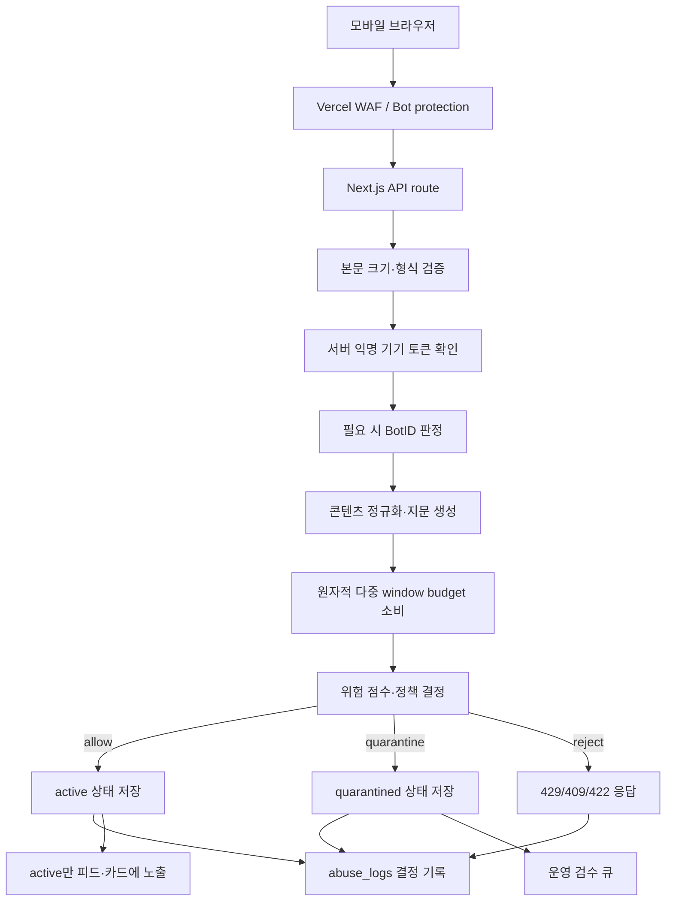
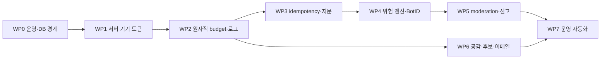

# 어뷰징 방어 시스템 설계 및 구현 계획

## 1. 문서 목적

이 문서는 익명·위치 기반 게시 서비스에서 발생할 수 있는 반복 게시, 대량
게시, 공감 조작, 허위 신고, 부적절한 콘텐츠, 지역 도배, 외부 API 비용
공격을 현재 코드 구조 안에서 방어하기 위한 구현 기준을 정의한다.

기존 `herebtw_prd.md`에는 다음 요구사항이 이미 있다.

- 글 작성은 서버가 확인한 익명 기기 기준 15초에 1회, 1시간에 10회만 허용
- 동일하거나 유사한 내용의 반복 업로드 방지
- 포스트당 익명 기기 기준 공감·신고 1회
- 신고만으로 포스트를 자동 숨김 처리하지 않음
- 어뷰징 이벤트를 DB에 기록하고 운영자가 사후 검수
- 공개 클라이언트는 쓰기 작업을 서버 API를 통해서만 수행

### 1-1. 2026-08-08 구현 상태

다음 기반 계층은 구현 및 운영 DB migration 적용을 마쳤다.

- 서버 서명 익명 기기 쿠키와 legacy body ID의 단계적 호환
- 기기당 포스트 15초 1회·1시간 10회·24시간 20회 원자적 budget
- 게시 멱등 키, strict/loose 정규화, 완전·근접 중복 판정
- 공감·신고·후보자 쓰기 제한, 신고 코드 allowlist, 비활성 후보 차단
- 위치 v4 actor binding, 위치·카드 네트워크 budget, BotID Basic
- RLS/직접 권한/함수 execute/view security invoker 보강
- 구조화 어뷰징 로그, JSON 크기 상한, 콘텐츠·이메일 안전 검사
- 이메일 소유권 확인 전 답변 알림 금지

교차 기기 문구 군집은 운영자 검수 화면이 생기기 전까지 shadow log만
남긴다. Vercel WAF 규칙은 프로젝트 재연결 후 Log 모드로 별도 배포한다.

문서 상태: **Implemented foundation / staged rollout**
작성 기준일: **2026-08-08**

## 2. 결론과 우선순위

가장 먼저 구현해야 하는 것은 AI 콘텐츠 분류기가 아니라 아래 다섯
가지다.

1. Vercel WAF에서 쓰기·비용성 경로를 우선 제한한다.
2. 요청 본문의 `anonymousDeviceId` 대신 서버가 서명한 익명 기기 토큰을
   권한과 제한 기준으로 사용한다.
3. Postgres의 원자적 카운터로 15초 작성 제한과 1시간 10회 제한을 함께
   적용한다.
4. 게시물 원문과 별도로 정규화 지문을 만들어 정확·근접 중복을 탐지한다.
5. 모든 허용·제한·격리 결정을 DB에 구조화해 남긴다.

이 다섯 가지가 완료되기 전에는 신고 수 기반 자동 숨김, 복잡한 평판 점수,
외부 AI 분류기를 먼저 도입하지 않는다. 현재 식별자와 관측 데이터가
신뢰할 수 없기 때문에 복잡한 모델을 얹어도 결과를 검증할 수 없다.

## 3. 현재 상태 기준선

### 3-1. 운영 데이터 스냅샷

2026-08-08 운영 DB를 원문과 식별자를 노출하지 않는 집계 쿼리로 확인한
결과다.

- 전체 포스트: 22개
- 활성 포스트: 22개
- 한 기기의 최대 작성 수: 2개
- 정규화 기준 반복 문구 그룹: 0개
- 신고: 0개
- 기기 식별자: 506개
- 게시·공감·신고 이력이 있는 기기: 21개
- 기록된 어뷰징 로그: 0개

현재 명확한 대량 공격 징후는 없다. 다만 활동 없는 기기 식별자가 485개이고
어뷰징 로그가 실제 DB에 기록되지 않으므로, 공격 부재와 탐지 부재를 구분할
수 없는 상태다.

### 3-2. 이미 존재하는 보호 장치

- 포스트 내용은 1~100자로 제한된다.
- 같은 DB 기기와 같은 활성 원문 조합에는 유니크 인덱스가 있다.
- 같은 DB 기기는 한 포스트에 공감·신고를 한 번만 저장할 수 있다.
- 위치 토큰은 HMAC 서명, 만료, 20m·100m 좌표 격자 검증을 수행한다.
- 피드 페이지 크기는 서버에서 상한을 둔다.
- 운영 DB의 핵심 테이블에는 RLS가 활성화돼 있다.

이 보호 장치는 실수와 단순 중복에는 유효하지만, 임의의 새 기기 ID를
만드는 공격이나 유사 문구 반복에는 충분하지 않다.

### 3-3. 확인된 구현 공백

- `src/lib/device/browser-device.ts`가 기기 ID를 브라우저에서 생성한다.
- `/api/device/register`는 길이 제한 없이 전달받은 ID를 upsert한다.
- `DUPLICATE_SEED_CONTENTS`가 빈 배열이라 애플리케이션 중복 검사가 항상
  통과한다.
- 중복 비교는 `trim()` 이후 완전 동일 문자열만 비교한다.
- `logAbuseEvent()`는 객체를 반환할 뿐 `abuse_logs`에 저장하지 않는다.
- 게시, 공감, 신고, 기기 등록, 위치 검색, 카드 생성에 서버 측 rate limit이
  없다.
- 공감 RPC는 공개 스키마의 `SECURITY DEFINER` 함수이며 `anon` 역할이 직접
  실행할 수 있다.
- `post_engagement_view`는 운영 DB advisor에서 security-definer view로
  탐지된다.
- 신고는 신고자 본인의 피드에서만 해당 글을 제외하며 운영 검수 큐는 없다.
- 게시물 콘텐츠 검사는 길이뿐이고 이메일 HTML에 원문이 escape 없이
  삽입된다.
- 후보자 API는 인증된 후보의 `is_active` 값을 불러오지만 쓰기 전에
  강제하지 않는다.

## 4. 목표와 비목표

### 4-1. 목표

- 익명성과 로그인 없는 사용 경험을 유지한다.
- Chrome, Safari, 모바일 WebView의 정상 사용자가 보이는 CAPTCHA를 최대한
  만나지 않게 한다.
- 같은 브라우저의 실수성 연속 제출과 자동화된 대량 제출을 구분한다.
- 기기 ID 초기화만으로 제한·공감·신고 제약을 완전히 우회하지 못하게 한다.
- 위치 직접 선택 사용자를 GPS 사용자보다 일괄적으로 불리하게 취급하지
  않는다.
- 동일 구호를 서로 다른 시민이 작성하는 정상적인 집단 표현을 전역 차단하지
  않는다.
- 부적절한 콘텐츠를 즉시 차단, 임시 격리, 사후 검토로 구분한다.
- 판단 근거와 운영자 결정을 감사 가능한 형태로 남긴다.
- Kakao, Supabase, Resend, 카드 렌더링의 비용 고갈을 방지한다.
- 새 클라이언트 배포 중 기존 클라이언트가 즉시 깨지지 않게 한다.

### 4-2. 비목표

- 익명 기기 토큰을 실명 또는 한 명의 사람에 대한 증명으로 간주하지 않는다.
- GPS나 직접 선택 지역을 거주지·선거구 자격 증명으로 사용하지 않는다.
- 정치적 주장 전체의 사실 여부를 자동 판정하지 않는다.
- IP 주소나 브라우저 fingerprint 하나로 사용자를 영구 차단하지 않는다.
- 모든 게시물을 외부 AI 서비스로 전송하지 않는다.
- 신고 개수 하나만으로 포스트를 자동 삭제하지 않는다.

## 5. 위협 모델

| 위협 | 예시 | 현재 결과 | 목표 대응 |
| --- | --- | --- | --- |
| 대량 작성 | 매 요청마다 새 기기 ID를 발급해 수백 개 작성 | 피드 도배 | WAF, 서버 기기 토큰, 네트워크·기기 다중 window 제한 |
| 정확 중복 | 같은 문장을 여러 기기 ID로 반복 | 동일 글 확산 | 정규화 strict hash와 캠페인 집계 |
| 근접 중복 | 공백·문장부호·이모지·제로폭 문자를 변경 | 기존 인덱스 우회 | NFKC 정규화, loose fingerprint, `pg_trgm` |
| 지역 도배 | 한 토큰 또는 수동 검색으로 여러 지역에 게시 | 지역 여론 왜곡 | 기기·네트워크별 지역 다양성 신호와 격리 |
| 공감 조작 | 가짜 기기 ID로 공감 수 증가 | 정렬·인기 왜곡 | 서버 토큰, 직접 RPC 차단, 토글 rate limit |
| 신고 폭탄 | 여러 ID로 같은 글을 신고 | 검수 큐 오염 | 신고자 다양성·평판 가중치, raw count 자동 숨김 금지 |
| 유해 콘텐츠 | 혐오, 협박, 개인정보, 사기 링크 | 즉시 공개 | 명백 규칙 차단, 회색 영역 격리·검토 |
| 후보 계정 오용 | 비활성·탈취 후보 계정으로 답변 | 공식성 오인 | 서버 `is_active` 강제, 후보 쓰기 제한·감사 로그 |
| 이메일 오용 | 피해자 이메일 입력, HTML 형태 문구 삽입 | 원치 않는 알림·피싱 | 형식·길이·소유권 확인, HTML escape, 목적별 제한 |
| 비용 공격 | 위치·카드·DB·이메일 반복 호출 | 비용·지연 증가 | 경로별 WAF, 캐시 키 정규화, 사전 budget 검사 |
| 저장소 고갈 | 매우 긴 ID·JSON 본문 반복 | DB·함수 자원 소비 | Content-Length 및 필드별 길이 상한 |
| 직접 Data API 우회 | 공개 Supabase RPC 직접 호출 | 앱 검증 우회 | 최소 권한, 함수 실행 권한 회수, 서버 전용 경로 |

## 6. 설계 원칙

### 6-1. 하나의 신호로 차단하지 않는다

IP, 기기 토큰, 문구 유사도, 지역 이동, 봇 판정은 모두 불완전한 신호다.
다음처럼 여러 신호를 결합한다.

```text
낮은 위험       정상 허용
빈도 증가       허용 + 로그 또는 짧은 대기
다중 신호       보이지 않는 봇 검증
고위험·불확실   저장 후 비공개 격리
명백한 위반     저장하지 않고 거부
```

### 6-2. 서버가 판단한다

- 클라이언트가 보내는 기기 ID, 제한 상태, 콘텐츠 지문, 위험 점수는 신뢰하지
  않는다.
- 서버가 기기 토큰을 검증하고 본문을 정규화하며 제한 카운터를 소비한다.
- WAF는 첫 번째 방어선이고 애플리케이션·DB 제한을 대체하지 않는다.
- 서버리스 인스턴스의 메모리 `Map`은 제한 저장소로 사용하지 않는다.

### 6-3. 원문과 비교용 표현을 분리한다

- 사용자가 작성한 원문은 표시용으로 보존한다.
- 정규화 결과는 중복·위험 분석에만 사용한다.
- 정규화 결과 때문에 원문을 변경해 보여주지 않는다.
- 전역 중복은 위험 신호이며 단독 차단 조건이 아니다.

### 6-4. 외부 호출보다 먼저 제한한다

Kakao, Resend, 카드 이미지 렌더링, 외부 분류기보다 먼저 다음을 수행한다.

1. 요청 본문 크기와 형식 검사
2. 서버 기기 토큰 확인
3. WAF·애플리케이션 budget 확인
4. idempotency 확인
5. 필요한 경우에만 외부 호출

외부 HTTP 호출 중에는 DB transaction이나 row lock을 유지하지 않는다.

### 6-5. 개인정보를 추가 수집하지 않는다

- 원본 IP를 DB에 저장하지 않는다.
- 서버에서 비밀 키로 HMAC한 기간별 network key만 저장한다.
- User-Agent 전체 문자열과 정밀 위치를 어뷰징 로그에 저장하지 않는다.
- 어뷰징 로그에는 포스트 ID, 콘텐츠 hash, 지역 범위, 규칙과 결정만 남긴다.

## 7. 목표 아키텍처



## 8. 서버 발급 익명 기기 식별

### 8-1. 토큰 형식

서버는 최초 등록 시 다음 정보를 포함한 서명 토큰을 발급한다.

```ts
type AnonymousDeviceTokenPayload = {
  version: 1;
  deviceId: string; // DB device_identities.id
  issuedAt: number;
  expiresAt: number;
  tokenVersion: number;
};
```

권장 전달 방식:

1. 기본: first-party `HttpOnly`, `Secure`, `SameSite=Lax` 쿠키
2. 쿠키 round-trip이 실패하는 제한적 WebView fallback: 서버가 서명한 토큰을
   전용 헤더로 전송

fallback 토큰도 서버 서명을 검증하므로 임의 ID보다 강하지만 JavaScript가
읽을 수 있어 XSS 노출면이 커진다. 기본 경로는 항상 HttpOnly 쿠키다.

### 8-2. 토큰의 의미

- 토큰은 같은 브라우저 세션의 연속성을 증명한다.
- 토큰은 사람 한 명, 거주지, 선거권을 증명하지 않는다.
- 쿠키나 저장소를 지우면 새 토큰을 받을 수 있으므로 network key와 행동
  신호를 함께 사용한다.
- 토큰 탈취·운영 차단에 대비해 `tokenVersion`과 `revokedAt`을 둔다.

### 8-3. 기존 기기 ID 마이그레이션

신규 클라이언트와 기존 클라이언트가 겹치는 기간에는 다음 순서로 동작한다.

1. 유효한 서버 토큰이 있으면 요청 본문의 `anonymousDeviceId`를 무시한다.
2. 서버 토큰이 없고 legacy ID가 정상 형식이면 기존
   `device_identities` 행을 찾아 서버 토큰을 발급한다.
3. legacy ID가 없으면 새 DB 기기와 서버 토큰을 발급한다.
4. 쓰기 결과에는 내부 DB UUID를 반환하지 않는다.
5. 두 번의 안정 배포 이후 쓰기 API에서 body `anonymousDeviceId` 지원을
   제거한다.

이 방식은 기존 사용자의 `myAgree`와 신고 상태를 가능한 범위에서 유지한다.
legacy ID는 고엔트로피 값이라 이전 행을 찾는 migration hint로는 쓸 수
있지만, 이후 권한 검증에는 사용하지 않는다.

### 8-4. 위치 토큰과의 결합

다음 위치 토큰 버전에서는 `deviceId` 원문 대신 서버 기기 토큰에서 계산한
actor binding hash와 `purpose: "post.create"`를 서명 payload에 포함한다.

- 기존 v3 토큰: migration 기간에만 network rate limit과 함께 허용
- 신규 토큰: 발급받은 서버 기기와 같은 요청에서만 허용
- 수동 지역 선택과 GPS 위치 모두 같은 binding 규칙 적용
- 위치 토큰 자체는 거주지 증명이 아니라 위치 값 변조 방지 수단으로 유지

POST 재시도는 위치 토큰을 일회용으로 만들어 막지 않고 별도의
idempotency key로 안전하게 처리한다.

## 9. 네트워크 식별과 개인정보

### 9-1. network key

Vercel이 정규화한 신뢰 가능한 요청 메타데이터에서 IP를 읽고 다음 값을
계산한다.

```text
networkKey = HMAC_SHA256(rotationSecret, canonicalNetworkPrefix)
```

- IPv4는 운영 검증 후 `/24` 또는 더 좁은 prefix를 선택한다.
- IPv6는 운영 검증 후 `/56` 또는 `/64` prefix를 선택한다.
- 이동통신사 NAT 오탐을 줄이기 위해 network key 단독 hard block을 하지
  않는다.
- rotation secret은 기간별로 교체하며 로그에는 secret version만 남긴다.
- 원본 IP와 canonical prefix는 저장하지 않는다.

정확한 prefix는 실제 트래픽을 관찰한 뒤 확정한다. 초기에 전체 IP hash와
prefix hash를 모두 영속 저장하는 방식은 피한다.

### 9-2. 신뢰 경계

- 임의 클라이언트가 보낸 `X-Forwarded-For`를 그대로 신뢰하지 않는다.
- Production과 Preview에서 Vercel이 전달하는 헤더 형태를 fixture로 고정한다.
- 향후 Vercel 앞에 다른 reverse proxy를 두면 Verified Proxy 설정과 헤더
  신뢰 정책을 다시 검토한다.

## 10. Rate limit 설계

### 10-1. 두 계층

#### 계층 A: Vercel WAF

앱과 외부 서비스에 도달하기 전에 대량 트래픽을 줄인다.

우선 경로:

- `POST /api/posts`
- `POST /api/posts/*/agree/toggle`
- `POST /api/posts/*/report`
- `POST /api/device/register`
- `POST /api/location/resolve`
- `POST /api/location/search`
- `GET /api/card/*`
- 후보자 쓰기 API

초기에는 Log 액션으로 정상 기준선을 확인한 후 Rate Limit 또는 Challenge로
전환한다. 사용 중인 Vercel plan에서 규칙 개수와 counting key 제한을 먼저
확인한다.

#### 계층 B: Postgres 원자적 budget

서비스 의미를 아는 제한이다. 다음 dimension을 조합한다.

- `device`
- `network`
- `content_strict_hash`
- `content_loose_hash`
- `administrative_area`
- `global`

각 요청은 초단기 burst와 장기 sustained window를 함께 소비한다.

### 10-2. 초기 정책 후보

아래 값은 2026-08-08 승인된 초기 운영 정책이다. 네트워크 단독 신호는
shadow 또는 challenge로 사용하고, 확정된 `포스트 15초 1회·1시간 10회`는
사용자에게 직접 적용한다.

| 액션 | 기준 | 초기 후보 | 초과 시 기본 결정 |
| --- | --- | --- | --- |
| 포스트 생성 | device | 15초 1회 | 429 + `Retry-After` |
| 포스트 생성 | device | 1시간 10회 | 429 + `Retry-After` |
| 포스트 생성 | device | 24시간 20회 | 격리 또는 제한 |
| 포스트 생성 | network | 10분 10회 | 추가 신호 없으면 challenge |
| 포스트 생성 | network | 1시간 60회 | 격리·운영 알림 |
| 기기 등록 | network | 10분 5회 | 429 또는 challenge |
| 공감 토글 | device | 5분 30회 | 429 |
| 공감 토글 | network | 10분 150회 | challenge |
| 신고 | device | 10분 5회 | 429 |
| 신고 | network | 10분 30회 | challenge·로그 |
| 위치 검색·확인 | network | 10분 20회 | 429, 기존 좌표 재사용 유도 |
| 카드 생성 | network | 10분 60회 | 429, CDN 캐시 우선 |

network 초과만으로 정상 사용자를 영구 차단하지 않는다. 공용 Wi-Fi와
이동통신망에서는 challenge 또는 일시 대기가 기본이다.

### 10-3. DB 카운터

MVP 호환안은 RLS로 잠긴 `public.abuse_rate_windows`를 service role 전용으로
사용하는 것이다.

```sql
-- 설계 스케치이며 실제 migration SQL이 아니다.
public.abuse_rate_windows (
  subject_kind text,
  subject_hash text,
  action text,
  window_started_at timestamptz,
  window_seconds integer,
  request_count integer,
  updated_at timestamptz,
  primary key (
    subject_kind,
    subject_hash,
    action,
    window_started_at,
    window_seconds
  )
)
```

필수 인덱스:

- 기본키: 한 window의 원자적 upsert
- `(updated_at)`: 만료 row 정리
- 필요할 때만 `(action, window_started_at)`: 운영 집계

`insert ... on conflict do update` 한 문장으로 카운터를 증가시켜
SELECT-후-INSERT 경쟁 조건을 없앤다.

각 window는 `consume_abuse_budget(...)` RPC의 짧은 transaction에서
처리한다. RPC는 다음 원칙을 지킨다.

- 기본 `SECURITY INVOKER`
- 객체 이름을 schema-qualified로 작성
- `search_path`를 고정
- `PUBLIC`, `anon`, `authenticated`의 execute 권한 회수
- `service_role`만 실행
- DB 시간으로 window 경계를 계산
- 허용 여부, 현재 count, `retryAfterSeconds`, 초과 rule을 반환

### 10-4. 장애 정책

- WAF는 앱과 독립적으로 계속 작동한다.
- Postgres budget 검사가 실패하면 포스트·공감·신고 쓰기는 503으로
  fail-closed한다.
- 위치 읽기와 일반 피드는 WAF 보호 아래 fail-open할 수 있다.
- 결정 로그 저장만 실패한 경우 요청 결과는 유지하되 구조화 서버 오류 로그와
  알림을 남긴다.
- 외부 분류기 장애는 명백 규칙이 없는 한 자동 hard block으로 바꾸지 않는다.

## 11. Idempotency와 재시도

정상 사용자의 버튼 연타, 모바일 네트워크 timeout, 클라이언트 재시도를
어뷰징으로 오판하지 않도록 `clientRequestId`를 사용한다.

```text
POST /api/posts
Idempotency-Key: <client generated UUID>
```

DB에는 `posts.client_request_id`를 추가하고 다음 유니크 인덱스를 둔다.

```text
(author_device_id, client_request_id) where client_request_id is not null
```

같은 key의 재요청이면 새 budget과 새 포스트를 소비하지 않고 이전 성공
응답을 반환한다. 같은 내용이라도 다른 key면 일반 중복 정책으로 처리한다.

호환 기간에는 헤더가 없는 기존 클라이언트 요청을 허용하되 서버 request ID를
생성한다. 신규 UI는 제출 시작 전에 key를 만들고 최종 성공 또는 명시적 취소
전까지 재사용한다.

## 12. 콘텐츠 정규화와 중복 탐지

### 12-1. 두 종류의 지문

#### Strict fingerprint

정상 사용자의 시각적 동일성을 최대한 보존하면서 우회 문자만 정리한다.

1. `String.prototype.normalize("NFKC")`
2. 제로폭 문자, BOM, bidi 제어문자 제거
3. 줄바꿈·탭·연속 공백을 한 칸으로 축약
4. 앞뒤 공백 제거
5. 영문에만 일관된 case fold 적용
6. SHA-256 hash 생성

strict hash는 동일 기기의 완전·시각적 동일 반복을 차단하는 데 사용한다.

#### Loose fingerprint

strict 결과에 다음 변환을 추가한다.

- 반복 문장부호 축약
- URL query·fragment 제거 및 host 표준화
- 전화번호 구분자 제거
- 과도한 반복 문자 축약본 추가 생성
- 공백·문장부호 변화에 덜 민감한 비교 문자열 생성

loose fingerprint는 단독 hard block에 사용하지 않고 근접 중복 후보를 찾는
위험 신호로만 사용한다.

### 12-2. 저장 필드

`posts`에 다음 서버 계산 필드를 추가한다.

```text
content_normalized_strict text
content_normalized_loose text
content_strict_hash text
content_fingerprint_version smallint
client_request_id uuid
```

클라이언트가 보낸 같은 이름의 값은 무시한다. normalization 정책을 바꾸면
version을 올리고 기존 데이터는 background backfill한다.

### 12-3. 인덱스

- `(author_device_id, content_strict_hash)` partial index
- `(author_device_id, created_at desc)` partial index
- `(content_strict_hash, created_at desc)` partial index
- `(administrative_dong_code, created_at desc)` 기존 인덱스 재사용 또는 보강
- `content_normalized_loose gin_trgm_ops` partial GIN index

partial 조건은 시민 포스트이며 `active` 또는 `quarantined`인 행으로 제한한다.
현재 데이터는 작지만 향후 대형 GIN index 생성 시에는 별도 배포 창과
concurrent 생성 여부를 검토한다.

### 12-4. 판정 순서

1. 같은 idempotency key면 기존 결과 반환
2. 같은 device의 strict hash가 활성·격리 상태로 존재하면 409
3. 같은 device의 최근 24시간 loose similarity가 높으면 challenge 또는 409
4. 같은 network·지역·짧은 시간에 여러 device가 같은 strict hash를 쓰면
   캠페인 신호 추가
5. 전역 유사도만 높은 경우 즉시 차단하지 않고 로그 또는 격리 점수에 반영

`pg_trgm` threshold는 shadow 데이터에서 조정한다. 짧은 문장은 trigram
유사도가 불안정하므로 최소 길이 미만은 strict hash와 행동 신호만 사용한다.

### 12-5. 사용자 응답

- 정확 중복: `최근에 같은 내용의 글을 남겼어요.`
- 근접 중복: `최근 글과 내용이 매우 비슷해요. 기존 글을 확인하거나 내용을 더 구체적으로 작성해 주세요.`
- 가능하면 기존 본인 글로 이동하는 CTA를 제공한다.
- 어떤 문자나 threshold가 탐지됐는지는 공개하지 않는다.

## 13. 위험 점수와 결정 모델

### 13-1. 입력 신호

```ts
type AbuseSignals = {
  deviceRate: number;
  networkRate: number;
  strictDuplicate: boolean;
  nearDuplicateSimilarity: number | null;
  distinctDeviceCountForHash: number;
  distinctAreaCount: number;
  botVerdict: "human" | "bot" | "unknown";
  contentRuleCodes: string[];
  priorRestrictionLevel: number;
};
```

### 13-2. 결정

```ts
type AbuseDecision =
  | { kind: "allow"; ruleCodes: string[] }
  | { kind: "allow_logged"; ruleCodes: string[] }
  | { kind: "challenge"; ruleCodes: string[] }
  | { kind: "quarantine"; ruleCodes: string[] }
  | {
      kind: "reject";
      reason: "rate" | "duplicate" | "automation" | "content";
      retryAfterSeconds?: number;
      ruleCodes: string[];
    };
```

점수와 threshold는 `src/lib/abuse/policy.ts` 한 곳에서 rule version과 함께
관리한다. route나 UI에서 숫자를 다시 선언하지 않는다.

### 13-3. 중요한 판정 규칙

- `strictDuplicate + sameDevice`: 차단 가능
- `nearDuplicate + sameDevice + shortWindow`: 차단 또는 challenge
- `sameHash + manyDevices + sameNetwork + shortWindow`: 격리
- `sameHash + manyDevices + diverseNetworks`: 정상 캠페인 가능성이 있어 로그
  또는 검토만 수행
- `manyAreas + shortWindow + repeatedContent`: 격리
- `networkRate` 단독: challenge 또는 대기, 영구 차단 금지
- `manualLocation` 단독: 위험 점수 추가 금지
- `botVerdict=bot`: 쓰기 차단, 읽기는 별도 정책

## 14. 콘텐츠 정책과 moderation

### 14-1. 처리 단계

| 종류 | 예시 | 기본 처리 |
| --- | --- | --- |
| 명백한 안전 위반 | 직접적 협박, 타인의 전화번호·주소, 악성 URL | 저장 거부 또는 증거 최소 로그 |
| 높은 위험·문맥 필요 | 후보 사칭, 반복 괴롭힘, 투표 일시·장소 허위 의심 | `quarantined` 저장 후 검토 |
| 정책 회색 영역 | 명예훼손 가능 주장, 문맥 의존 혐오, 풍자 | 자동 삭제 금지, 검토 우선 |
| 정상 표현 | 정책 비판, 의견, 풍자, 개별 시민의 같은 구호 | 허용 |
| 상업성 스팸 | 반복 광고, 연락처·URL 유도 | 빈도·중복과 결합해 제한 |

정치적 사실 판단은 deterministic rule이나 일반 목적 ML 점수 하나로 자동
삭제하지 않는다.

### 14-2. 포스트 상태

현재 `posts.status`를 다음 상태로 확장한다.

```text
active       공개 피드·상세·카드에 표시
quarantined  저장됐지만 운영 검토 전까지 비공개
hidden       운영 결정으로 비공개
deleted      작성자 삭제 또는 삭제 정책 적용
```

피드, 상세, 카드, candidate reply 대상 조회 모두 `active`만 공개한다.
`post_feed_projection`은 비활성 상태의 행을 projection에서 제거하거나 모든
조회 함수가 상태를 다시 확인해야 한다.

작성자가 3분 내 삭제할 수 있는 대상에는 `active`와 `quarantined`를 포함한다.

### 14-3. 검수 데이터

```sql
-- 설계 스케치
public.moderation_cases (
  id uuid primary key,
  post_id uuid,
  state text,       -- queued/reviewing/resolved
  priority integer,
  risk_score integer,
  rule_codes text[],
  created_at timestamptz,
  updated_at timestamptz
)

public.moderation_decisions (
  id uuid primary key,
  case_id uuid,
  moderator_auth_user_id uuid,
  decision text,    -- publish/hide/delete/no_action
  reason_code text,
  note text,
  created_at timestamptz
)
```

- 두 테이블 모두 RLS 활성화, 공개 정책 없음, anon/authenticated 권한 회수
- 운영자는 별도의 활성 moderator 매핑으로 서버에서 검증
- 권한은 Supabase `user_metadata`가 아니라 서버 DB 또는 안전한 app metadata를
  사용
- 모든 결정과 복구를 append-only로 기록

관리자 UI가 준비되기 전에는 제한된 운영 스크립트로 같은 decision row를
남기고 직접 `posts.status`만 수정하는 수동 작업을 금지한다.

## 15. 신고 설계

### 15-1. 서버 검증

- body 기기 ID 대신 서버 기기 토큰 사용
- `postId` UUID 검증
- `reasonCode`를 서버 enum allowlist로 검증
- 본인 포스트 신고 허용 여부는 제품 정책으로 확정
- 같은 서버 기기·같은 포스트는 1회 유지
- 제한 초과와 중복 신고를 구분해 응답

권장 신고 코드:

```text
hate_or_abuse
threat_or_violence
personal_information
impersonation
misinformation
spam_or_ad
scam_or_malicious_link
other_policy
```

### 15-2. 집계 원칙

- 신고 raw count만으로 자동 숨김하지 않는다.
- 서로 다른 network key와 오래된 정상 기기의 신고에 더 높은 신뢰를 둔다.
- 짧은 시간에 같은 network에서 집중된 신고는 report-bombing 신호로 본다.
- 신고는 moderation case의 우선순위를 높일 수 있지만 최종 결정을 대신하지
  않는다.
- 신고자는 현재처럼 자신의 피드에서 해당 글을 즉시 숨길 수 있다.

## 16. 공감 설계

- 공개 클라이언트의 `toggle_post_agree` 직접 실행 권한을 회수한다.
- Next.js API가 서버 기기 토큰을 검증한 뒤 service role로만 RPC를 호출한다.
- RPC는 `SECURITY INVOKER`, fixed `search_path`, service-role-only execute를
  사용한다.
- 토글 연타도 write 비용을 만들기 때문에 별도 rate limit을 적용한다.
- 한 포스트의 공감 수가 짧은 시간에 급등하면서 참여 기기가 같은 network에
  몰리면 순위 계산에서 임시 제외하거나 운영 신호로 기록한다.
- 공감 수 원본과 신뢰 조정 점수를 분리한다. 첫 구현에서는 사용자에게
  조정 점수를 노출하지 않는다.

## 17. 후보자 쓰기와 이메일

### 17-1. 후보자 API

- 모든 후보자 쓰기 route에서 `session.isActive === true`를 강제한다.
- 비활성 후보는 403 `CANDIDATE_INACTIVE`를 반환한다.
- 첫 메시지와 답변에도 길이 외 콘텐츠 정책을 적용한다.
- 후보별 작성·수정 빈도 제한과 감사 로그를 추가한다.
- 한 포스트에 하나의 답변이라는 DB 제약은 유지한다.
- 후보가 답할 수 있는 지역 범위 제한은 별도 제품 결정으로 남긴다.

### 17-2. 알림 이메일

즉시 적용:

- 서버 이메일 형식·최대 길이 검증
- HTML special character escape
- 제목과 HTML에 들어가는 후보 이름도 escape
- 포스트 생성 시 24시간 만료 확인 링크를 발송하고, 확인된 주소에만 답변
  알림 발송
- 확인 토큰 원문 대신 SHA-256 hash만 저장
- Resend 실패 시 답변 알림을 활성화하지 않음

후속 개선:

- MVP의 `posts.notification_email_*` 필드를 별도
  `notification_subscriptions`의 `pending/verified/unsubscribed` 상태로 분리
- 이메일 주소별·network별 발송 budget
- 확인 메일 자체의 폭탄을 막기 위해 destination hash별 빈도 제한
- raw 이메일을 `posts` 공개 도메인 모델에서 분리

## 18. 비용성 API 보호

### 18-1. 위치 검색·확인

- WAF와 network budget을 Kakao 호출 전에 적용한다.
- 정상 위치 세션의 짧은 중복 요청은 기존 promise·cache를 재사용한다.
- 같은 20m 조회 셀의 캐시는 유지한다.
- provider 429와 앱 429를 다른 내부 code로 기록한다.
- 수동 지역 검색은 정상 fallback이므로 사용 자체에 위험 점수를 주지 않는다.

### 18-2. 카드 생성

- cache key를 `uuid + 허용된 type`으로 정규화하고 나머지 query parameter는
  결과에 영향을 주지 않게 한다.
- 허용되지 않은 `type`은 기본값으로 조용히 캐시를 분산시키지 말고 400으로
  거부한다.
- CDN TTL과 immutable 가능 여부를 검토한다.
- network WAF 제한을 적용한다.
- 이미지 생성 시간을 관측하고 timeout을 둔다.

### 18-3. 요청 본문

`readJsonBody()` 앞단 또는 route wrapper에서 다음을 검사한다.

- `Content-Type: application/json`
- route별 최대 `Content-Length`
- 실제 읽은 body 크기
- 배열 원소 수
- 기기 legacy ID, 위치 토큰, 이메일, 신고 코드의 최대 길이

플랫폼 기본 한도만 의존하지 않는다.

## 19. DB 모델 변경

### 19-1. `device_identities`

추가 후보:

```text
token_version smallint not null default 1
revoked_at timestamptz null
risk_level smallint not null default 0
last_restricted_at timestamptz null
```

`anonymous_device_id`는 migration 동안 유지한다. 새 쓰기 경로는 서명된
device token의 내부 UUID를 사용한다.

### 19-2. `posts`

추가 후보:

```text
client_request_id uuid null
content_normalized_strict text null
content_normalized_loose text null
content_strict_hash text null
content_fingerprint_version smallint null
moderation_score smallint null
moderation_rule_codes text[] not null default '{}'
```

기존 row backfill 전에는 nullable로 추가하고, 신규 쓰기 경로 전환과 backfill
완료 후 필요한 필드만 `NOT NULL`로 강화한다.

### 19-3. `abuse_logs`

기존 테이블을 실제 이벤트 저장소로 확장한다.

```text
request_id uuid
action text
decision text
rule_codes text[]
rule_version integer
network_key_hash text
post_id uuid
content_hash text
risk_score integer
metadata jsonb
created_at timestamptz
```

저장하지 않는 항목:

- 원본 IP
- Authorization·Cookie
- 위치 토큰
- 원본 좌표·좌표 bucket
- 이메일 원문
- 차단된 게시물 전체 원문

권장 인덱스:

- `(created_at desc)`
- `(action, created_at desc)`
- `(decision, created_at desc)`
- `(device_id, created_at desc)`
- 차단·격리 row만 포함하는 partial index

### 19-4. 신규 테이블

- `abuse_rate_windows`
- `moderation_cases`
- `moderation_decisions`
- 후속 `notification_subscriptions`

모든 공개 스키마 테이블은 RLS를 활성화하고 공개 정책을 만들지 않으며,
anon/authenticated의 불필요한 table privilege를 회수한다.

### 19-5. Migration 안전성

과거 `location_source already exists` 오류를 반복하지 않도록 다음 규칙을
지킨다.

- 새 migration 파일은 `supabase migration new <name>`으로 생성
- column은 `add column if not exists`
- PostgreSQL에 없는 `add constraint if not exists` 문법을 사용하지 않음
- constraint는 `pg_constraint`를 확인하는 `DO` block으로 idempotent하게 추가
- index는 `create index if not exists`
- 함수는 signature를 명시해 drop·replace
- 권한은 migration에서 명시적으로 revoke·grant
- schema 변경 전후 advisor와 실제 catalog query로 검증
- migration은 로컬 reset과 빈 DB, 운영과 유사한 기존 DB 양쪽에서 검증

## 20. Supabase 보안 경계

### 20-1. 목표 권한 모델

```text
브라우저 publishable key
  └─ Supabase Auth 로그인·로그아웃만 사용
  └─ 핵심 테이블 직접 읽기·쓰기 없음
  └─ 쓰기 RPC 직접 실행 없음

Next.js server + secret key
  └─ 검증된 API 경로에서만 DB 접근
  └─ abuse budget·mutation RPC 실행
  └─ 비밀 값은 NEXT_PUBLIC 환경변수 금지
```

### 20-2. 함수와 뷰

- `toggle_post_agree`, `soft_delete_post`의 anon/authenticated execute 권한 회수
- 필요하면 `SECURITY INVOKER`로 변경하고 service role만 실행
- trigger function도 직접 실행 권한을 회수
- 모든 함수의 `search_path`를 고정하고 객체를 schema-qualified로 참조
- `post_engagement_view`는 `security_invoker = true`로 교체하거나 공개 접근을
  회수하고 서버 route만 사용
- advisor가 보고한 security-definer view와 mutable search path 경고를 0으로
  만드는 것을 배포 완료 조건에 포함

### 20-3. 현재 REST 구조와 private schema

장기적으로 운영·어뷰징 테이블은 비노출 `private` schema가 더 명확하다.
하지만 현재 repository가 Supabase Data API의 `public` schema와 secret key를
사용하므로 첫 구현에서 무리하게 private schema를 노출 목록에 추가하지
않는다.

MVP에서는 다음 조합을 사용한다.

- `public` table
- RLS 활성화
- anon/authenticated 정책 없음
- 명시적 table privilege revoke
- service role 전용 server repository
- public 함수가 필요하면 security invoker + service-role-only execute

향후 직접 Postgres 연결 계층을 도입할 때 운영 테이블을 private schema로
이동한다.

## 21. API 공통 구조

### 21-1. 공통 enforcement 함수

```ts
type EnforceAnonymousWriteInput = {
  action: AbuseAction;
  request: Request;
  content?: string;
  administrativeAreaCode?: string | null;
  idempotencyKey?: string | null;
};

type EnforceAnonymousWriteResult = {
  actor: VerifiedAnonymousActor;
  networkKey: string;
  contentFingerprint?: ContentFingerprint;
  decision: AbuseDecision;
  requestId: string;
};
```

route는 아래 순서를 바꾸지 않는다.

```text
request shape 검증
→ actor 확인
→ idempotency 확인
→ BotID/WAF 신호 확인
→ abuse budget 소비
→ 콘텐츠·위치 신호 계산
→ allow/quarantine/reject 결정
→ 실제 mutation
→ 결정 이벤트 저장
→ 응답
```

### 21-2. HTTP 응답

| 상황 | HTTP | code | 필수 정보 |
| --- | ---: | --- | --- |
| 초단기 제한 | 429 | `RATE_LIMITED` | `Retry-After`, `retryAfterSeconds` |
| 정확 중복 | 409 | `DUPLICATE_CONTENT` | 가능하면 기존 본인 post UUID |
| 자동화 차단 | 403 | `REQUEST_VERIFICATION_FAILED` | 재시도 가능한 일반 문구 |
| 명백 정책 위반 | 422 | `CONTENT_NOT_ALLOWED` | 세부 탐지 규칙은 숨김 |
| 격리 접수 | 200, 후속 202 검토 | 성공 + `publicationStatus: under_review` | 사용자 안내 문구 |
| 보호 계층 장애 | 503 | `PROTECTION_UNAVAILABLE` | 잠시 후 재시도 |

배포 호환성을 위해 첫 버전의 격리 응답은 기존 성공 envelope를 유지하고
`publicationStatus`를 additive하게 추가한다. 모든 클라이언트가 대응한 뒤
202 전환을 검토한다.

### 21-3. 사용자 문구

- 빈도 제한: `짧은 시간에 여러 번 요청했어요. {n}초 후 다시 시도해 주세요.`
- 중복: `최근에 같은 내용의 글을 남겼어요.`
- 검증 실패: `요청을 확인하지 못했어요. 페이지를 새로고침한 뒤 다시 시도해 주세요.`
- 격리: `글이 접수되었어요. 안전한 운영을 위해 확인 후 공개될 수 있어요.`
- 보호 계층 장애: `지금은 글을 안전하게 접수하기 어려워요. 잠시 후 다시 시도해 주세요.`

사용자가 입력한 본문과 선택한 지역은 실패 후에도 유지한다.

## 22. BotID와 브라우저 호환성

현재 프로젝트는 Next.js 15.3 계열이므로 `instrumentation-client.ts`의
`initBotId()` 경로를 우선 검토한다.

초기 보호 대상:

- 포스트 생성
- 공감 토글
- 신고
- 후보자 답변·첫 메시지 쓰기

위치 검색과 기기 등록은 앱 초기화·복구 흐름을 깨뜨릴 수 있어 첫 단계에는
WAF와 app budget으로 보호하고 BotID는 shadow 결과를 본 뒤 추가한다.

호환 원칙:

- Basic 또는 log 수준에서 시작
- 정상 브라우저에는 보이는 CAPTCHA를 기본 노출하지 않음
- challenge 실패를 영구 차단으로 저장하지 않음
- WebView, Safari private mode, 콘텐츠 차단기 환경을 실제 기기로 검증
- curl 기반 API smoke test에는 production BotID를 직접 적용하지 않고 공식
  test/bypass 방법을 사용
- reverse proxy를 추가하면 Vercel Bot Protection 정확도 저하를 재검토

## 23. 코드 구조

추가 후보:

```text
src/lib/abuse/
  policy.ts
  anonymous-device-token.ts
  network-key.ts
  request-shape.ts
  content-normalize.ts
  content-fingerprint.ts
  rate-limit.ts
  risk-engine.ts
  event-log.ts
  types.ts
  repository/
    budgets.ts
    events.ts
    moderation.ts

src/lib/moderation/
  content-rules.ts
  report-policy.ts
  moderator-session.ts

src/app/api/moderation/
  cases/route.ts
  cases/[caseId]/decision/route.ts
```

수정 대상:

```text
src/app/api/device/register/route.ts
src/app/api/posts/route.ts
src/app/api/posts/[postId]/agree/toggle/route.ts
src/app/api/posts/[postId]/report/route.ts
src/app/api/location/resolve/route.ts
src/app/api/location/search/route.ts
src/app/api/card/[uuid]/route.ts
src/app/api/candidate/replies/route.ts
src/app/api/candidate/first-message/route.ts
src/lib/device/browser-device.ts
src/lib/posts/mutations.ts
src/lib/posts/repository/mutations.ts
src/lib/email/send-reply-notification.ts
src/lib/geo/location-resolution-token.ts
src/lib/api/request.ts
next.config.ts
package.json
supabase/migrations/*
```

`src/lib/abuse`의 정책·정규화·위험 계산은 가능한 한 pure function으로 두고,
DB·헤더·BotID 의존성은 adapter에서 주입한다.

## 24. 구현 작업 패키지

## WP0. 즉시 운영 보호와 DB 직접 우회 차단

작업:

1. Vercel WAF mutation·비용성 경로 Log rule 생성
2. 정상 트래픽 기준 확인 후 포스트 생성에 15초·1시간 이중 rate limit 적용
3. `toggle_post_agree`, `soft_delete_post`, trigger 함수의 공개 execute 권한 회수
4. `post_engagement_view`를 security invoker 또는 서버 전용으로 전환
5. 모든 public 함수의 `search_path` 점검
6. 서버 이메일 HTML escape와 필드 길이 검증
7. 후보자 쓰기 `isActive` 강제

완료 조건:

- publishable key로 mutation RPC를 직접 실행할 수 없음
- Supabase security advisor의 관련 오류·경고 제거
- 일반 게시 경로가 WAF Log 또는 제한 rule에 표시됨
- 이메일 본문의 사용자 텍스트가 HTML로 해석되지 않음

## WP1. 서버 익명 기기 토큰

작업:

1. 전용 secret과 token codec 추가
2. `/api/device/register`에서 cookie 발급
3. legacy ID를 기존 DB 행에 연결하는 호환 경로
4. 쓰기 route가 cookie actor를 우선 사용
5. 내부 DB UUID 응답 제거
6. WebView fallback capability test와 전용 header
7. read 경로에서 기기 upsert가 발생하지 않도록 select-only 분리

완료 조건:

- body ID를 바꿔도 유효한 cookie actor가 바뀌지 않음
- 서명 변조·만료·revocation이 거부됨
- 기존 사용자의 공감 상태가 migration 후 유지됨
- 쿠키 미지원 환경은 명확한 fallback 또는 복구 UX를 가짐

## WP2. 원자적 budget과 영속 이벤트

작업:

1. `abuse_rate_windows` migration
2. service-role-only `consume_abuse_budget` RPC
3. `abuse_logs` 확장과 실제 repository 연결
4. network HMAC과 secret rotation version
5. 포스트 15초·1시간 제한, 기기 등록, 공감, 신고에 적용
6. 위치·카드 비용성 제한 적용
7. 오래된 window 정리 작업과 retention 설정

완료 조건:

- 같은 actor의 100개 병렬 요청에서도 허용 수가 정책을 넘지 않음
- 새 body ID를 매번 보내도 network 제한이 작동함
- 차단·허용·격리 이벤트가 DB에 기록됨
- 로그에 원본 IP·좌표·이메일·토큰이 없음

## WP3. Idempotency와 콘텐츠 지문

작업:

1. `clientRequestId` 생성·재사용
2. posts idempotency 유니크 인덱스
3. strict·loose 정규화 pure function
4. fingerprint version과 posts 컬럼
5. 기존 22개 row backfill
6. exact duplicate query와 기존 빈 seed 제거
7. `pg_trgm` extension·GIN index·근접 중복 shadow query

완료 조건:

- 같은 key 병렬 제출은 포스트 하나와 같은 응답을 만듦
- 공백·제로폭·Unicode 호환 문자 변경이 strict 또는 loose 신호로 잡힘
- 정상 한글 원문은 변경되지 않음
- 전역 동일 구호는 유사도 하나만으로 차단되지 않음

## WP4. 위험 엔진과 점진적 마찰

작업:

1. rule code·version·threshold 중앙화
2. `allow/allow_logged/challenge/quarantine/reject` 결정 모델
3. BotID Basic integration과 서버 검증
4. shadow mode 메트릭
5. 포스트·지역 다양성·캠페인 신호 결합
6. 사용자 오류·격리 UX

완료 조건:

- 동일 fixture는 같은 rule version에서 같은 결정을 반환
- 정상 브라우저는 추가 UI 없이 게시 가능
- BotID 실패만으로 장기 제재가 생성되지 않음
- 결정 응답과 DB 이벤트의 request ID가 일치함

## WP5. Moderation과 신고

작업:

1. posts 상태 확장
2. moderation case·decision migration
3. 신고 코드 allowlist와 확장
4. 신고자 다양성·집중도 집계
5. 격리 포스트의 피드·상세·카드 차단
6. moderator session과 최소 검수 API
7. publish/hide/delete/no_action 감사 로그

완료 조건:

- 신고 수 하나만으로 자동 비노출되지 않음
- 격리 글은 직접 UUID·카드 경로에서도 공개되지 않음
- 운영자 결정과 복구가 모두 append-only 기록으로 남음
- 비운영자와 비활성 운영자는 검수 API를 사용할 수 없음

## WP6. 공감·후보·이메일 보완

작업:

1. 공감 RPC service-role-only 전환
2. 공감 급등·network 집중 관측
3. 후보자 active·빈도·콘텐츠 검증
4. 이메일 escape·format·길이·destination budget
5. notification subscription 확인 흐름 설계·구현

완료 조건:

- 임의 ID·공개 RPC로 공감 수를 올릴 수 없음
- 비활성 후보의 쓰기가 서버에서 차단됨
- 임의 HTML이 이메일 markup으로 실행되지 않음
- 확인되지 않은 이메일에는 답변 알림을 보내지 않음

## WP7. 비용·검증·운영 자동화

작업:

1. 카드 cache key와 type 검증
2. request body 공통 상한
3. `npm run test:abuse` 추가
4. SQL concurrency·RLS·grant 검증
5. architecture guard 보강
6. 운영 dashboard·alert·runbook
7. 보존 기간과 정리 job

완료 조건:

- `npm run verify`가 abuse unit/API/architecture 검사를 포함
- card query parameter 변형으로 렌더링 비용을 무제한 증가시키기 어려움
- quota·429·격리율·challenge 결과를 운영에서 확인 가능
- 보호 기능 비상 완화와 롤백 절차가 문서화됨

## 25. 구현 순서와 의존성



권장 PR 분리:

1. DB 권한 hotfix + 이메일 escape + 후보 active check
2. server-issued anonymous device token
3. atomic budgets + persisted abuse events
4. idempotency + normalization + exact duplicate
5. `pg_trgm` shadow detection + risk engine
6. BotID + WAF enforcement tuning
7. quarantine + moderation queue
8. report/reaction integrity + notification ownership
9. operations dashboard + complete verification

각 PR은 migration, 애플리케이션 호환 경로, 테스트, rollback을 함께 포함한다.

## 26. Rollout 계획

### 단계 0. 기준선 수집

- WAF를 Log mode로 적용
- 현재 API별 요청량, IP·JA4 분포, 오류율, provider 비용 확인
- 원본 IP를 앱 DB에 저장하지 않음
- 기존 22개 포스트 fingerprint backfill 결과를 수동 검토

### 단계 1. DB 경계 hotfix

- 공개 함수 execute 회수
- view와 search path 수정
- 후보 active와 이메일 escape 배포
- 기능 회귀를 확인한 뒤 다음 단계 진행

### 단계 2. 기기 토큰 dual mode

- 신규 cookie 발급
- cookie 우선, legacy body ID fallback
- 토큰 발급률·검증 실패율·WebView fallback 비율 관측
- 아직 body ID를 제거하지 않음

### 단계 3. Budget shadow mode

- 카운터와 결정 로그는 기록하지만 장기 제한은 적용하지 않음
- 확정된 15초 1회·1시간 10회 device 제한만 사용자에게 적용
- p95/p99와 정상 사용 시나리오를 비교

### 단계 4. 쓰기 제한 enforce

- 포스트 sustained limit
- 기기 등록·공감·신고 제한
- 위치·카드 비용성 제한
- network 단독은 challenge 중심

### 단계 5. 콘텐츠 지문과 격리

- strict duplicate enforce
- loose similarity shadow
- shadow 오탐 검토 후 same-device near duplicate부터 enforce
- cross-device campaign은 quarantine만 적용

### 단계 6. BotID와 moderation

- BotID Basic을 보호 route에 적용
- quarantine 검수 경로가 준비된 뒤 고위험 콘텐츠 격리 활성화
- 운영자 처리 시간과 복구율 관측

### 단계 7. Legacy 제거

- 두 번 이상의 안정 배포 후 body `anonymousDeviceId` 제거
- 위치 v3 token의 legacy 허용 종료
- unused register 응답 필드 제거
- 기존 localStorage 값은 마이그레이션 정보 외에는 사용하지 않음

## 27. 테스트 전략

### 27-1. Unit test

기기 토큰:

- 정상 서명
- signature 변조
- 만료
- token version revocation
- 다른 환경 secret

정규화:

- 한글 NFC/NFKC
- 전각 영문·숫자
- 연속 공백·탭·줄바꿈
- 제로폭 문자와 bidi control
- emoji와 variation selector
- URL query 회전
- 전화번호 구분자
- 정상 문장부호 보존

위험 엔진:

- 각 단일 신호
- network-only 오탐 방지
- manual location 단독 무가중치
- 다중 기기·동일 network·동일 hash 캠페인
- rule version snapshot

### 27-2. DB test

- 100개 동시 upsert의 정확한 count
- window 경계
- 오래된 window cleanup
- idempotency unique race
- strict hash 동시 중복
- anon/authenticated의 table·RPC 접근 거부
- service role mutation 성공
- security invoker view 동작
- 함수 search path 고정
- migration 재적용 가능한 부분의 idempotency

### 27-3. API test

- body가 너무 큰 요청
- 잘못된 legacy ID·token·email·reason code
- cookie actor가 body ID보다 우선
- 같은 idempotency key 재시도
- 429와 `Retry-After`
- strict duplicate 409
- quarantine 성공 envelope
- BotID human/bot/unknown
- budget DB 장애 503
- 로그 저장 장애가 mutation을 중복시키지 않음
- 비활성 후보 403
- 이메일 HTML escape

### 27-4. 공격 시뮬레이션

- 한 actor에서 병렬 포스트 100개
- 매 요청 다른 legacy ID, 같은 network
- 같은 문장에 공백·이모지·제로폭 문자 삽입
- 여러 지역에 같은 loose fingerprint 게시
- 공감 토글 반복
- 한 포스트에 다중 가짜 ID 신고
- 위치 token replay
- 카드 query parameter 무작위화
- 수 MB JSON body

### 27-5. 모바일 호환성

- iOS Safari 일반·private
- Android Chrome 일반·시크릿
- 인앱 WebView
- 쿠키 차단 환경
- 모바일 통신망 IP 변경
- 공용 Wi-Fi 다중 사용자
- BotID 스크립트 지연·차단
- 위치 권한 거부 후 직접 지역 선택

## 28. Architecture guard

`scripts/check-architecture-rules.mjs`에 다음 회귀 방지를 추가한다.

- anonymous write route가 공통 abuse enforcement를 거치지 않으면 실패
- route가 body `anonymousDeviceId`를 권한 기준으로 직접 사용하면 실패
- client component가 abuse secret을 참조하면 실패
- `src/lib/abuse/policy.ts` 밖에서 핵심 threshold를 재선언하면 실패
- public migration에 새 `SECURITY DEFINER`가 추가되면 검토 실패
- 공개 함수 생성 후 revoke가 없으면 검토 실패
- `dangerouslySetInnerHTML` 또는 이메일 template에 사용자 원문이 직접 들어가면
  실패 또는 명시적 escape wrapper 요구
- process-memory `Map` 기반 rate limiter 추가 금지

## 29. 운영 지표와 알림

### 29-1. 필수 지표

- API action별 요청 수와 성공률
- allow, allow_logged, challenge, quarantine, reject 비율
- rule code별 발생 수
- device·network window 초과 수
- strict·near duplicate 탐지 수
- 동일 hash의 device·network 다양성
- 한 actor의 일일 distinct area 수
- 신고 접수와 report-bombing 의심 수
- moderation queue 크기와 처리 시간
- publish/hide/no_action·복구율
- BotID 통과·실패·unknown 비율
- Kakao 429·latency·호출량
- card generation latency·cache hit
- Resend 성공·거부·destination 제한
- rate DB RPC latency·오류율

### 29-2. 초기 알림 후보

- 포스트 생성량이 같은 시간대 7일 기준선의 3배 초과
- 5분간 reject 또는 quarantine 비율이 비정상 급증
- 단일 strict hash가 여러 device·한 network에서 급증
- 새 기기 등록 대비 실제 행동 비율이 급격히 하락
- rate RPC 오류 발생
- moderation queue가 운영 처리 목표를 초과
- Kakao 또는 Resend quota 경고

절대 숫자보다 기준선 대비 변화율을 우선 사용한다. 트래픽이 작은 초기에는
최소 표본 수 조건을 함께 둔다.

## 30. 로그 보존과 접근

- rate window: 만료 후 짧은 grace가 지나면 삭제
- abuse event: 초기 90일 후보, 실제 운영·법무 정책에 따라 확정
- moderation decision: 서비스 정책상 필요한 감사 기간 유지
- network HMAC secret: rotation과 이전 버전 검증 기간 명시
- raw IP·token·좌표·이메일은 로그 금지
- 운영자 접근 자체도 감사 로그 기록
- 통계는 가능한 한 aggregate로 장기 보존

보존 기간은 기술 기본값일 뿐 개인정보·선거 관련 운영 정책 확정 후 최종
승인한다.

## 31. 장애·완화·롤백

### 31-1. 오탐 급증

1. 특정 rule을 `enforce`에서 `shadow`로 즉시 전환
2. WAF Rate Limit을 Log로 완화
3. server device token 검증은 유지
4. 격리된 정상 글을 moderation decision으로 publish
5. rule version과 영향 범위를 기록

### 31-2. 공격 급증

1. WAF path rule 강화
2. Bot Protection Challenge 활성화
3. 포스트 생성 sustained threshold 임시 하향
4. cross-device campaign을 quarantine으로 전환
5. 카드·위치 등 비용성 endpoint 별도 제한
6. 정상 트래픽과 차단 비율을 동시에 관측

### 31-3. DB rate 계층 장애

1. mutation은 503 fail-closed
2. 피드 읽기는 유지
3. WAF 제한 강화
4. budget table·RPC latency와 lock 확인
5. 복구 후 중복 요청은 idempotency로 흡수

### 31-4. 배포 롤백

- additive DB column과 table은 즉시 삭제하지 않음
- 애플리케이션을 legacy 호환 모드로 되돌릴 feature flag 유지
- 공개 함수 권한 회수는 보안상 롤백하지 않고 서버 경로를 수정
- fingerprint version을 이전 값으로 되돌리기보다 새 version으로 교정
- quarantine 상태는 active로 일괄 전환하지 않고 검토 후 복구

## 32. Feature flag

최소 flag:

```text
ABUSE_DEVICE_TOKEN_MODE=shadow|dual|enforce
ABUSE_RATE_LIMIT_MODE=off|shadow|enforce
ABUSE_NEAR_DUPLICATE_MODE=off|shadow|challenge|quarantine
ABUSE_BOT_MODE=off|basic|deep
ABUSE_CONTENT_MODE=off|shadow|quarantine|enforce
```

Production 환경변수만 바꾸는 긴급 완화 경로를 제공하되, 실제 결정에는
flag 값과 rule version을 함께 로그한다. secret과 flag를 같은 변수로
재사용하지 않는다.

필수 secret 후보:

```text
ABUSE_DEVICE_TOKEN_SECRET
ABUSE_NETWORK_HASH_SECRET_CURRENT
ABUSE_NETWORK_HASH_SECRET_PREVIOUS
```

각 환경은 서로 다른 32자 이상의 secret을 사용한다.

## 33. 미확정 제품 결정

구현 전 담당자가 결정해야 하지만 P0~P2 진행을 막지는 않는 항목이다.

1. 격리된 글을 작성자에게 어느 수준까지 설명할지
2. 사용자가 자신의 신고를 취소할 수 있게 할지
3. 본인 포스트 신고를 허용할지
4. 후보가 답변할 수 있는 지역 범위를 제한할지
5. 운영자 검수 목표 시간과 사용자 이의제기 경로
6. 투표 일시·장소 관련 콘텐츠의 공식 출처와 검수 책임자
7. 이메일 알림 확인 절차와 보존 기간
8. 동일 구호 캠페인을 서비스에서 어떻게 표시할지

기술적으로는 기본값을 다음처럼 둔다.

- 격리 글은 비공개 접수 사실만 안내
- 신고 raw count 자동 숨김 없음
- 후보 active 필수, 지역 제한은 아직 없음
- cross-device 동일 구호는 차단하지 않고 관측
- 이메일은 확인 전 답변 알림 발송 안 함

## 34. 최종 완료 기준

- 클라이언트가 임의 body ID를 바꿔 actor 권한을 바꿀 수 없음
- 같은 actor의 15초 연속 작성과 1시간 10회 초과가 원자적으로 제한됨
- 여러 ID를 생성해도 network·행동 신호가 누적됨
- 정상 재시도는 idempotency로 포스트 하나만 생성함
- strict·loose fingerprint와 version이 서버에서 계산됨
- 공백·제로폭·Unicode 변형 반복을 탐지함
- 전역 동일 문구 하나만으로 정상 시민을 차단하지 않음
- `allow/challenge/quarantine/reject` 결정이 DB에 기록됨
- 원본 IP·좌표·이메일·token이 어뷰징 로그에 없음
- 격리·숨김 글이 피드·상세·카드에서 공개되지 않음
- 공감 RPC를 anon/authenticated가 직접 실행할 수 없음
- 신고 수 하나만으로 자동 숨김되지 않음
- 비활성 후보의 쓰기가 서버에서 거부됨
- 이메일 사용자 입력이 HTML로 해석되지 않음
- 위치·카드·이메일 외부 비용 경로에 사전 제한이 있음
- Supabase security advisor 관련 경고가 해결됨
- `npm run verify`에 abuse unit, API, DB security 검증이 포함됨
- Preview와 Production에서 모바일 브라우저 호환 검증을 완료함
- 운영자가 제한을 shadow로 완화하고 공격 시 강화할 runbook을 가짐

## 35. 참고 자료

- Supabase, Row Level Security:
  https://supabase.com/docs/guides/database/postgres/row-level-security
- Supabase, Securing your API:
  https://supabase.com/docs/guides/api/securing-your-api
- Vercel, WAF Rate Limiting:
  https://vercel.com/docs/vercel-firewall/vercel-waf/rate-limiting
- Vercel, Bot Management:
  https://vercel.com/docs/bot-management
- Vercel, BotID for Next.js:
  https://vercel.com/docs/botid/get-started
- PostgreSQL, `pg_trgm`:
  https://www.postgresql.org/docs/current/pgtrgm.html
- OWASP API4, Unrestricted Resource Consumption:
  https://owasp.org/API-Security/editions/2023/en/0xa4-unrestricted-resource-consumption/
- OWASP API6, Unrestricted Access to Sensitive Business Flows:
  https://owasp.org/API-Security/editions/2023/en/0xa6-unrestricted-access-to-sensitive-business-flows/
- OWASP Input Validation Cheat Sheet:
  https://cheatsheetseries.owasp.org/cheatsheets/Input_Validation_Cheat_Sheet.html
- Unicode Security Considerations:
  https://www.unicode.org/reports/tr36/
