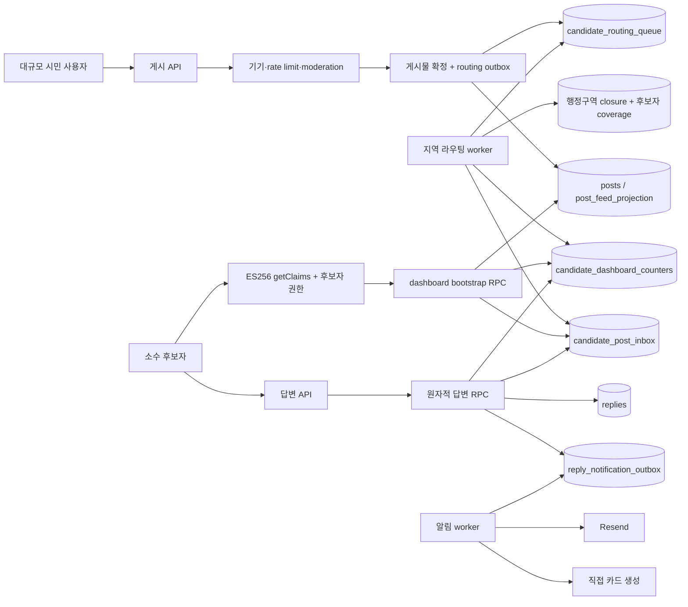
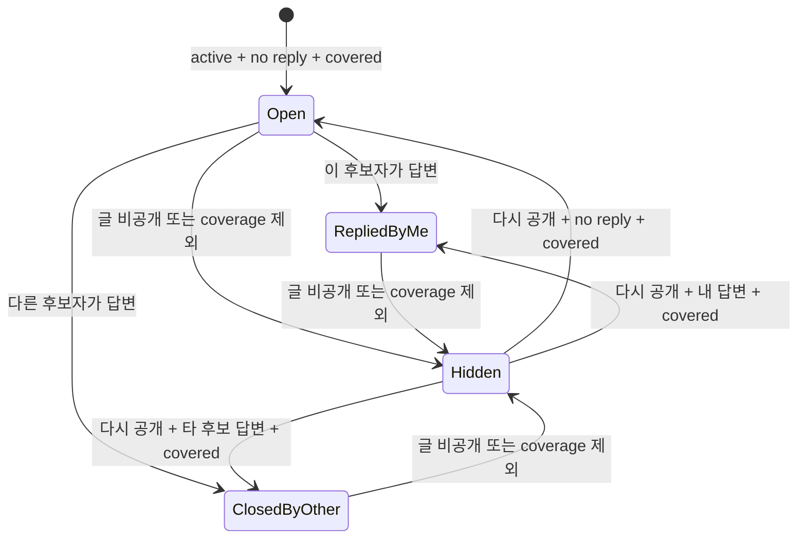
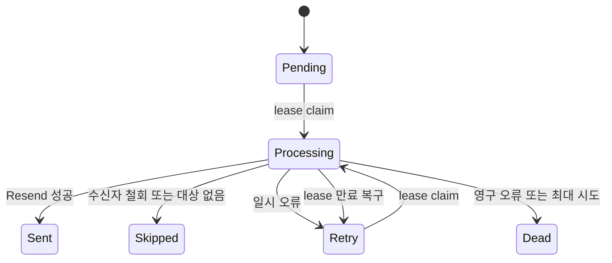

# 후보자 대시보드 대규모 트래픽 성능 개선 설계 및 구현 계획

문서 상태: **구현 기준안**  
작성 기준일: **2026-08-09**  
적용 범위: 후보자 인증, 후보자 대시보드, 지역별 글 배정, 후보자 답변, 답변 알림  
부하 전제: **대규모 시민 사용자와 상대적으로 소수인 후보자**

관련 문서:

- [어뷰징 방어 시스템 설계 및 구현 계획](./abuse-prevention-design-and-implementation-plan.md)
- [콘텐츠 안전·유해 표현 탐지 구현 설계 및 실행 계획](./content-moderation-implementation-plan.md)
- [위치 시스템 종합 보완 설계 및 구현 계획](./location-system-hardening-plan.md)

## 1. 결론

후보자 대시보드가 느린 원인은 현재 데이터베이스 자체의 처리 속도가 아니라 다음 네 가지가 겹친 결과다.

1. 대시보드의 답변 링크가 화면에 보이는 즉시 자동 prefetch되어, 한 번의 화면 진입이 여러 개의 인증·서버 렌더링·DB 요청으로 증폭된다.
2. 이미 인증되고 계정 단위 제한을 받는 후보자 저장 API가 매번 외부 BotID 검증까지 기다린다.
3. 후보자 경로마다 middleware와 페이지/API가 Supabase Auth를 중복 호출하고, 현재 프로젝트의 legacy 대칭 JWT는 로컬 서명 검증을 활용할 수 없다.
4. 대시보드 한 화면을 만들기 위해 후보자 조회, 글 목록, 통계, 첫 메시지를 여러 네트워크 호출로 나누고 있으며 지역명 부분검색과 실시간 전체 집계는 데이터가 커질수록 느려진다.

즉시 적용할 우선순위는 다음과 같다.

1. 동적 답변 링크에 `prefetch={false}`를 설정하고 해당 경로에 `loading.tsx`를 둔다.
2. 인증된 후보자 전용 쓰기 API에서 BotID를 제거하고, 후보자 인증·활성 상태·계정 rate limit·idempotency를 유지한다.
3. Supabase Auth signing key를 비대칭 ES256으로 전환하고 `getClaims()` 기반 검증으로 바꾼다.
4. 대시보드 초기 데이터를 하나의 제한된 bootstrap RPC로 합치고 Server Component 중심으로 재구성한다.

대규모 데이터에 대한 최종 구조는 다음과 같다.

- 지역 이름의 `LIKE '%지역명%'` 검색을 없애고 행정구역 코드와 후보자 관할 코드로만 연결한다.
- 시민 글 전체를 후보자 화면에서 매번 검색하지 않는다.
- 글이 공개되면 `candidate_routing_queue`를 통해 대상 후보자를 계산하고 `candidate_post_inbox`에 후보자별 projection을 만든다.
- 후보자 대시보드는 첫 20개 inbox 항목과 증분 집계만 조회한다.
- 후보자 답변과 알림 outbox 생성을 하나의 DB 트랜잭션으로 처리하고, 카드 생성·이메일 전송은 응답 이후 worker가 수행한다.

이 구조에서는 시민 글과 반응이 수천만 건으로 늘어도 후보자 대시보드 한 요청의 비용은 전체 데이터 크기가 아니라 **페이지 크기 20개와 후보자 한 명의 인덱스 범위**에 의해 결정된다.

## 2. 목표와 비목표

### 2-1. 목표

- 대규모 시민 트래픽이 후보자 화면의 지연이나 장애로 직접 전파되지 않게 한다.
- 소수 후보자 계정에 수많은 지역 글이 집중되는 many-to-few 부하를 안정적으로 처리한다.
- 후보자 한 명에게 수백만 개의 대상 글이 있어도 OFFSET이나 전체 집계 없이 일정한 비용으로 페이지를 조회한다.
- 후보자 답변 저장은 DB 확정까지만 기다리고 카드·이메일·Telegram 같은 외부 I/O를 기다리지 않는다.
- 지역 범위가 동, 시군구, 시도 중 어느 단위여도 후보자 관할과 정확하게 교차 판정한다.
- 인증, RLS, RPC 권한, 후보자 답변 권한을 성능 최적화 과정에서 약화하지 않는다.
- 단계별 배포, shadow 비교, 즉시 롤백이 가능하게 한다.

### 2-2. 비목표

- 시민 게시물 어뷰징·콘텐츠 moderation 정책을 이 문서에서 다시 정의하지 않는다.
- 후보자 답변 내용에 시민 게시물용 moderation을 새로 적용하지 않는다. 기존 확정 정책을 유지한다.
- 개인화 후보자 화면을 CDN에 공개 캐시하지 않는다.
- 초기부터 별도 검색 엔진, 유료 메시지 큐, 분산 캐시를 필수 구성으로 도입하지 않는다.
- 후보자 수가 시민 수와 비슷해지는 완전히 다른 제품 모델은 대상으로 삼지 않는다.

## 3. 용량 모델

정확한 가입자 예측값이 아직 없으므로 아래 수치는 사업 예측이 아니라 구현과 부하 테스트를 위한 검증 envelope다.

| 항목 | Scale A | Scale B 최종 검증 |
| --- | ---: | ---: |
| 일간 활성 시민 | 100,000 | 1,000,000 |
| 활성 시민 글 | 1,000,000 | 10,000,000 |
| 후보자 계정 | 100 | 1,000 |
| 동시 후보자 세션 | 활성 후보자 수 × 3 이하 | 활성 후보자 수 × 3 이하 |
| 시민 글 생성 peak | 20건/초 | 100건/초 |
| 공감·신고 등 engagement peak | 500건/초 | 3,000건/초 |
| 후보자 대시보드 요청 peak | 20건/초 | 100건/초 |
| 글당 대상 후보자 fan-out | 평균 5 이하 | p99 20 이하 |

핵심은 후보자 요청 수가 시민 요청 수보다 적어도 후보자 한 명의 데이터 범위는 매우 클 수 있다는 점이다. 따라서 단순히 “후보자가 적으니 괜찮다”고 판단해서는 안 된다.

후보자 계정 수는 선거 단위에 따라 바뀔 수 있으므로 동시 세션의 절대값을 고정하지 않는다. 부하 테스트와 운영 용량은 **활성 후보자 수 × 3**을 최대 동시 세션으로 계산한다. 이는 후보자 한 명이 최대 세 개의 기기·탭·중복 요청 흐름을 만드는 상황까지 포함한 상한이다.

fan-out p99가 20을 넘으면 잘못된 광역 관할 매핑이나 후보자 coverage 중복을 먼저 조사한다. 정상적인 제품 요구로 20을 지속적으로 넘을 때만 worker batch와 테이블 용량을 다시 산정한다.

## 4. 실측 기준선과 확인된 원인

### 4-1. 브라우저 실측

테스트 계정으로 Production 환경을 직접 측정한 결과다.

| 구간 | 실측 결과 |
| --- | --- |
| 첫 로그인 → 대시보드 | 3,335ms |
| 별도 warm 로그인 → 대시보드 | 1,245ms |
| 인증 상태 대시보드 전체 진입 5회 | 641~914ms, 중앙값 731ms |
| 대시보드 → 답변 작성 | 352~853ms, 중앙값 603ms |
| 답변 작성 → 대시보드 | 381~550ms, 중앙값 395ms |
| 첫 메시지 같은 값 PATCH | 3,259ms, 3,274ms |
| 로그아웃 | 474ms |
| Supabase Auth 직접 로그인 | 265.3ms |
| `getUser()` | 약 21~68ms |
| 후보자 REST 조회 | 약 46ms |
| 카드 cold render | 약 1,674ms |
| 카드 warm cache | 약 14~44ms |

운영 DB의 현재 데이터량은 작고 핵심 쿼리 실행 시간도 매우 짧았다.

| DB 작업 | 실측 결과 |
| --- | --- |
| 지역 글 목록 | 약 0.24~0.87ms |
| 후보자 통계 | 약 0.05~0.09ms |
| 후보자 조회 | 약 0.035ms |
| `consume_abuse_budget` 평균 / 최대 | 4.402ms / 26.599ms |

따라서 현재 체감 지연은 DB 계산 시간보다 요청 증폭, 외부 검증, 인증 round trip, 여러 REST/RPC 호출의 합이 더 큰 원인이다. 다만 현재 DB가 빠르다는 사실은 지역명 부분검색과 전체 집계가 대량 데이터에서도 안전하다는 의미가 아니다.

### 4-2. 답변 링크 자동 prefetch

격리된 로그인 한 번에서 다음 요청 흐름을 확인했다.

- 대시보드 시작: `22:20:47.164Z`
- 화면 준비: `22:20:48.409Z`
- 그 직후 `22:20:48.421Z`부터 `22:20:48.942Z` 사이에 서로 다른 `/candidate/reply/{id}` 요청 8개 발생
- 당시 화면에 보이는 답변 링크가 정확히 8개였고 사용자는 어느 링크도 누르지 않았다.

원인은 `src/components/candidate/candidate-dashboard-post-list.tsx`의 `Link`가 기본 prefetch 동작을 사용하는 것이다. 각 동적 답변 페이지는 middleware 인증, 페이지 인증, 후보자 조회, 게시물 조회를 다시 수행한다. 화면에 링크 8개가 보이면 약 0.5초 동안 최대 수십 개의 Auth·Supabase 요청이 투기적으로 발생할 수 있다. 스크롤하면 나머지 링크도 같은 문제를 일으킬 수 있다.

### 4-3. 후보자 저장 API의 BotID 대기

첫 메시지 저장은 브라우저에서 Vercel까지 약 254~268ms였지만 전체 응답은 약 3.26초였다. 인증, rate limit RPC, 실제 DB 변경보다 반복적으로 기다리는 외부 경계는 `checkBotId()`였다.

현재 다음 후보자 전용 요청이 BotID client protect와 server `checkBotId()`를 모두 사용한다.

- `POST /api/candidate/first-message`
- `PATCH /api/candidate/first-message`
- `POST /api/candidate/replies`

BotID는 익명 고가치 API에는 유효하지만, 이 세 경로는 이미 후보자 로그인, 활성 후보자 확인, 계정 rate limit을 통과해야 한다. 후보자 계정 탈취를 BotID가 해결하지도 못한다. 이 경로에서 BotID를 기다리는 비용이 방어 이득보다 크다.

### 4-4. 중복 인증과 legacy JWT

- `src/middleware.ts`는 모든 `/candidate/*` 요청에서 `getUser()`를 호출한다.
- 페이지와 API의 `getCandidateSession()`이 다시 `getUser()`를 호출하고 후보자 레코드를 조회한다.
- 확인 당시 Supabase JWKS 응답의 `keys`가 비어 있어 legacy 대칭 JWT를 사용 중인 것으로 판단된다.

Supabase의 `getClaims()`도 대칭 signing key에서는 Auth 서버에 검증 요청을 보낸다. 비대칭 signing key로 전환해야 JWKS를 이용한 빠른 로컬 서명 검증의 효과를 얻을 수 있다.

### 4-5. 분절된 bootstrap과 과도한 Client Component 경계

`src/app/candidate/dashboard/page.tsx`는 다음 과정을 거친다.

1. middleware Auth
2. 페이지 Auth
3. 후보자 REST 조회
4. 글 목록 RPC, 통계 RPC, 첫 메시지 REST 조회를 병렬 호출

병렬 호출은 순차 waterfall보다 낫지만 화면 하나에 필요한 데이터가 여러 네트워크 왕복으로 흩어져 있다. 또한 `src/components/candidate/dashboard-screen.tsx` 전체가 Client Component라 정적 헤더, 통계, 글 목록까지 hydration 대상이 된다. 현재 대시보드 첫 JavaScript 전달량은 약 172KB gzip으로 측정됐다.

### 4-6. 대량 데이터에서 깨지는 지역 조회와 통계

현재 `list_district_posts`와 `get_candidate_dashboard_stats`는 다음 조건을 사용한다.

```sql
p.administrative_dong_name like '%' || target_district || '%'
```

문제는 다음과 같다.

- 선행 `%`가 있는 부분검색은 일반 B-tree 지역 인덱스를 활용하기 어렵다.
- `서울`, `중구`처럼 중복되거나 큰 이름은 과도한 범위를 매칭한다.
- 동, 시군구, 시도의 상하위 관계를 문자열 포함 여부로 정확히 표현할 수 없다.
- 통계는 대시보드 진입마다 대상 게시물을 다시 집계한다.
- 후보자 한 명의 대상 글이 수백만 개가 되면 현재의 빠른 실행 시간은 유지되지 않는다.

### 4-7. 답변 응답이 카드와 이메일을 기다림

현재 `createCandidateReply()`는 답변 insert 후 알림 이메일 정보를 다시 조회하고 `sendReplyNotification()`을 기다린다. 이메일 함수는 다시 서비스 자신의 `/api/card/{uuid}`를 호출해 카드를 생성한 뒤 Resend를 기다린다.

현재 verified notification email이 없어 주요 지연으로 나타나지 않았지만, 사용자가 늘면 다음 문제가 발생한다.

- 카드 cold render와 이메일 provider 지연이 후보자 답변 저장 시간에 포함된다.
- 함수 timeout이나 provider 장애가 사용자 응답과 결합된다.
- 내부 self-HTTP가 불필요한 함수 호출과 네트워크 비용을 만든다.
- 실패 재시도와 중복 방지의 내구성 있는 상태가 없다.

## 5. 확정 설계 결정

| 영역 | 결정 |
| --- | --- |
| 후보자 Link | 동적·인증 답변 링크는 자동 prefetch하지 않는다. |
| 후보자 BotID | 인증된 후보자 전용 쓰기 API에서는 제거한다. 익명 시민 API에서는 기존 정책을 유지한다. |
| 인증 | Supabase 비대칭 ES256 signing key와 `getClaims()`를 사용한다. |
| 세션 권한 | middleware만 신뢰하지 않고 페이지/API의 서버 DAL이 후보자 권한을 다시 확인한다. |
| 대시보드 읽기 | Server Component에서 단일 bootstrap RPC를 직접 호출한다. |
| 지역 매칭 | 표시 이름이 아닌 정규화된 행정구역 코드와 closure/coverage 관계를 사용한다. |
| 대규모 후보자 조회 | 원본 게시물 전체검색 대신 후보자별 inbox projection을 사용한다. |
| 페이지네이션 | OFFSET을 사용하지 않고 복합 keyset cursor를 사용한다. |
| 통계 | 요청 시 전체 `count(*)` 대신 후보자별 증분 counter를 사용한다. |
| 후보자 답변 | 한 게시물에 답변 하나라는 현재 정책을 유지하고 DB RPC에서 원자적으로 경쟁을 해결한다. |
| 넓은 지역 routing | 동은 해당 동을 포함하는 모든 후보자, 시군구는 해당 지역의 기초·광역 후보자, 시도는 시도 전체를 대표하는 후보자에게만 배정한다. |
| 과거 게시글 | `candidate_inbox_start_at` 설정 이후의 활성 게시글만 신규·재가입 후보자 inbox에 backfill한다. 최초 값은 migration 적용 시각으로 둔다. |
| 기본 목록 | `답변 대기`를 기본으로 하고 `내가 답변한 글`을 분리한다. 다른 후보자가 답변한 글은 기본 목록에서 제외한다. |
| 후보자 MFA | 목록 열람은 일반 인증을 허용하되 답변·첫 메시지·계정 설정 등 모든 쓰기는 AAL2를 요구한다. |
| 알림 | DB transactional outbox + worker로 비동기 처리한다. |
| 캐시 | 개인화 페이지를 공개 캐시하지 않는다. DB projection으로 원본 조회 비용을 줄인다. |
| 새 유료 인프라 | 초기 구현에는 도입하지 않는다. Supabase DB와 기존 내부 worker 패턴을 재사용한다. |

## 6. 목표 아키텍처



중요한 격리 경계는 다음과 같다.

- 시민 게시 요청은 지역 fan-out, 카드 생성, 이메일을 기다리지 않는다.
- 후보자 대시보드는 원본 게시물의 전체 지역검색과 전체 통계를 실행하지 않는다.
- 후보자 답변 응답은 알림 provider를 기다리지 않는다.
- worker가 지연되면 새 글 표시나 이메일만 늦어지고 시민 게시·후보자 답변의 DB 확정은 계속 가능하다.

## 7. 요청·렌더링 구조 개선

### 7-1. 자동 prefetch 제거

`src/components/candidate/candidate-dashboard-post-list.tsx`의 답변 링크에 다음 정책을 적용한다.

```tsx
<Link href={href} prefetch={false}>
```

`/v/{uuid}` 같은 공개 상세 링크도 카드가 많고 서버 비용이 높다면 같은 방식으로 계측 후 결정한다. 이번 문제에서 반드시 끄는 대상은 인증과 DB 조회가 반복되는 `/candidate/reply/{postId}`다.

자동 prefetch를 끈 대신 사용자가 눌렀을 때 지연이 무반응처럼 보이지 않게 한다.

- `src/app/candidate/reply/[postId]/loading.tsx`에 즉시 표시되는 skeleton 추가
- 클릭된 row에 진행 상태 표시
- 중복 클릭 방지
- 10초 이상이면 재시도 안내, 사용자가 작성하던 내용은 유지

완료 조건은 사용자가 클릭하기 전에 `/candidate/reply/*` 요청이 **0건**인 것이다.

### 7-2. Server/Client Component 경계

대시보드 기본값은 Server Component로 바꾼다.

Server Component로 유지할 부분:

- 화면 shell과 배경
- 후보자 이름·지역 헤더
- 통계 카드
- 첫 페이지 글 목록
- 빈 상태와 pending 안내

Client Component로 격리할 부분:

- `CandidateLogoutButton`
- `CandidateFirstMessageEditor`
- 클릭 pending 표시가 필요한 작은 `CandidateReplyLink`
- 이후 cursor 페이지를 불러오는 `LoadMore` 또는 infinite-scroll controller

Server Component에서 Client Component로 넘기는 값은 문자열, 숫자, boolean, plain object/array만 사용한다. 날짜는 ISO 문자열로 직렬화한다.

### 7-3. loading과 error 경계

다음을 추가한다.

- `src/app/candidate/dashboard/loading.tsx`
- `src/app/candidate/dashboard/error.tsx`
- `src/app/candidate/reply/[postId]/loading.tsx`
- 필요 시 `src/app/candidate/reply/[postId]/error.tsx`

`error.tsx`에는 민감한 서버 오류를 노출하지 않고 request ID와 “다시 시도”만 제공한다.

## 8. 인증과 후보자 권한

### 8-1. ES256 전환

Supabase Dashboard의 Auth → Signing Keys에서 legacy JWT secret을 signing key 시스템으로 이관하고 ES256 비대칭 key를 current로 회전한다.

순서:

1. 현재 코드가 legacy secret을 직접 검증하는지 정적 검색한다.
2. standby ES256 key를 생성한다.
3. Preview에서 `getClaims()`와 로그인·refresh·로그아웃을 검증한다.
4. ES256을 current로 rotate한다.
5. access token TTL과 안전 여유를 기다린 뒤 legacy key를 revoke한다.
6. JWKS에 공개 key가 보이고 `getClaims()`가 Auth 서버 round trip 없이 동작하는지 timing으로 확인한다.

회전 중 기존 토큰과 새 토큰이 함께 유효한 기간을 둔다. 즉시 legacy key를 폐기해 사용자를 강제로 로그아웃시키지 않는다.

### 8-2. 후보자 principal DAL

`src/lib/auth/candidate-session.ts`를 다음 두 책임으로 나눈다.

- `verifyAuthClaims()`: `getClaims()`로 서명, 만료, issuer를 검증하고 `sub`를 반환
- `getCandidatePrincipal()`: 검증된 `sub`를 활성 후보자 레코드와 연결

React Server Component 렌더 한 번 안에서의 중복 호출만 `react.cache()`로 제거한다. 모듈 전역 Map이나 여러 사용자 사이에서 공유되는 무기한 캐시는 사용하지 않는다.

middleware의 역할:

- 세션 cookie refresh
- 명백히 비인증인 요청의 빠른 로그인 redirect
- 후보자 DB role 조회나 세부 권한 결정은 하지 않음

페이지/API의 역할:

- 검증된 claims를 다시 확인
- `auth_user_id`와 후보자 레코드 연결
- `is_active`, onboarding 상태, 요청 대상 게시물 권한 확인

middleware가 임의 헤더에 후보자 ID를 넣고 페이지가 이를 신뢰하는 방식은 사용하지 않는다. 사용자가 해당 헤더를 위조하거나 CDN 경계에서 혼동될 수 있기 때문이다.

### 8-3. 후보자 계정 보안

BotID 제거는 후보자 권한 검사를 제거한다는 뜻이 아니다. 다음 보호를 유지하거나 추가한다.

- 후보자 이메일 확인과 운영자 활성화
- 계정 단위 rate limit: 현재 10분 30회 정책 유지
- 후보자 쓰기 idempotency key
- 비활성·탈퇴·정지 후보자 즉시 차단
- 로그인 실패와 비정상 세션에 대한 Supabase Auth 보호 및 운영 알림
- 후보자 수가 적고 계정 가치가 높으므로 TOTP MFA를 후보자 운영 준비 완료 조건으로 추가
- 민감한 첫 메시지 변경은 AAL2 세션을 요구하고, 일반 답변은 정책에 따라 같은 세션을 사용

MFA 도입 전에도 성능 개선은 배포할 수 있지만 정식 대규모 공개 전에는 후보자 계정 탈취 대응 절차와 세션 강제 해제 절차를 운영 문서에 추가한다.

## 9. 행정구역과 후보자 coverage 모델

### 9-1. 원칙

- 이름은 표시용이다.
- 매칭, 인덱스, 권한 판단에는 코드만 사용한다.
- 게시물의 선택 단위가 동·시군구·시도 중 무엇인지 별도로 저장한다.
- 후보자 관할이 여러 동으로 구성된 선거구라면 여러 coverage row로 표현한다.
- 더 큰 단위로 작성한 글과 더 작은 후보자 관할이 겹치는 경우도 정확하게 연결한다.

### 9-2. 테이블

`administrative_areas`

| 컬럼 | 설명 |
| --- | --- |
| `code` | 정규화된 행정구역 코드 PK |
| `name` | 표시 이름 |
| `level` | `province`, `district`, `dong` |
| `parent_code` | 직계 상위 지역 코드 |
| `is_active` | 폐지·변경 지역 구분 |
| `version` | 행정구역 데이터 버전 |

`administrative_area_closure`

| 컬럼 | 설명 |
| --- | --- |
| `ancestor_code` | 상위 또는 자기 코드 |
| `descendant_code` | 하위 또는 자기 코드 |
| `depth` | 자기 자신 0, 아래로 갈수록 증가 |

PK는 `(ancestor_code, descendant_code)`로 두고 역방향 조회 인덱스도 둔다.

`candidate_coverage_areas`

| 컬럼 | 설명 |
| --- | --- |
| `candidate_id` | 후보자 FK |
| `area_code` | 후보자가 담당하는 코드 |
| `coverage_type` | 시도·시군구·선거구 구성동 등 운영 구분 |
| `coverage_version` | 매핑 데이터 버전 |
| `active_from`, `active_until` | 선거·재임 기간 경계 |

PK는 `(candidate_id, area_code, coverage_version)`로 둔다. 같은 선거구가 여러 동으로 구성되면 해당 동 코드를 각각 저장한다.

`parent_code`, `candidate_id`, `area_code`, `ancestor_code`, `descendant_code`처럼 FK나 join에 쓰이는 컬럼에는 PK와 별개로 필요한 역방향 인덱스를 모두 둔다. Postgres는 FK 컬럼의 인덱스를 자동으로 만들지 않으므로 migration 검증 스크립트에서 누락된 FK 인덱스를 검사한다.

`posts`에는 `location_area_code`를 추가한다. 기존 `administrative_dong_code`는 backfill 원천과 호환용으로 유지하고, 전환이 끝난 뒤 역할을 정리한다.

### 9-3. 범위 겹침 규칙

게시물의 `location_area_code`와 후보자 coverage는 다음 중 하나면 겹친다.

1. 게시물 지역이 후보자 coverage 지역의 상위 지역이다.
2. 후보자 coverage 지역이 게시물 지역의 상위 지역이다.
3. 두 코드가 같다.

이를 closure table의 ancestor/descendant 관계로 판정한다. 예를 들어 서울 전체로 작성한 글은 서울 아래 coverage를 가진 후보자에게 연결될 수 있고, 특정 동 글은 그 동을 포함하는 시군구 또는 여러 동 묶음 선거구 후보자에게 연결된다.

광역 글이 너무 많은 후보자에게 전달되는 것은 성능 문제가 아니라 제품 routing 정책 문제가 될 수 있다. 기본 정책은 지역이 겹치는 후보자 모두에게 전달하되, `location_scope=province`의 fan-out이 상한을 넘으면 별도의 광역 후보자 유형만 받도록 정책을 좁힌다. 그 결정은 이름 문자열 검색으로 우회하지 않고 coverage 규칙의 버전으로 관리한다.

### 9-4. 데이터 품질

- Kakao 역지오코딩 결과의 코드와 직접 검색 결과를 같은 canonical code로 정규화한다.
- 코드가 없는 legacy 글은 backfill 전까지 별도 `unmapped` 상태로 두고 이름 추정으로 자동 권한을 부여하지 않는다.
- coverage 변경은 `coverage_version`을 올리고 재라우팅 job을 생성한다.
- 매 배포에서 후보자별 coverage 0건, 비활성 코드, 중복 coverage를 검사한다.

## 10. 후보자 inbox projection

### 10-1. 필요한 이유

대규모 시민·소수 후보자 구조에서는 읽을 때마다 전체 posts에서 지역을 찾는 것보다 글이 공개될 때 대상 후보자를 한 번 계산해 두는 것이 유리하다. 후보자 화면이 열릴 때 계산하는 비용을 시민 글 확정 이후의 비동기 projection으로 옮긴다.

### 10-2. `candidate_routing_queue`

권장 컬럼:

```text
post_id              uuid primary key
reason               text
requested_version    bigint
processed_version    bigint
available_at         timestamptz
attempts             integer
locked_by            uuid null
locked_at            timestamptz null
last_error_code      text null
created_at           timestamptz
updated_at           timestamptz
```

게시물이 `active`가 되는 트랜잭션에서 queue row를 함께 upsert한다. 처음부터 허용된 글뿐 아니라 moderation 격리 후 공개되는 글도 같은 경로를 거친다. 게시물 삭제·숨김·지역 변경은 별도 reason으로 재라우팅한다.

동일 post의 연속 변경을 한 row로 합치되 변경을 잃지 않도록 enqueue마다 `requested_version`을 증가시킨다. worker는 claim 당시 version까지만 `processed_version`으로 기록한다. 처리 중 더 높은 version이 들어오면 `requested_version > processed_version`이 유지되어 다음 batch에서 다시 처리된다. 단순 `post_id` PK와 `completed_at`만 사용하는 방식은 처리 중 발생한 지역·상태 변경을 잃을 수 있으므로 사용하지 않는다.

claim 인덱스는 처리 완료 row를 제외하는 partial index로 작게 유지한다.

```text
(available_at, post_id)
where requested_version > processed_version
```

worker는 작은 batch를 `FOR UPDATE SKIP LOCKED`로 claim하고 다음을 한 트랜잭션에서 수행한다.

1. post의 canonical area와 상태 확인
2. closure와 candidate coverage로 대상 후보자 계산
3. `candidate_post_inbox` upsert
4. 더 이상 대상이 아닌 기존 inbox row 종료
5. counter delta 반영
6. claim한 version을 `processed_version`에 기록

worker는 같은 post를 반복 처리해도 결과가 같아야 한다. `post_id` queue PK와 inbox 복합 PK가 중복 fan-out을 막는다.

worker 트랜잭션 안에서는 외부 HTTP를 호출하지 않고 짧은 `statement_timeout`을 적용한다. 여러 후보자 inbox와 counter를 갱신할 때는 항상 `candidate_id` 오름차순으로 lock/update해 deadlock 가능성을 줄인다.

빠른 표시를 위해 게시 응답 후 `after()`에서 best-effort worker kick을 할 수 있지만, 이것은 내구성 보장이 아니다. DB에 남은 queue를 주기적으로 처리하는 scheduler가 source of truth다. routing은 순수 SQL이므로 Supabase Cron에서 private DB 함수를 직접 실행하는 방식을 우선한다.

### 10-3. `candidate_post_inbox`

권장 컬럼:

```text
candidate_id          uuid
coverage_version      integer
post_id               uuid
post_created_at       timestamptz
state                 text  -- open, replied_by_me, closed_by_other, hidden
state_rank            smallint generated  -- 0, 1, 2, 3
agree_count_snapshot  integer
reply_id              uuid null
routed_at             timestamptz
updated_at            timestamptz
primary key (candidate_id, coverage_version, post_id)
```

권장 인덱스:

```text
(candidate_id, coverage_version, agree_count_snapshot desc, post_created_at desc, post_id)
  where state = 'open'
(candidate_id, coverage_version, state_rank, agree_count_snapshot desc, post_created_at desc, post_id)
(post_id, candidate_id, coverage_version)
```

가장 빈번한 미답변 화면에는 작은 partial index를 사용하고, 답변 이력에는 별도 복합 인덱스를 사용한다. equality 조건인 `candidate_id`, `state`를 범위·정렬 컬럼보다 앞에 둔다. 실제 `EXPLAIN`에서 heap fetch가 병목이면 화면에 필요한 작은 projection 컬럼만 `INCLUDE`하는 covering index를 검토하되 본문처럼 큰 값을 index에 복제하지 않는다.

inbox에는 게시물 본문과 이메일을 복제하지 않는다. 첫 페이지의 최대 21개 post ID를 찾은 뒤 `post_feed_projection`과 한 번 join해 화면 필드만 반환한다.

후보자 목록 정렬은 다음 복합 키를 사용한다.

```text
state_rank asc,
agree_count_snapshot desc,
post_created_at desc,
post_id asc
```

cursor에는 같은 네 값을 모두 넣는다. `OFFSET`은 사용하지 않는다. 서버는 cursor 형식과 크기를 검증하고 후보자 ID는 cursor나 client body에서 받지 않는다.

### 10-4. 공감 수와 우선순위 갱신

공감 한 건마다 후보자 inbox 모든 row를 즉시 갱신하면 시민 engagement가 후보자 projection의 write amplification을 만든다. 다음 방식으로 제한한다.

- `candidate_priority_dirty_posts`를 `post_id` unique queue로 사용한다.
- 공감 변경은 같은 post에 대해 하나의 dirty marker로 합쳐진다.
- worker가 10~30초 단위로 최신 `agree_count`를 읽어 대상 inbox row를 한 번 갱신한다.
- 후보자 UI는 “공감 수는 수십 초 내 갱신될 수 있음”을 내부 운영 특성으로 허용한다.

정확한 공감 토글 결과와 공개 글 상세의 값은 기존 engagement source of truth를 유지한다. inbox의 값은 정렬용 snapshot이다.

### 10-5. 후보자별 증분 통계

`candidate_dashboard_counters` 권장 컬럼:

```text
candidate_id          uuid
coverage_version      integer
total_targeted        bigint
open_posts            bigint
replied_by_me         bigint
closed_by_other       bigint
updated_at            timestamptz
primary key (candidate_id, coverage_version)
```

counter는 routing과 reply 트랜잭션의 delta로 갱신한다. 음수가 되지 않도록 check와 update 조건을 둔다. 동일 event 재처리를 막기 위해 event key 또는 inbox state transition을 기준으로 idempotent하게 계산한다.

하루 한 번 또는 drift 경보 시 inbox를 기준으로 재집계하는 reconciliation job을 둔다. 차이가 발견되면 자동 교정하되 Telegram에는 후보자 ID, 차이 수, job ID만 보내고 본문이나 개인정보는 보내지 않는다.

현재 UI의 `total`, `replied`, `unreplied`, `reply_rate`는 전환 기간에 다음처럼 매핑한다.

- `total` = `total_targeted`
- `replied` = `replied_by_me`
- `unreplied` = `open_posts`
- `reply_rate` = `replied_by_me / (replied_by_me + open_posts)`

다른 후보자가 먼저 답한 `closed_by_other`는 후보자 개인 응답률의 분모에서 제외한다. 기존 전체 지역 통계와 의미가 달라지는 부분이므로 UI 레이블과 분석 이벤트 버전을 함께 바꾼다.

## 11. 단일 dashboard bootstrap

### 11-1. RPC 계약

서버 전용 `get_candidate_dashboard_bootstrap` RPC 하나가 다음을 반환한다.

```ts
type CandidateDashboardBootstrap = {
  candidate: {
    id: string;
    name: string;
    districtLabel: string;
    isActive: boolean;
  };
  onboarding: {
    hasFirstMessage: boolean;
    hasPendingFirstMessage: boolean;
  };
  firstMessage: { id: string; content: string } | null;
  stats: {
    totalTargeted: number;
    openPosts: number;
    repliedByMe: number;
    closedByOther: number;
    replyRate: number;
  };
  items: DashboardPost[];
  nextCursor: string | null;
  generatedAt: string;
};
```

입력은 검증된 Auth `sub`, page size, 선택적 cursor다. RPC 내부에서 `auth_user_id`로 후보자를 찾기 때문에 별도 candidate REST 조회가 필요 없다. page size는 기본 20, 최대 50으로 제한한다.

초기 전환 단계에서는 현재 posts 쿼리를 하나의 RPC로 묶을 수 있다. 최종 전환 후 같은 응답 계약을 유지한 채 내부 source를 `candidate_post_inbox`와 counter로 바꾼다.

### 11-2. 보안

- 함수는 `language sql stable`, 기본 `SECURITY INVOKER`를 사용한다.
- 공개 schema에 둘 경우 `public`, `anon`, `authenticated`의 execute를 revoke하고 `service_role`에만 grant한다.
- 브라우저 Supabase client가 이 RPC를 직접 호출하지 않는다.
- 서버 secret key를 Client Component, HTML, 로그에 노출하지 않는다.
- 모든 신규 테이블은 RLS를 켜고 `public`, `anon`, `authenticated` 직접 접근을 revoke한다.
- private worker용 `SECURITY DEFINER` 함수가 필요하면 노출되지 않는 private schema에 두고 owner와 `search_path`를 고정한다.

### 11-3. 캐시 정책

후보자 화면은 로그인 상태와 새 글이 중요하므로 기본은 `no-store`다. 후보자 수가 적다는 이유로 여러 사용자에게 공유되는 공개 캐시를 사용하지 않는다.

projection과 counter가 이미 조회 비용을 제한하므로 캐시가 필수는 아니다. 추후 동일 후보자의 새로고침이 과도하면 후보자 ID별 3~5초 private server cache를 별도 실험하되, 다음 조건을 만족할 때만 활성화한다.

- auth와 cache key가 분리됨
- 후보자 ID가 key에 포함됨
- 답변 후 즉시 invalidate됨
- 다른 후보자 데이터가 섞이지 않는 자동 테스트 존재

## 12. 후보자 쓰기 경로

### 12-1. BotID 제거 범위

다음 경로를 `src/instrumentation-client.ts`의 BotID protect 목록에서 제거한다.

- `POST /api/candidate/first-message`
- `PATCH /api/candidate/first-message`
- `POST /api/candidate/replies`

같은 route의 `getBotRejectionResponse()` 호출도 제거한다. 익명 게시, 공감, 신고 경로의 BotID는 그대로 유지한다.

롤아웃 중 재활성화가 필요하면 `CANDIDATE_BOTID_ENABLED` server flag를 사용할 수 있다. 기본값은 `false`이며 재활성화 시 client와 server의 check level이 반드시 같아야 한다.

### 12-2. 원자적 답변 RPC

`create_candidate_reply_atomic`은 한 DB 트랜잭션에서 다음을 수행한다.

1. 활성 후보자와 Auth 연결 확인
2. 후보자의 current `coverage_version`에 있는 `(candidate_id, post_id)` inbox row가 답변 가능한 상태인지 확인
3. 게시물이 active이고 아직 답변이 없는지 확인
4. candidate reply insert
5. responder inbox를 `replied_by_me`로 전환
6. 같은 post를 보던 다른 후보자 inbox를 `closed_by_other`로 전환
7. 후보자별 counter delta 반영
8. `reply_notification_outbox` insert
9. 생성된 reply와 공개 UUID 반환

`replies.post_id` unique constraint를 최종 경쟁 방어선으로 유지한다. 두 후보자가 동시에 답하면 한 명만 성공하고 다른 요청은 일반 500이 아니라 `409 ALREADY_REPLIED`를 받는다.

후보자 ID는 client body를 신뢰하지 않고 인증된 principal에서 가져온다.

### 12-3. idempotency

후보자 답변과 첫 메시지 변경 요청에는 `clientRequestId`를 추가한다.

- 후보자별 unique `(candidate_id, client_request_id)`
- 같은 key와 같은 payload는 기존 성공 결과 반환
- 같은 key와 다른 payload는 `409 IDEMPOTENCY_CONFLICT`
- 네트워크 timeout 후 재시도가 중복 답변이나 모호한 실패를 만들지 않게 함

## 13. 답변 알림 outbox

### 13-1. 테이블

`reply_notification_outbox` 권장 컬럼:

```text
id                    bigint generated identity primary key
reply_id              uuid unique
post_id               uuid
status                text  -- pending, processing, sent, failed, dead
attempts              integer
next_attempt_at       timestamptz
locked_at             timestamptz null
last_error_code       text null
created_at            timestamptz
sent_at               timestamptz null
```

claim용으로 `(next_attempt_at, id) where status in ('pending', 'failed')` partial index를 둔다. `reply_id`와 `post_id` FK의 인덱스도 명시적으로 확인한다.

수신 이메일 원문은 outbox에 복제하지 않는다. worker 처리 시 현재 게시물에서 `notification_email_verified_at`이 유효한 수신자만 읽는다. 사용자가 이메일을 철회했으면 발송하지 않고 `skipped_recipient_unavailable`로 종료한다.

### 13-2. worker

worker는 다음 순서로 처리한다.

1. `FOR UPDATE SKIP LOCKED`로 batch claim
2. 현재 verified email과 게시물·답변 정보 로드
3. `src/lib/card/generate.ts`의 카드 생성 함수를 직접 호출
4. Resend 전송
5. 성공 상태 기록
6. 실패 시 지수 backoff와 jitter 적용
7. 최대 시도 초과 시 `dead` 전환과 Telegram 운영 알림

DB claim과 상태 변경 트랜잭션은 짧게 끝내고 카드 생성·Resend HTTP 호출 중에는 row lock을 잡고 있지 않는다. `processing`과 `locked_at` lease를 먼저 commit한 다음 외부 작업을 수행하고, lease 만료 row는 안전하게 다시 claim할 수 있게 한다.

서비스 자신의 `/api/card/{uuid}`를 다시 호출하지 않는다. 공개 카드 route와 worker가 같은 pure generation 함수를 사용한다.

권장 초기 retry는 1분, 5분, 30분, 2시간, 12시간이며 provider의 `Retry-After`가 있으면 우선한다. `reply_id` unique와 provider idempotency 기능을 함께 사용해 중복 발송을 줄인다.

답변 API는 reply와 outbox가 commit되는 즉시 성공을 반환한다. 이메일 전송 성공 여부는 후보자 응답의 성공 여부를 바꾸지 않는다.

## 14. 대규모 시민 트래픽과의 격리

### 14-1. 시민 쓰기

시민 게시 처리의 동기 경로에는 다음만 남긴다.

- 요청 검증
- 기기·rate budget
- 확정된 moderation fast path 또는 격리 저장
- 게시물과 routing outbox의 원자적 기록

후보자 fan-out, 통계, 카드, 이메일은 기다리지 않는다. 기존 moderation 외부 provider와 후보자 routing worker는 queue와 동시성 limit을 분리해 한쪽 backlog가 다른 쪽을 막지 않게 한다.

### 14-2. candidate hot key

후보자가 적으면 특정 `candidate_id` 하나에 쓰기와 읽기가 집중될 수 있다.

- inbox의 첫 인덱스 컬럼을 `candidate_id`로 둔다.
- counter는 후보자별 한 row라 update 경합이 생길 수 있으므로 routing batch 하나당 후보자별 delta를 합쳐 한 번만 update한다.
- priority update도 같은 post의 여러 engagement를 coalesce한다.
- 후보자 bootstrap은 20개만 읽고 전체 `count(*)`를 하지 않는다.
- 같은 후보자의 무한 새로고침은 계정 단위 read budget과 짧은 UI debounce로 완화하되 정상 사용을 막지 않는다.

### 14-3. backpressure

worker는 queue 깊이에 따라 batch를 늘리되 한 invocation의 최대 처리 시간과 DB row 수를 제한한다.

- routing backlog가 60초를 넘으면 경고
- 5분을 넘으면 Telegram critical 알림
- 후보자 화면에는 “새 글 반영이 지연되고 있습니다” 상태를 표시할 수 있음
- worker 실패 시 시민 게시를 실패시키지 않음
- DB saturation 시 priority refresh보다 신규 routing과 답변 notification을 우선

### 14-4. 파티셔닝과 별도 인프라 전환 기준

초기에는 복합 B-tree와 batch 처리로 시작한다. 다음 중 하나가 지속될 때만 inbox 파티셔닝을 설계한다.

- `candidate_post_inbox` 1억 row 초과
- index 크기와 vacuum 시간이 운영 window를 반복적으로 초과
- 후보자 한 명의 첫 페이지 indexed query p95가 DB 내부 50ms 초과
- backfill이나 삭제가 autovacuum을 장시간 방해

별도 Redis/queue/search 도입 기준:

- durable DB outbox의 backlog SLO를 수직 확장과 batch 조정으로 지킬 수 없음
- Postgres write IOPS의 20% 이상을 projection worker가 지속 사용
- candidate priority 검색 요구가 단순 정렬을 넘어 전문 검색·복합 facet으로 확장

그 전에는 새 운영 시스템을 추가하지 않는다.

대규모 backfill이나 coverage 재계산 뒤에는 대상 테이블과 핵심 정렬 컬럼을 `ANALYZE`해 planner 통계를 갱신한다. inbox·outbox처럼 churn이 큰 테이블은 dead tuple, 마지막 autovacuum/analyze, vacuum 진행 상황을 관측하고 실제 churn 비율에 맞춰 테이블별 autovacuum threshold를 조정한다.

## 15. 관측과 SLO

### 15-1. 구조화 timing

다음 phase timing을 서버 로그와 APM에 기록한다.

```text
candidate_session:
  claims_ms, candidate_lookup_ms, total_ms

candidate_dashboard:
  bootstrap_rpc_ms, item_count, has_more, total_ms

candidate_write:
  auth_ms, rate_limit_ms, mutation_ms, outbox_ms, total_ms

routing_worker:
  claimed, routed_posts, inbox_rows, fanout_avg, fanout_p99, failed, backlog_age_ms

notification_worker:
  claimed, card_ms, email_ms, attempts, sent, failed, dead
```

기록하지 않을 값:

- 게시물·답변 본문
- 이메일 주소
- access/refresh token
- 정확한 GPS 좌표
- secret 또는 암호화 원문

request ID와 Vercel `x-vercel-id`를 연결하고 candidate ID는 운영상 필요할 때 HMAC 형태로 로그한다.

### 15-2. 성능 목표

| 항목 | 목표 |
| --- | --- |
| 클릭 전 답변 페이지 자동 요청 | 0건 |
| 인증 상태 대시보드 server response | p50 400ms 이하, p95 800ms 이하 |
| 대시보드 → 답변 화면 | p95 800ms 이하, 즉시 loading 표시 |
| 첫 메시지 저장 | p50 500ms 이하, p95 900ms 이하 |
| 후보자 답변 DB 확정 응답 | p95 1초 이하 |
| 후보자 inbox indexed DB query | p95 50ms 이하 |
| 새 공개 글의 inbox 반영 | p95 15초 이하, p99 60초 이하 |
| 답변 이메일 | p95 5분 이하, 실패는 재시도 |
| routing/notification outbox 유실 | 0건 |

이 수치는 서울과 같은 넓은 범위 후보자, 20개 첫 페이지, Scale B 데이터셋에서 검증한다.

### 15-3. 알림

- 대시보드 p95 800ms 초과 15분 지속
- 후보자 저장 p95 900ms 초과
- routing backlog oldest 60초/5분 경고·critical
- notification dead letter 1건 이상
- counter reconciliation drift 1건 이상
- candidate routing fan-out p99 20 초과
- ES256 전환 후 Auth 오류율 기준선 대비 2배
- 특정 후보자 409/429 급증 또는 비정상 로그인 증가

기존 Telegram 모니터링 채널을 사용하고 개인정보와 본문은 보내지 않는다.

## 16. 구현 계획

### WP0. 기준선과 회귀 측정

작업:

- 현재 실측 수치를 `scripts` 기반 반복 측정으로 고정
- Vercel 로그에서 자동 reply prefetch 개수를 계산
- 후보자 API phase timing 추가
- DB `EXPLAIN (ANALYZE, BUFFERS)` 저장 형식 마련
- 테스트 계정 작업 전후 posts/replies count 검증

완료 조건:

- 동일 계정·동일 네트워크에서 5회 이상 반복 가능한 baseline 존재
- 로그에 본문·이메일·token이 없음

### WP1. 즉시 지연 제거

변경 대상:

- `src/components/candidate/candidate-dashboard-post-list.tsx`
- `src/instrumentation-client.ts`
- `src/app/api/candidate/first-message/route.ts`
- `src/app/api/candidate/replies/route.ts`
- `src/app/candidate/dashboard/loading.tsx`
- `src/app/candidate/reply/[postId]/loading.tsx`

작업:

- 답변 Link `prefetch={false}`
- 후보자 전용 BotID client/server guard 제거
- loading skeleton과 클릭 pending UI
- 인증·rate limit은 그대로 유지

완료 조건:

- 클릭 전 reply route 요청 0건
- 동일 값 PATCH p95 900ms 이하
- 익명 API BotID 회귀 없음

롤백:

- Link 속성은 단일 revert 가능
- candidate BotID는 server flag로 일시 재활성화 가능

### WP2. Auth hot path 개선

외부 준비:

- Supabase Auth signing key ES256 migration

코드 작업:

- `getUser()`를 `getClaims()` 기반 검증으로 전환
- `verifyAuthClaims`와 `getCandidatePrincipal` 분리
- RSC render 단위 `react.cache()` 적용
- legacy/ES256 token 전환 테스트
- 후보자 MFA 운영 준비

완료 조건:

- JWKS 공개 key 확인
- Auth 서버 장애 주입 시 유효한 cached JWKS 토큰 검증 경로 확인
- 로그인, refresh, 만료, 로그아웃, 비활성 후보자 테스트 통과

롤백:

- Supabase signing key를 이전 상태로 되돌릴 수 있는 window 유지
- legacy key revoke는 soak 이후 수행

### WP3. bootstrap RPC와 RSC 분리

DB 작업은 `supabase migration new`로 실제 migration 이름을 생성한 뒤 수행한다.

작업:

- 현재 데이터 source를 사용하는 `get_candidate_dashboard_bootstrap` v1 추가
- execute 권한을 service role로 제한
- page size 20, max 50, keyset cursor 계약 추가
- `DashboardScreen`의 정적 영역을 Server Component로 이동
- 로그아웃·첫 메시지 편집·load more만 Client Component로 분리
- 기존 여러 REST/RPC 호출을 단일 bootstrap으로 교체

완료 조건:

- 대시보드 한 번에 Auth 이후 데이터 요청 1회
- 기존 화면과 first page ID·통계 parity
- Client JavaScript 크기 감소 확인

롤백:

- `CANDIDATE_DASHBOARD_BOOTSTRAP_V2` flag로 구 경로를 한 배포 동안 유지
- 안정화 후 영구 dual path는 제거

### WP4. 행정구역 정규화와 coverage

작업:

- `administrative_areas`, closure, `candidate_coverage_areas` 생성
- `posts.location_area_code` additive 추가
- Kakao/직접검색 결과의 canonical code adapter 구현
- 기존 글 batch backfill
- 현재 후보자 district와 선거구 JSON을 coverage row로 생성
- 후보자별 coverage 검증 리포트 생성
- 신규 FK와 인덱스는 online-safe 순서로 추가하고 constraint validation을 분리

완료 조건:

- active 게시물 mapping 100% 또는 명시적 `unmapped` 목록 0건
- 후보자 coverage 0건 0명
- 동·시군구·시도 테스트 매트릭스 통과
- 이름이 같은 다른 시도의 지역이 섞이지 않음

롤백:

- 기존 이름 필드를 표시용으로 유지
- read 전환 전까지 additive schema만 배포

### WP5. routing outbox와 candidate inbox

작업:

- `candidate_routing_queue`, `candidate_post_inbox`, counter, dirty priority queue 생성
- RLS·revoke·service role 권한 설정
- private batch claim/process 함수 구현
- 신규 공개 글과 moderation 공개 전환에서 outbox insert
- 기존 글 batch backfill
- 기존 지역 쿼리와 inbox 결과를 shadow 비교
- cursor pagination 구현
- counter reconciliation job과 Telegram drift 알림 구현

backfill 규칙:

- PK 범위 또는 created_at + id keyset batch
- 매 batch 후 짧은 pause와 DB 부하 확인
- `OFFSET` 금지
- production write와 충돌하지 않게 batch 자동 축소
- 재실행 가능하고 처리 위치를 기록
- insert는 row별 왕복이 아니라 multi-row batch 또는 안전한 bulk load를 사용
- 큰 backfill batch가 끝날 때 핵심 테이블 `ANALYZE`

완료 조건:

- Scale B에서 첫 페이지 DB p95 50ms 이하
- shadow first-page post ID parity 99.9% 이상, 나머지 차이는 설명 가능한 정책 차이
- 새 글 p95 15초 내 반영
- 같은 outbox 재처리 시 중복 row/counter drift 없음

롤백:

- inbox read flag를 끄고 bootstrap v1로 복귀
- outbox dual-write는 유지해 재전환 데이터 손실 방지

### WP6. 원자적 답변과 알림 outbox

작업:

- `create_candidate_reply_atomic` RPC
- 후보자 write idempotency
- `reply_notification_outbox`
- claim/retry/dead-letter worker
- 카드 pure generation 직접 호출
- 기존 self-HTTP와 동기 Resend 제거
- worker 인증에 기존 `CRON_SECRET` timing-safe 패턴 재사용

완료 조건:

- 두 후보자 동시 답변에서 정확히 한 건만 성공
- reply commit과 outbox insert가 항상 함께 성공/실패
- worker 재실행에도 이메일 중복 없음
- Resend 장애 중 답변 API p95 유지

롤백:

- 이메일 worker를 정지해도 답변 데이터는 안전
- outbox row를 보존한 채 worker만 이전 버전으로 되돌림

### WP7. 우선순위 projection과 대규모 검증

작업:

- engagement dirty coalescing
- priority snapshot worker
- Scale A/B seed 생성
- k6 또는 동급 도구로 public write + candidate read 혼합 부하
- 후보자 hot-key, broad province post, worker backlog, email provider 장애 테스트
- 인덱스·autovacuum·DB CPU/IO 관찰
- SLO dashboard와 Telegram alert 연결

완료 조건:

- Scale B 목표 충족
- public write와 candidate dashboard 혼합 부하에서 오류율 0.1% 미만
- projection worker가 지연돼도 동기 API SLO 유지
- rollback rehearsal 완료

### WP8. 구 경로 제거

최소 7일 soak 후 수행한다.

- `LIKE '%district%'` 후보자 조회 제거
- 구 dashboard stats RPC 제거
- 사용하지 않는 repository 함수 제거
- 임시 feature flag와 dual-read 로그 제거
- 문서와 운영 runbook을 최종 구조에 맞게 갱신

destructive migration은 별도 배포로 분리하고 삭제 전 usage log가 0인지 확인한다.

## 17. 테스트 전략

### 17-1. 단위·정적 테스트

- 후보자 reply Link가 `prefetch={false}`인지 검증
- 후보자 API가 BotID 보호 목록과 server guard에 포함되지 않는지 architecture guard 추가
- 익명 API BotID 보호는 그대로인지 검증
- cursor encode/decode, 최대 길이, 변조·잘못된 값 검증
- 행정구역 ancestor/descendant/동일 코드 매칭
- 동·시군구·시도 broad-scope fan-out
- idempotency same payload/different payload
- 이메일 retry와 dead-letter 계산

### 17-2. DB 통합 테스트

- bootstrap v1과 기존 세 쿼리의 결과 parity
- inbox PK와 outbox 재처리 idempotency
- reply 경쟁과 `409 ALREADY_REPLIED`
- 답변 시 responder/other candidate inbox 상태와 counter delta
- hidden/quarantined/deleted 상태 전환 시 inbox 제외
- counter reconciliation과 자동 교정
- RLS, revoke, RPC execute 권한
- anon/authenticated가 신규 테이블과 RPC를 직접 읽거나 쓸 수 없음

### 17-3. 실행계획 테스트

1백만, 1천만 게시물 synthetic dataset에서 다음을 확인한다.

- 후보자 첫 페이지가 `candidate_id` 선두 복합 인덱스를 사용
- region name sequential scan 없음
- dashboard request 중 원본 posts 전체 count 없음
- cursor 다음 페이지에 OFFSET 없음
- broad-area routing은 closure 인덱스를 사용
- worker batch lock이 일반 게시·답변 트랜잭션을 장시간 막지 않음

실행계획은 row estimate 오차, actual time, shared hit/read blocks까지 저장한다.

### 17-4. E2E

- 로그인 → 대시보드
- 대시보드에서 아무것도 누르지 않고 5초 대기: reply route 0건
- 답변 클릭 → loading → 작성 화면
- 답변 저장 → 즉시 상세 이동, 이메일은 비동기
- 첫 메시지 수정과 격리 상태
- 세션 만료·로그아웃·비활성 후보자
- worker backlog 중 새 글 지연 안내
- 모바일 Safari/Chrome에서 navigation과 작성 내용 보존

### 17-5. 부하·장애 주입

- 시민 글 100건/초와 engagement 3,000건/초를 함께 발생
- 특정 후보자 한 명에게 전체 후보자 read의 80% 집중
- province 글 연속 생성으로 fan-out 상한 검증
- routing worker 5분 중지 후 catch-up
- Resend timeout/429/5xx
- Supabase Auth 지연과 JWKS cache
- DB transaction deadlock·timeout 재시도
- 배포 중 구 버전과 신 버전 동시 요청

## 18. 배포 순서와 gate

```mermaid
flowchart LR
  wp0["WP0 측정"] --> wp1["WP1 prefetch·BotID"]
  wp1 --> wp2["WP2 ES256 Auth"]
  wp2 --> wp3["WP3 bootstrap·RSC"]
  wp3 --> wp4["WP4 지역 코드·coverage"]
  wp4 --> wp5["WP5 inbox projection"]
  wp5 --> wp6["WP6 답변·알림 outbox"]
  wp6 --> wp7["WP7 Scale B 검증"]
  wp7 --> soak["7일 soak"]
  soak --> wp8["WP8 구 경로 제거"]
```



각 WP는 다음 gate를 통과해야 다음 단계로 이동한다.

1. typecheck, unit, integration, build 통과
2. Preview E2E 통과
3. Production 소량 전환 또는 단일 후보자 canary
4. SLO와 오류율 확인
5. rollback 동작 확인
6. 다음 단계 진행

DB schema는 반드시 additive → backfill → dual-read/shadow → read switch → soak → cleanup 순서로 바꾼다.

## 19. 파일별 예상 변경 지도

| 경로 | 변경 |
| --- | --- |
| `src/components/candidate/candidate-dashboard-post-list.tsx` | prefetch 제거, 작은 pending client 경계 |
| `src/components/candidate/dashboard-screen.tsx` | Server Component 중심 분리 |
| `src/app/candidate/dashboard/page.tsx` | 단일 bootstrap 사용 |
| `src/app/candidate/dashboard/loading.tsx` | 신규 skeleton |
| `src/app/candidate/reply/[postId]/loading.tsx` | 신규 skeleton |
| `src/lib/auth/candidate-session.ts` | claims/principal DAL 분리 |
| `src/middleware.ts` | ES256 claims 기반 최소 인증·cookie refresh |
| `src/instrumentation-client.ts` | 후보자 BotID 경로 제거 |
| `src/app/api/candidate/first-message/route.ts` | BotID 제거, idempotency, timing |
| `src/app/api/candidate/replies/route.ts` | BotID 제거, 원자적 RPC, timing |
| `src/lib/posts/repository/candidate-lookups.ts` | bootstrap/inbox repository로 교체 |
| `src/lib/candidates/mutations.ts` | 동기 이메일 제거, atomic reply 사용 |
| `src/lib/email/send-reply-notification.ts` | pure worker 호출 구조로 변경 |
| `src/lib/card/generate.ts` | 공개 route·worker 공용 pure generation 확인 |
| `src/app/api/internal/reply-notifications/worker/route.ts` | signed worker 신규 |
| `scripts/check-architecture-rules.mjs` | prefetch/BotID/RPC 경계 guard |
| `scripts/run-api-smoke-tests.mjs` | 후보자·worker 비인증 smoke test |
| `supabase/migrations/*` | bootstrap, area, coverage, inbox, counters, outbox, 권한 |

실제 migration 파일명은 계획 문서에서 임의 timestamp를 만들지 않고 작업 시 `supabase migration new`로 생성한다.

## 20. 위험과 대응

| 위험 | 대응 |
| --- | --- |
| 잘못된 행정구역 mapping | 이름 fallback 금지, versioned coverage, shadow 결과 비교, 후보자별 audit 리포트 |
| broad location fan-out 폭증 | fan-out 지표·상한 경보, 광역 후보자 유형 정책 분리 |
| inbox 반영 지연 | durable outbox, scheduler, backlog SLO, UI 지연 상태 |
| counter drift | idempotent transition, reconciliation, Telegram alert |
| 후보자 hot row 경합 | batch delta 집계, priority update coalescing, 전체 count 제거 |
| BotID 제거 후 자동화 | 검증된 후보자 계정, 활성 상태, account rate limit, idempotency, MFA, 이상 로그인 알림 |
| ES256 회전 오류 | Preview 검증, dual-key window, legacy revoke 지연, rollback 가능 상태 유지 |
| 이메일 provider 장애 | 답변과 분리, retry/backoff/dead letter, 본문 미포함 알림 |
| 개인정보 복제 | inbox/outbox에 본문·이메일 미복제, server-only join, 90일 정책 준수 |
| feature flag 장기 방치 | 각 WP soak 종료 후 flag와 구 경로 제거 작업을 Definition of Done에 포함 |
| 대량 backfill DB 부하 | keyset batch, 자동 throttle, 재실행 가능 checkpoint, peak 시간 회피 |

## 21. 운영 준비물

코드만으로 끝나지 않는 준비는 다음 세 가지다.

1. Supabase Auth signing key ES256 전환 권한과 rollback 담당자
2. 후보자별 canonical coverage code 데이터와 검증 책임자
3. routing·notification worker scheduler와 Telegram 경보 확인

추가 유료 서비스 결제는 초기 구현에 필요하지 않다. 현재 Supabase, Vercel, Resend, 기존 Telegram 모니터링을 사용한다. 다만 Scale B 부하 테스트 결과 DB compute나 Resend 전송량이 현재 plan 한계를 넘으면 실제 사용량을 근거로 별도 증설 결정을 한다.

## 22. 최종 완료 기준

- 사용자가 클릭하기 전 답변 route 자동 요청이 없다.
- 인증된 후보자 저장 API가 BotID 외부 판정을 기다리지 않는다.
- 비대칭 JWT와 `getClaims()` 기반 인증이 배포되어 있다.
- 대시보드가 Auth 이후 하나의 bounded bootstrap 호출로 렌더된다.
- 후보자 화면의 정적 부분이 Server Component다.
- 지역 조회와 후보자 권한이 이름 부분검색에 의존하지 않는다.
- 동·시군구·시도 게시물을 versioned coverage로 정확히 라우팅한다.
- 후보자 inbox와 counter가 대량 posts 전체검색을 대체한다.
- 목록은 최대 20개 기본·50개 상한의 keyset pagination을 사용한다.
- 답변과 알림 outbox가 한 트랜잭션으로 저장된다.
- 카드·이메일이 후보자 응답 이후 worker에서 처리된다.
- 모든 신규 테이블에 RLS와 명시적 권한 제한이 있다.
- Scale B 혼합 부하에서 정의한 SLO와 오류율을 만족한다.
- routing backlog, dead letter, counter drift, Auth 오류를 Telegram에서 감지할 수 있다.
- rollback rehearsal와 7일 soak 후 구 RPC·LIKE 조회·임시 flag가 제거됐다.

## 23. 구체 구현 명세

이 절은 앞선 설계를 실제 migration, repository, Route Handler, worker 작업으로 옮길 때 사용하는 기준안이다. SQL은 migration 작성 전 검증할 초안이며 실제 파일은 Supabase CLI로 생성한다.

### 23-1. 릴리스 단위와 최종 요청 수

최종 대시보드 진입의 서버 요청 흐름은 다음 두 번의 외부 왕복으로 제한한다.

```text
1. Supabase Auth/JWKS claims 검증
2. PostgREST RPC get_candidate_dashboard_bootstrap
```

middleware와 RSC가 각각 claims를 검증할 수는 있지만 ES256 전환 후에는 JWKS cache를 사용하는 로컬 검증이므로 Auth 서버 네트워크 왕복을 반복하지 않는다. 후보자 레코드, 첫 메시지, 통계, 첫 페이지는 bootstrap RPC 하나에서 반환한다.

사용자 클릭 전 허용되는 후보자 route 요청:

```text
/candidate/dashboard       1
/candidate/reply/*         0
/api/candidate/*           0
```

사용자가 답변 링크를 누른 뒤에는 reply target RPC 한 번만 추가한다. initial dashboard RSC가 자신의 `/api` Route Handler를 self-fetch하지 않고 repository에서 Supabase RPC를 직접 호출한다.

claims DAL 초안:

```ts
// verified-claims.ts
import { cache } from "react";
import { createClient } from "../server";

export type VerifiedClaims = {
  sub: string;
  aal: "aal1" | "aal2";
  sessionId: string | null;
};

export async function verifyAuthClaims(): Promise<VerifiedClaims | null> {
  const supabase = await createClient();
  const { data, error } = await supabase.auth.getClaims();
  const claims = data?.claims;

  if (error || !claims || typeof claims.sub !== "string") return null;

  return {
    sub: claims.sub,
    aal: claims.aal === "aal2" ? "aal2" : "aal1",
    sessionId: typeof claims.session_id === "string" ? claims.session_id : null,
  };
}

// RSC 렌더 안에서만 dedupe. Route Handler는 verifyAuthClaims를 직접 호출한다.
export const getCachedVerifiedClaims = cache(verifyAuthClaims);
```

실제 Supabase JWT의 AAL·session claim 이름은 ES256 Preview 전환 시 발급 토큰과 공식 타입으로 확인한다. `user_metadata`는 후보자 권한 판단에 절대 사용하지 않는다. dashboard와 atomic RPC는 검증된 `sub`를 `candidates.auth_user_id`에 연결한다.

### 23-2. 데이터베이스 DDL 초안

#### 행정구역

행정구역 코드는 provider 문자열을 그대로 쓰지 않고 서비스 canonical code로 변환한다. 초기 canonical 값은 Kakao 행정구역 코드이며 코드 길이나 숫자 형식을 DB check로 과도하게 고정하지 않는다. 행정구역 개편을 고려해 opaque text key로 취급한다.

```sql
create table public.administrative_areas (
  code text primary key,
  name text not null,
  level text not null
    check (level in ('province', 'district', 'dong')),
  parent_code text null
    references public.administrative_areas(code) on delete restrict,
  is_active boolean not null default true,
  data_version integer not null,
  valid_from date null,
  valid_until date null,
  created_at timestamptz not null default now(),
  updated_at timestamptz not null default now(),
  check (code <> ''),
  check (parent_code is null or parent_code <> code),
  check (valid_until is null or valid_from is null or valid_until >= valid_from)
);

create index idx_administrative_areas_parent
  on public.administrative_areas (parent_code, code)
  where parent_code is not null;

create table public.administrative_area_closure (
  ancestor_code text not null
    references public.administrative_areas(code) on delete cascade,
  descendant_code text not null
    references public.administrative_areas(code) on delete cascade,
  depth smallint not null check (depth >= 0),
  primary key (ancestor_code, descendant_code),
  check ((depth = 0) = (ancestor_code = descendant_code))
);

create index idx_administrative_area_closure_descendant
  on public.administrative_area_closure (descendant_code, ancestor_code);
```

closure table에는 각 지역의 자기 자신 `(code, code, 0)`도 반드시 저장한다. 따라서 동일 코드, 상위→하위, 하위→상위를 같은 구조로 처리할 수 있다.

#### 후보자 coverage

```sql
alter table public.candidates
  add column coverage_version integer not null default 1,
  add column primary_area_code text null;

alter table public.candidates
  add constraint candidates_primary_area_code_fkey
  foreign key (primary_area_code)
  references public.administrative_areas(code)
  not valid;

create table public.candidate_coverage_areas (
  id bigint generated always as identity primary key,
  candidate_id uuid not null
    references public.candidates(id) on delete cascade,
  area_code text not null
    references public.administrative_areas(code) on delete restrict,
  coverage_version integer not null check (coverage_version > 0),
  coverage_type text not null
    check (coverage_type in (
      'province',
      'district',
      'election_district_member',
      'manual_override'
    )),
  source text not null,
  active_from timestamptz not null default now(),
  active_until timestamptz null,
  created_at timestamptz not null default now(),
  unique (candidate_id, area_code, coverage_version),
  check (active_until is null or active_until > active_from)
);

create index idx_candidate_coverage_candidate_version
  on public.candidate_coverage_areas
    (candidate_id, coverage_version, area_code);

create index idx_candidate_coverage_area_version
  on public.candidate_coverage_areas
    (area_code, coverage_version, candidate_id);

create table public.candidate_coverage_rebuild_jobs (
  id bigint generated always as identity primary key,
  candidate_id uuid not null
    references public.candidates(id) on delete cascade,
  target_coverage_version integer not null check (target_coverage_version > 0),
  status text not null default 'pending'
    check (status in ('pending', 'running', 'ready', 'completed', 'failed')),
  high_watermark_created_at timestamptz not null default now(),
  cursor_created_at timestamptz null,
  cursor_post_id uuid null,
  processed_posts bigint not null default 0,
  last_error_code text null,
  created_at timestamptz not null default now(),
  updated_at timestamptz not null default now(),
  completed_at timestamptz null,
  unique (candidate_id, target_coverage_version)
);

create index idx_candidate_coverage_rebuild_pending
  on public.candidate_coverage_rebuild_jobs (status, updated_at, id)
  where status in ('pending', 'running', 'ready');
```

실제 매칭은 `candidate_coverage_areas.coverage_version = candidates.coverage_version`인 row만 사용한다. 새 coverage를 먼저 완성한 뒤 candidates의 version 한 칼럼만 원자적으로 바꿔 불완전한 중간 상태를 노출하지 않는다.

#### 게시물 canonical area

```sql
alter table public.posts
  add column location_area_code text null;

alter table public.posts
  add constraint posts_location_area_code_fkey
  foreign key (location_area_code)
  references public.administrative_areas(code)
  not valid;

alter table public.posts
  add constraint posts_citizen_location_area_required
  check (author_type <> 'citizen' or location_area_code is not null)
  not valid;

create index idx_posts_active_location_area_created
  on public.posts (location_area_code, created_at desc, id)
  where status = 'active' and author_type = 'citizen';
```

기존 대형 posts에 인덱스를 추가할 때는 production write 차단을 피하기 위해 `CREATE INDEX CONCURRENTLY` 필요 여부를 확인한다. concurrent index는 transaction block 안에서 실행할 수 없으므로 실제 Supabase CLI migration 실행 방식과 Postgres 상태를 먼저 검증한다. 실패한 invalid index는 재시도 전에 식별하고 제거한다.

#### routing queue

이 테이블은 append-only event log가 아니라 동일 post의 최신 desired state를 합치는 durable coalescing queue다.

```sql
create table public.candidate_routing_queue (
  post_id uuid primary key
    references public.posts(id) on delete cascade,
  reason text not null
    check (reason in (
      'published',
      'location_changed',
      'visibility_changed',
      'coverage_changed',
      'backfill'
    )),
  requested_version bigint not null default 1
    check (requested_version > 0),
  processed_version bigint not null default 0
    check (processed_version >= 0),
  available_at timestamptz not null default now(),
  attempts integer not null default 0 check (attempts >= 0),
  locked_by uuid null,
  locked_at timestamptz null,
  last_error_code text null,
  created_at timestamptz not null default now(),
  updated_at timestamptz not null default now(),
  check (processed_version <= requested_version)
);

create index idx_candidate_routing_queue_available
  on public.candidate_routing_queue (available_at, post_id)
  where requested_version > processed_version;
```

enqueue는 반드시 다음 UPSERT 의미를 가진다.

```sql
insert into public.candidate_routing_queue (
  post_id, reason, requested_version, processed_version, available_at
)
values (p_post_id, p_reason, 1, 0, now())
on conflict (post_id) do update
set reason = excluded.reason,
    requested_version = public.candidate_routing_queue.requested_version + 1,
    available_at = least(public.candidate_routing_queue.available_at, now()),
    attempts = 0,
    last_error_code = null,
    updated_at = now();
```

#### 후보자 inbox

```sql
create table public.candidate_post_inbox (
  candidate_id uuid not null
    references public.candidates(id) on delete cascade,
  coverage_version integer not null check (coverage_version > 0),
  post_id uuid not null
    references public.posts(id) on delete cascade,
  post_created_at timestamptz not null,
  state text not null
    check (state in (
      'open',
      'replied_by_me',
      'closed_by_other',
      'hidden'
    )),
  state_rank smallint generated always as (
    case state
      when 'open' then 0
      when 'replied_by_me' then 1
      when 'closed_by_other' then 2
      else 3
    end
  ) stored,
  agree_count_snapshot integer not null default 0
    check (agree_count_snapshot >= 0),
  reply_id uuid null references public.replies(id) on delete set null,
  routed_version bigint not null,
  routed_at timestamptz not null default now(),
  state_changed_at timestamptz not null default now(),
  updated_at timestamptz not null default now(),
  primary key (candidate_id, coverage_version, post_id)
);

create index idx_candidate_inbox_open_order
  on public.candidate_post_inbox (
    candidate_id,
    coverage_version,
    agree_count_snapshot desc,
    post_created_at desc,
    post_id
  )
  where state = 'open';

create index idx_candidate_inbox_all_order
  on public.candidate_post_inbox (
    candidate_id,
    coverage_version,
    state_rank,
    agree_count_snapshot desc,
    post_created_at desc,
    post_id
  );

create index idx_candidate_inbox_post
  on public.candidate_post_inbox
    (post_id, candidate_id, coverage_version);

create index idx_candidate_inbox_reply
  on public.candidate_post_inbox (reply_id)
  where reply_id is not null;
```

본문, 이메일, 좌표는 inbox에 복제하지 않는다. `post_created_at`과 공감 snapshot은 정렬 인덱스를 위해서만 복제한다.

#### 후보자 통계

```sql
create table public.candidate_dashboard_counters (
  candidate_id uuid not null
    references public.candidates(id) on delete cascade,
  coverage_version integer not null check (coverage_version > 0),
  total_targeted bigint not null default 0 check (total_targeted >= 0),
  open_posts bigint not null default 0 check (open_posts >= 0),
  replied_by_me bigint not null default 0 check (replied_by_me >= 0),
  closed_by_other bigint not null default 0 check (closed_by_other >= 0),
  updated_at timestamptz not null default now(),
  primary key (candidate_id, coverage_version),
  check (
    total_targeted = open_posts + replied_by_me + closed_by_other
  )
);
```

`hidden` inbox는 통계에서 제외한다. worker가 여러 글을 처리할 때 `(candidate_id, coverage_version)`별 delta를 먼저 합산한 뒤 해당 counter row를 한 번만 갱신한다.

inbox와 counter가 coverage version을 포함하는 이유는 관할 변경을 무중단으로 전환하기 위해서다. 새 version의 coverage와 inbox/counter를 dashboard에 노출하지 않은 채 batch로 완성하고, 검증이 끝나면 `candidates.coverage_version` 한 값만 바꾼다. 이전 version row는 7일 rollback window 뒤 keyset batch로 삭제한다.

#### 공감 정렬 갱신 queue

```sql
create table public.candidate_priority_dirty_posts (
  post_id uuid primary key
    references public.posts(id) on delete cascade,
  requested_version bigint not null default 1,
  processed_version bigint not null default 0,
  available_at timestamptz not null default now(),
  locked_by uuid null,
  locked_at timestamptz null,
  updated_at timestamptz not null default now(),
  check (processed_version <= requested_version)
);

create index idx_candidate_priority_dirty_available
  on public.candidate_priority_dirty_posts (available_at, post_id)
  where requested_version > processed_version;
```

공감 toggle은 이 테이블에 post당 한 row만 UPSERT한다. 정렬 snapshot은 최대 30초 늦을 수 있으며 공개 상세의 정확한 공감 수에는 영향을 주지 않는다.

#### 후보자 쓰기 idempotency

```sql
create table public.candidate_write_requests (
  candidate_id uuid not null
    references public.candidates(id) on delete cascade,
  client_request_id uuid not null,
  action text not null
    check (action in (
      'first_message_create',
      'first_message_update',
      'reply_create'
    )),
  request_hash bytea not null,
  status text not null
    check (status in ('processing', 'succeeded')),
  result_entity_id uuid null,
  created_at timestamptz not null default now(),
  completed_at timestamptz null,
  expires_at timestamptz not null default (now() + interval '7 days'),
  primary key (candidate_id, client_request_id)
);

create index idx_candidate_write_requests_expiry
  on public.candidate_write_requests (expires_at);
```

`request_hash`는 action과 정규화된 request body의 SHA-256이다. 본문을 idempotency 테이블에 복제하지 않는다. 같은 key·다른 hash는 `IDEMPOTENCY_CONFLICT`다.

#### 답변 알림 outbox

```sql
create table public.reply_notification_outbox (
  id bigint generated always as identity primary key,
  reply_id uuid not null unique
    references public.replies(id) on delete cascade,
  post_id uuid not null
    references public.posts(id) on delete cascade,
  status text not null default 'pending'
    check (status in (
      'pending',
      'processing',
      'retry',
      'sent',
      'skipped',
      'dead'
    )),
  attempts integer not null default 0 check (attempts >= 0),
  next_attempt_at timestamptz not null default now(),
  locked_by uuid null,
  locked_at timestamptz null,
  provider_message_id text null,
  last_error_code text null,
  created_at timestamptz not null default now(),
  sent_at timestamptz null,
  expires_at timestamptz not null default (now() + interval '90 days')
);

create index idx_reply_notification_claim
  on public.reply_notification_outbox (next_attempt_at, id)
  where status in ('pending', 'retry');

create index idx_reply_notification_lease_recovery
  on public.reply_notification_outbox (locked_at, id)
  where status = 'processing';

create index idx_reply_notification_post
  on public.reply_notification_outbox (post_id);
```

### 23-3. RLS와 함수 배치

모든 신규 public table은 생성 migration 안에서 즉시 RLS를 켠다. 브라우저 직접 접근 정책은 만들지 않는다.

```sql
create schema if not exists private;
revoke all on schema private from public, anon, authenticated;

alter table public.administrative_areas enable row level security;
alter table public.administrative_area_closure enable row level security;
alter table public.candidate_coverage_areas enable row level security;
alter table public.candidate_coverage_rebuild_jobs enable row level security;
alter table public.candidate_routing_queue enable row level security;
alter table public.candidate_post_inbox enable row level security;
alter table public.candidate_dashboard_counters enable row level security;
alter table public.candidate_priority_dirty_posts enable row level security;
alter table public.candidate_write_requests enable row level security;
alter table public.reply_notification_outbox enable row level security;

revoke all on table
  public.administrative_areas,
  public.administrative_area_closure,
  public.candidate_coverage_areas,
  public.candidate_coverage_rebuild_jobs,
  public.candidate_routing_queue,
  public.candidate_post_inbox,
  public.candidate_dashboard_counters,
  public.candidate_priority_dirty_posts,
  public.candidate_write_requests,
  public.reply_notification_outbox
from public, anon, authenticated;
```

`service_role`에는 각 server repository가 필요한 최소 `select`, `insert`, `update`, `delete`만 grant한다. identity sequence에는 필요한 `usage`, `select`만 grant한다.

초기 grant 기준:

```sql
grant select on table
  public.administrative_areas,
  public.administrative_area_closure,
  public.candidate_coverage_areas,
  public.candidate_post_inbox,
  public.candidate_dashboard_counters
to service_role;

grant select, insert, update, delete on table
  public.candidate_coverage_rebuild_jobs,
  public.candidate_routing_queue,
  public.candidate_post_inbox,
  public.candidate_dashboard_counters,
  public.candidate_priority_dirty_posts,
  public.candidate_write_requests,
  public.reply_notification_outbox
to service_role;

grant usage, select on sequence
  public.candidate_coverage_areas_id_seq,
  public.candidate_coverage_rebuild_jobs_id_seq,
  public.reply_notification_outbox_id_seq
to service_role;
```

migration 보안 테스트는 필요한 권한이 빠진 경우뿐 아니라 불필요한 `anon`·`authenticated` 권한도 실패로 처리한다.

함수 배치:

| 함수 | schema | security | 호출자 |
| --- | --- | --- | --- |
| `get_candidate_dashboard_bootstrap` | `public` | invoker | service role only |
| `get_candidate_reply_target` | `public` | invoker | service role only |
| `create_candidate_reply_atomic` | `public` | invoker | service role only |
| `enqueue_candidate_routing` | `private` | definer, 고정 `search_path` | posts 상태 trigger |
| `process_candidate_routing_batch` | `private` | definer, 고정 `search_path` | Supabase Cron |
| `process_candidate_priority_batch` | `private` | definer, 고정 `search_path` | Supabase Cron |
| `process_candidate_coverage_rebuild_batch` | `private` | definer, 고정 `search_path` | 운영 job |
| `reconcile_candidate_counters` | `private` | definer, 고정 `search_path` | 운영 job |

공개 함수는 다음 권한 패턴을 사용한다.

```sql
revoke all on function public.get_candidate_dashboard_bootstrap(
  uuid, integer, text, smallint, integer, timestamptz, uuid
)
  from public, anon, authenticated;
grant execute on function public.get_candidate_dashboard_bootstrap(
  uuid, integer, text, smallint, integer, timestamptz, uuid
)
  to service_role;
```

private definer 함수는 `set search_path = ''`를 사용하고 모든 객체를 `public.table_name`처럼 완전 수식한다. 노출된 public schema에는 새 `SECURITY DEFINER` 함수를 만들지 않는다.

### 23-4. 지역 overlap SQL

`OR` 하나로 두 방향을 합쳐 index 사용을 방해하지 않고 두 indexed branch를 `UNION`한다.

```sql
with candidate_current_coverage as (
  select
    coverage.candidate_id,
    coverage.coverage_version,
    coverage.area_code
  from public.candidate_coverage_areas as coverage
  inner join public.candidates as candidate
    on candidate.id = coverage.candidate_id
   and candidate.coverage_version = coverage.coverage_version
  where candidate.is_active = true
    and coverage.active_from <= now()
    and (coverage.active_until is null or coverage.active_until > now())
),
matched_candidates as (
  -- 게시물 지역이 coverage의 상위 또는 같은 지역
  select coverage.candidate_id, coverage.coverage_version
  from public.administrative_area_closure as relation
  inner join candidate_current_coverage as coverage
    on coverage.area_code = relation.descendant_code
  where relation.ancestor_code = p_post_area_code

  union

  -- coverage가 게시물 지역의 상위 또는 같은 지역
  select coverage.candidate_id, coverage.coverage_version
  from public.administrative_area_closure as relation
  inner join candidate_current_coverage as coverage
    on coverage.area_code = relation.ancestor_code
  where relation.descendant_code = p_post_area_code
)
select distinct candidate_id, coverage_version
from matched_candidates;
```

하나의 후보자가 여러 coverage row로 같은 글에 매칭돼도 inbox PK 때문에 한 row만 생성된다.

### 23-5. routing 처리 알고리즘

`private.process_candidate_routing_batch(200)`은 한 번에 최대 200개 post를 set-based로 처리한다. 정상 상태에서는 current coverage만 계산하고, `running` rebuild job이 있는 후보자에 한해서 target coverage version도 함께 계산한다.

queue enqueue trigger는 area backfill이 끝난 뒤 생성한다.

```text
AFTER INSERT OR UPDATE OF status, location_area_code, moderation_state
ON public.posts
```

조건은 시민 글이면서 routing에 영향을 주는 값이 실제로 달라진 경우다. candidate first message는 enqueue하지 않는다. trigger 함수는 private schema에 두고 `INSERT ... ON CONFLICT DO UPDATE` 한 문장만 수행한다. legacy backfill은 trigger로 수천만 queue row를 한꺼번에 만들지 않고 별도 keyset batch가 명시적으로 `reason='backfill'`을 enqueue한다.

```text
1. transaction advisory lock 획득 시도
2. available_at <= now, requested > processed row를
   FOR UPDATE SKIP LOCKED로 200개 claim
3. 각 post의 현재 status, author_type, location_area_code, reply 확인
4. active citizen post면 overlap `(candidate_id, coverage_version)` set 계산
5. 신규 대상 inbox를 해당 coverage version으로 UPSERT
   - reply 없음: open
   - reply candidate와 같음: replied_by_me
   - 다른 candidate 답변 존재: closed_by_other
6. 더 이상 대상이 아니거나 post가 비공개인 기존 inbox를 hidden 처리
7. old state → new state transition을 후보자별 delta로 집계
8. counter를 candidate_id, coverage_version 오름차순으로 lock하고 한 번씩 update
9. claimed_version까지만 processed_version에 기록
10. 처리 중 requested_version이 증가했다면 pending 상태 유지
11. commit
```

실패 시 해당 queue row만 `attempts + 1`, `last_error_code`, backoff된 `available_at`으로 되돌리고 다른 row 처리를 계속한다. 오류 문자열 전체나 게시물 본문은 queue에 기록하지 않는다.

routing 상태 전이:



#### coverage 세대 교체

관할 변경은 기존 세대 row를 제자리에서 대량 수정하지 않는다.

```text
1. target coverage_version의 coverage row를 모두 insert
2. candidate_coverage_rebuild_jobs 생성, high watermark 고정
3. active posts를 (created_at, id) keyset batch로 읽어
   target version inbox를 생성
4. rebuild가 running인 동안 새 post routing은
   current version과 target version에 dual-write
5. target version counter를 inbox에서 계산·검증
6. 한 transaction에서 candidate row lock
7. rebuild job이 ready이고 queue gap이 없는지 확인
8. candidates.coverage_version을 target으로 변경
9. job completed
10. 7일 rollback window 뒤 이전 inbox/counter generation batch 삭제
```

backfill 대상 area code는 target coverage와 closure의 양방향 관계에서 먼저 작은 code set으로 만든 뒤 `posts.location_area_code` 인덱스로 조회한다. posts 전체를 후보자마다 sequential scan하지 않는다.

### 23-6. bootstrap RPC 명세

함수 시그니처 초안:

```sql
public.get_candidate_dashboard_bootstrap(
  p_auth_user_id uuid,
  p_limit integer default 20,
  p_filter text default 'all',
  p_cursor_state_rank smallint default null,
  p_cursor_agree_count integer default null,
  p_cursor_created_at timestamptz default null,
  p_cursor_post_id uuid default null
) returns jsonb
```

규칙:

- `p_limit`: 1~50로 clamp
- `p_filter`: `all`, `open`, `mine`만 허용
- cursor 네 값은 전부 null이거나 전부 non-null이어야 함
- 후보자가 없거나 비활성이면 데이터 대신 구조화된 상태 반환
- inbox와 counter는 후보자의 현재 `coverage_version`만 조회
- `limit + 1`개만 읽고 마지막 한 개로 `hasMore` 판단
- `items`는 최대 limit개만 반환
- 전체 count 실행 금지

mixed ordering의 다음 페이지 조건은 방향이 섞여 있으므로 단순 row comparison 대신 명시적으로 작성한다.

```sql
where
  inbox.candidate_id = candidate.id
  and inbox.coverage_version = candidate.coverage_version
  and inbox.state <> 'hidden'
  and (
  p_cursor_state_rank is null
  or inbox.state_rank > p_cursor_state_rank
  or (
    inbox.state_rank = p_cursor_state_rank
    and inbox.agree_count_snapshot < p_cursor_agree_count
  )
  or (
    inbox.state_rank = p_cursor_state_rank
    and inbox.agree_count_snapshot = p_cursor_agree_count
    and inbox.post_created_at < p_cursor_created_at
  )
  or (
    inbox.state_rank = p_cursor_state_rank
    and inbox.agree_count_snapshot = p_cursor_agree_count
    and inbox.post_created_at = p_cursor_created_at
    and inbox.post_id > p_cursor_post_id
  )
  )
order by
  inbox.state_rank asc,
  inbox.agree_count_snapshot desc,
  inbox.post_created_at desc,
  inbox.post_id asc
limit bounded_limit + 1;
```

`open` filter는 partial open index에 맞춰 별도 query branch를 사용한다. 하나의 SQL에서 `p_filter = 'open' or ...` 형태로 합쳐 planner가 범용 plan을 선택하게 하지 않는다.

JSON 응답 예시:

```json
{
  "candidate": {
    "id": "uuid",
    "name": "후보자명",
    "districtLabel": "서울 중구",
    "isActive": true
  },
  "onboarding": {
    "hasFirstMessage": true,
    "hasPendingFirstMessage": false
  },
  "firstMessage": {
    "id": "uuid",
    "content": "첫 메시지"
  },
  "stats": {
    "totalTargeted": 1234,
    "openPosts": 1100,
    "repliedByMe": 120,
    "closedByOther": 14,
    "replyRate": 9.84
  },
  "items": [],
  "nextCursorParts": {
    "stateRank": 0,
    "agreeCount": 3,
    "createdAt": "2026-08-09T00:00:00.000Z",
    "postId": "uuid"
  },
  "generatedAt": "2026-08-09T00:00:01.000Z"
}
```

DB는 cursor parts를 반환하고 TypeScript server repository가 opaque cursor로 인코딩한다.

`generatedAt`은 응답 생성 시각이며 여러 페이지가 하나의 DB snapshot을 공유한다는 뜻이 아니다. 공감 snapshot이나 답변 상태가 페이지를 넘기는 중 바뀌면 row가 이동할 수 있으므로 client는 `postId`로 중복을 제거한다. 새 상태를 정확히 다시 보려면 첫 페이지를 refresh한다. 장시간 고정 snapshot을 유지해 DB vacuum을 방해하는 방식은 사용하지 않는다.

답변 작성 페이지는 raw posts REST 조회 대신 다음 RPC를 사용한다.

```sql
public.get_candidate_reply_target(
  p_auth_user_id uuid,
  p_post_id uuid
) returns jsonb
```

이 함수는 후보자의 current coverage version에서 `state='open'`인 inbox row와 active post를 함께 확인한다. 결과는 `eligible`, `already_replied`, `not_found` 중 하나이며 `not_found`는 글이 실제로 없는 경우와 후보자 대상이 아닌 경우를 구분하지 않는다. `already_replied`에는 공개 UUID만 반환해 `/v/{uuid}`로 redirect한다.

### 23-7. cursor codec

wire format은 Base64URL JSON이다.

```ts
type CandidateDashboardCursorV1 = {
  v: 1;
  filter: "all" | "open" | "mine";
  stateRank: 0 | 1 | 2;
  agreeCount: number;
  createdAt: string;
  postId: string;
};
```

검증 규칙:

- encoded cursor 최대 512자
- decode 결과 최대 384 byte
- `v === 1`
- UUID, ISO timestamp, 0 이상의 32-bit agree count
- 현재 요청 filter와 cursor filter 일치
- candidate ID는 cursor에 넣지 않음
- client는 이미 받은 `postId`를 중복 제거
- 유효하지 않으면 `400 INVALID_CURSOR`

서명은 초기에는 필요하지 않다. cursor가 후보자 ID나 권한을 담지 않고 서버가 현재 principal로 query를 제한하기 때문이다. 향후 cursor가 snapshot 권한이나 유료 데이터 범위를 담게 될 때만 HMAC 서명을 추가한다.

### 23-8. Next.js 컴포넌트와 파일 구조

```text
src/app/candidate/dashboard/
  page.tsx                       Server Component
  loading.tsx                    route skeleton
  error.tsx                      Client error boundary

src/app/candidate/reply/[postId]/
  page.tsx                       Server Component
  loading.tsx
  error.tsx

src/app/api/candidate/dashboard/posts/route.ts
                                  cursor 이후 page 전용 GET
src/app/api/candidate/replies/route.ts
                                  기존 POST 유지
src/app/api/internal/reply-notifications/worker/route.ts
                                  Node.js worker

src/components/candidate/dashboard/
  candidate-dashboard-shell.tsx  Server Component
  candidate-dashboard-header.tsx Server Component
  candidate-dashboard-stats.tsx  Server Component
  candidate-post-list.tsx         Server Component
  candidate-first-message-editor.tsx  Client Component
  candidate-logout-button.tsx     Client Component
  candidate-reply-link.tsx        Client Component, prefetch=false
  candidate-load-more.tsx         Client Component

src/lib/auth/
  verified-claims.ts
  candidate-principal.ts

src/lib/candidate-dashboard/
  repository.ts
  types.ts
  cursor.ts
  timing.ts

src/lib/candidate-notifications/
  repository.ts
  worker.ts
  retry-policy.ts
```

현재 앱과 smoke test가 이미 Route Handler 계약을 사용하므로 후보자 mutation은 이번 전환에서 Server Action으로 바꾸지 않는다. 내부 화면 read는 Server Component가 repository를 직접 호출하고, load-more만 browser가 GET Route Handler를 호출한다.

`page.tsx` 의사 코드:

```tsx
export const dynamic = "force-dynamic";

export default async function CandidateDashboardPage() {
  const claims = await verifyAuthClaims();
  if (!claims) redirect("/auth/login");

  const bootstrap = await loadCandidateDashboardBootstrap({
    authUserId: claims.sub,
    limit: 20,
    filter: "all",
  });

  if (bootstrap.status === "candidate_not_found") redirect("/auth/login");
  if (bootstrap.status === "onboarding_required") {
    redirect("/candidate/onboarding");
  }

  return <CandidateDashboardShell data={bootstrap.data} />;
}
```

`redirect()`는 try/catch 밖에서 호출한다. `error.tsx`는 반드시 Client Component로 만들고 서버 오류의 원문 대신 digest/request ID만 표시한다.

화면 상태 계약:

| 상태 | 화면 동작 |
| --- | --- |
| claims 없음 | `/auth/login` redirect |
| 후보자 레코드 없음 | 로그인 session 정리 후 `/auth/login` |
| 비활성 후보자 | 403 안내, dashboard 데이터 미노출 |
| 첫 메시지 없음 | `/candidate/onboarding` redirect |
| 첫 메시지 검수 중 | dashboard 진입 허용, 검수 중 banner |
| bootstrap 대기 | 통계·목록 모양이 유지되는 skeleton |
| open 글 0건 | “현재 답변을 기다리는 글이 없습니다.” |
| routing oldest 60초 초과 | “새 글 반영이 평소보다 늦어지고 있습니다.” 비차단 banner |
| 답변 대상 open | 작성 화면 표시 |
| 이미 답변됨 | 공개 `/v/{uuid}` redirect |
| 대상 아님/숨김 | 상세를 노출하지 않는 not-found UI |
| 저장 중 | 버튼 disabled + “답변 저장 중…” |
| DB commit 성공 | 즉시 공개 상세로 이동; 이메일 상태를 기다리지 않음 |

대시보드 initial HTML에는 20개 항목만 포함한다. 다음 페이지는 사용자의 명시적 “더 보기” 또는 목록 하단 도달 한 번에만 요청하고, 동시에 한 요청만 허용한다. 실패 시 기존 목록을 유지하며 같은 cursor로 재시도한다.

### 23-9. HTTP API 계약

#### 다음 페이지

```http
GET /api/candidate/dashboard/posts?filter=all&cursor={opaque}
```

성공 `200`:

```json
{
  "success": true,
  "data": {
    "items": [],
    "nextCursor": null
  },
  "error": null
}
```

#### 답변 저장

```http
POST /api/candidate/replies
Content-Type: application/json
```

```json
{
  "clientRequestId": "uuid",
  "postId": "uuid",
  "content": "답변 내용",
  "isPromise": false,
  "promiseDeadline": null
}
```

성공 `200`은 DB commit이 끝났고 알림이 queue에 들어갔다는 뜻이다. 이메일 발송 완료를 의미하지 않는다.

```json
{
  "success": true,
  "data": {
    "reply": {
      "id": "uuid",
      "postId": "uuid",
      "publicUuid": "uuid",
      "createdAt": "ISO-8601"
    },
    "notification": "queued"
  },
  "error": null
}
```

오류 계약:

| HTTP | code | 의미 |
| ---: | --- | --- |
| 400 | `VALIDATION_ERROR` | 길이, 날짜, 형식 오류 |
| 400 | `INVALID_CURSOR` | cursor schema 오류 |
| 401 | `UNAUTHORIZED` | 유효한 후보자 세션 없음 |
| 403 | `CANDIDATE_INACTIVE` | 비활성 후보자 |
| 403 | `MFA_REQUIRED` | 요구 AAL 미충족 |
| 404 | `POST_NOT_ELIGIBLE` | inbox에 없거나 비공개인 글; 존재 여부를 더 노출하지 않음 |
| 409 | `ALREADY_REPLIED` | 다른 후보자 또는 동일 후보자가 이미 답변 |
| 409 | `IDEMPOTENCY_CONFLICT` | 같은 request ID에 다른 payload |
| 429 | `RATE_LIMITED` | 계정 budget 초과, `Retry-After` 포함 |
| 500 | `MUTATION_FAILED` | 예기치 못한 서버 오류 |

모든 API 응답에는 `X-Request-Id`를 포함한다. 사용자가 볼 문구와 내부 error code를 분리한다.

#### 첫 메시지 수정 no-op

동일한 첫 메시지를 다시 저장하는 불필요한 요청을 두 겹으로 줄인다.

1. client editor는 `trim()`된 현재 값과 초기 값이 같으면 저장 버튼을 비활성화한다.
2. server는 세션·권한 확인 후 DB의 현재 값과 동일하면 moderation·UPDATE 없이 `changed:false`로 성공한다.

이미 게시된 동일 본문은 새 moderation 판정 대상이 아니다. 값이 달라진 경우에만 기존 후보자 첫 메시지 moderation과 격리 정책을 수행한다.

```json
{
  "success": true,
  "data": {
    "changed": false,
    "publicationStatus": "published"
  },
  "error": null
}
```

성공 mutation 응답에는 `Cache-Control: private, no-store`를 명시한다. 후보자 dashboard와 load-more 응답도 공유 CDN cache를 사용하지 않는다.

### 23-10. 원자적 답변 RPC 세부 순서

함수 시그니처 초안:

```sql
public.create_candidate_reply_atomic(
  p_auth_user_id uuid,
  p_client_request_id uuid,
  p_request_hash bytea,
  p_post_id uuid,
  p_content text,
  p_is_promise boolean,
  p_promise_deadline date
) returns jsonb
```

트랜잭션 순서:

```text
1. auth_user_id로 active candidate 조회
2. candidate_write_requests INSERT
   - same key/same hash/succeeded: 기존 entity 반환
   - same key/different hash: IDEMPOTENCY_CONFLICT
3. candidate의 현재 coverage version에 있는 inbox target row FOR UPDATE
4. 같은 post를 대상으로 하는 각 후보자의 current version과 `running/ready` rebuild version inbox row를 `(candidate_id, coverage_version)` 오름차순 FOR UPDATE
5. 같은 generation의 counter row를 `(candidate_id, coverage_version)` 오름차순 FOR UPDATE
6. active post와 기존 reply 확인
7. replies INSERT
8. 내 current/rebuild inbox → replied_by_me
9. 나머지 current/rebuild open inbox → closed_by_other
10. `(candidate_id, coverage_version)`별 counter delta를 한 UPDATE로 반영
11. reply_notification_outbox INSERT ON CONFLICT DO NOTHING
12. candidate_write_requests → succeeded + result_entity_id
13. reply id, public uuid, created_at 반환
```

3번에서 target row가 없으면 `POST_NOT_ELIGIBLE`, 6번에서 reply가 있으면 `ALREADY_REPLIED`를 반환한다. 예상된 business conflict는 구조화된 JSON으로 반환하고 예상하지 못한 DB 오류만 transaction을 rollback하며 500으로 변환한다.

외부 HTTP, 카드 생성, 이메일은 이 RPC와 transaction 안에서 절대 실행하지 않는다.

### 23-11. 알림 worker lease와 retry

claim RPC는 다음 조건의 최대 20건을 `FOR UPDATE SKIP LOCKED`로 잡고 즉시 `processing`으로 commit한다.

```text
status in (pending, retry)
next_attempt_at <= now()
또는 processing 상태인데 locked_at < now() - 2분
```

worker ID는 invocation마다 UUID를 생성한다. 외부 작업이 끝난 뒤 `id + locked_by + status=processing` 조건으로만 완료 상태를 갱신해 만료된 이전 worker가 새 worker의 결과를 덮지 못하게 한다.

재시도 정책:

| 실패 후 attempts | 다음 시도 |
| ---: | ---: |
| 1 | 1분 + jitter |
| 2 | 5분 + jitter |
| 3 | 30분 + jitter |
| 4 | 2시간 + jitter |
| 5 | 12시간 + jitter |
| 6 | `dead` |

재시도 대상:

- 네트워크 timeout
- Resend 429
- Resend 5xx
- 일시적 카드 render 오류

재시도하지 않는 대상:

- 수신 이메일 미검증·철회 → `skipped`
- 영구 validation 오류 → `dead`
- 게시물/답변이 삭제되어 정책상 알림 불가 → `skipped`

Resend 호출에는 `candidate-reply/{replyId}`를 idempotency key로 사용한다. 전체 retry window를 24시간 안에 끝내 provider 중복 방지 window를 벗어나지 않게 한다. outbox의 `sent` 상태는 provider window 이후에도 source of truth다.

카드 생성은 `generateCardPng()`를 직접 호출하며 self-HTTP를 사용하지 않는다. 한 invocation의 카드 render concurrency는 초기 4로 제한한다. backlog가 커지면 email 본문과 링크를 먼저 보내고 attachment를 생략하는 degradation flag를 사용할 수 있지만 기본 제품 동작 변경은 별도 계측 후 결정한다.

알림 상태 전이:



### 23-12. scheduler 설정

두 종류의 job을 분리한다.

| job | 실행 위치 | 초기 주기 | batch | 이유 |
| --- | --- | ---: | ---: | --- |
| candidate routing | Supabase Cron → private DB function | 1초 | 200 posts | 순수 DB 작업, 네트워크 없음 |
| candidate priority refresh | Supabase Cron → private DB function | 10초 | 500 posts | 공감 update coalescing |
| reply notification | Supabase Cron + `pg_net` → Vercel internal route | 10초 | 20 replies | 카드·Resend Node.js 의존 |

Supabase Cron의 second interval은 프로젝트 Postgres 버전이 지원하는지 배포 전에 확인한다. routing cron에는 transaction advisory lock을 사용해 이전 실행이 끝나지 않았으면 즉시 0건으로 종료한다. 정상 Scale B에서 100 post/s를 받으면서 batch 200/s로 2배 headroom을 둔다.

운영 등록 SQL 초안:

```sql
select cron.schedule(
  'candidate-routing-worker',
  '1 second',
  $$ select private.process_candidate_routing_batch(200); $$
);

select cron.schedule(
  'candidate-priority-worker',
  '10 seconds',
  $$ select private.process_candidate_priority_batch(500); $$
);

select vault.create_secret(
  'https://YOUR_PRODUCTION_DOMAIN/api/internal/reply-notifications/worker',
  'candidate_notification_worker_url'
);

select vault.create_secret(
  'YOUR_64_CHARACTER_CRON_SECRET',
  'candidate_notification_worker_secret'
);

select cron.schedule(
  'candidate-notification-worker',
  '10 seconds',
  $$
  select net.http_post(
    url := (
      select decrypted_secret
      from vault.decrypted_secrets
      where name = 'candidate_notification_worker_url'
    ),
    headers := jsonb_build_object(
      'Authorization', 'Bearer ' || (
        select decrypted_secret
        from vault.decrypted_secrets
        where name = 'candidate_notification_worker_secret'
      ),
      'Content-Type', 'application/json'
    ),
    body := '{}'::jsonb,
    timeout_milliseconds := 15000
  );
  $$
);
```

URL과 secret 등록은 migration이 아니라 운영 runbook에서 한 번 수행한다. 재등록 전 `cron.job`과 Vault secret name의 중복을 확인한다. Preview와 Production은 서로 다른 URL과 secret을 사용한다.

notification URL과 64-character `CRON_SECRET`은 Git이나 migration에 넣지 않고 기존 moderation worker와 같은 Supabase Vault 패턴을 사용한다. 후보자 worker route도 `timingSafeEqual`로 Bearer secret을 검증한다.

Cron 동시 실행은 전체 8개 이하, 각 job은 10분 이하라는 운영 한계를 지킨다. routing p95가 800ms를 넘으면 batch를 무작정 키우기 전에 SQL plan과 lock을 확인한다. 단일 worker로 처리량이 부족할 때만 post ID hash 기반 4 shard로 확장한다.

### 23-13. 용량 계산

Scale B의 기준 계산:

```text
active posts                    10,000,000
평균 후보자 fan-out                         5
candidate inbox rows            50,000,000

peak new posts                         100/s
평균 fan-out                               5
inbox insert/update 요구량              500/s
목표 worker headroom                   1,000/s

candidate dashboard requests            100/s
page rows                                  21
최대 indexed inbox rows read           2,100/s
```

inbox 한 row와 3~4개 인덱스의 실제 크기는 데이터·fillfactor·vacuum 상태에 따라 달라진다. 계획값은 row당 총 300~500 byte로 잡아 5천만 row에 약 15~25GB를 예상하되, production 결정은 다음 실측으로 한다.

coverage rebuild 동안 해당 후보자의 current/target generation이 일시적으로 공존한다. 최악 용량 산정에는 가장 큰 후보자 inbox 한 세대가 추가되는 여유 공간과 인덱스 build 공간을 포함한다.

```sql
select
  pg_size_pretty(pg_relation_size('public.candidate_post_inbox')) as heap,
  pg_size_pretty(pg_indexes_size('public.candidate_post_inbox')) as indexes,
  pg_size_pretty(pg_total_relation_size('public.candidate_post_inbox')) as total;
```

100만/1천만 synthetic dataset에서 fan-out 1, 5, 20의 세 분포를 각각 테스트한다. 후보자 hot-key 테스트는 한 후보자에게 전체 inbox의 30%가 집중된 데이터로 수행한다.

### 23-14. feature flag와 전환 조합

| 환경변수 | 초기값 | 용도 | 제거 시점 |
| --- | --- | --- | --- |
| `CANDIDATE_BOTID_ENABLED` | `false` | 후보자 BotID 긴급 복구 | WP1 7일 후 |
| `CANDIDATE_AUTH_CLAIMS_ENABLED` | `false` | ES256/getClaims 전환 | legacy revoke 후 |
| `CANDIDATE_DASHBOARD_BOOTSTRAP_V2` | `false` | 단일 RPC/RSC 전환 | WP3 7일 후 |
| `CANDIDATE_INBOX_SHADOW_ENABLED` | `true` | 구 결과와 inbox 비교 | read switch 7일 후 |
| `CANDIDATE_INBOX_READ_ENABLED` | `false` | inbox source 전환 | WP5 안정화 후 flag 제거 |
| `REPLY_NOTIFICATION_ASYNC_ENABLED` | `false` | outbox worker 전환 | WP6 7일 후 |
| `REPLY_CARD_ATTACHMENT_ENABLED` | `true` | backlog 시 카드 attachment 완화 | 운영 정책 유지 |

flag 조합 제약:

- `CANDIDATE_INBOX_READ_ENABLED=true`이면 routing worker와 counter reconciliation이 먼저 활성화돼 있어야 한다.
- `REPLY_NOTIFICATION_ASYNC_ENABLED=true`이면 reply atomic RPC와 notification cron이 모두 배포돼 있어야 한다.
- `CANDIDATE_AUTH_CLAIMS_ENABLED=true`는 Supabase ES256 current 전환 이후에만 가능하다.
- client와 server가 서로 다른 BotID 설정을 갖는 배포는 허용하지 않는다.

### 23-15. migration 실행 패키지

실제 작업 시작 시 먼저 `supabase --help`, `supabase migration --help`, `supabase db --help`로 설치된 CLI 명령을 확인한다. migration 파일은 다음 명령이 만든 실제 timestamp를 사용한다.

```powershell
npx supabase migration new candidate_dashboard_bootstrap_v1
npx supabase migration new candidate_administrative_area_model
npx supabase migration new candidate_inbox_routing
npx supabase migration new candidate_atomic_reply_notifications
```

각 migration 책임:

1. `candidate_dashboard_bootstrap_v1`
   - 현행 table을 사용하는 단일 RPC
   - execute privilege
   - schema 변경 최소화
2. `candidate_administrative_area_model`
   - administrative area/closure/coverage
   - nullable `posts.location_area_code`
   - 아직 required constraint validate 금지
3. `candidate_inbox_routing`
   - queue, inbox, counters, priority dirty
   - private worker functions와 cron 등록 SQL은 운영 값과 분리
4. `candidate_atomic_reply_notifications`
   - idempotency, atomic reply RPC, notification outbox

production 전환 순서:

```text
schema additive
→ reference data seed
→ posts area backfill
→ FK validate
→ required check validate
→ routing dual-write
→ inbox backfill
→ ANALYZE
→ shadow compare
→ candidate canary read
→ 전체 read switch
→ 7일 soak
→ legacy query cleanup
```

backfill checkpoint는 `(created_at, id)`를 저장하고 1,000~10,000 row 사이에서 DB 부하에 따라 batch를 자동 조절한다. row별 REST insert는 금지하고 multi-row statement 또는 bulk load를 사용한다.

### 23-16. 구현 ticket 분해

| ID | 작업 | 의존성 | 완료 산출물 |
| --- | --- | --- | --- |
| CDP-01 | reply Link prefetch 제거 | 없음 | 요청 0건 E2E |
| CDP-02 | 후보자 BotID 제거 | 없음 | client/server guard 회귀 테스트 |
| CDP-03 | loading/error UI | CDP-01 | dashboard/reply 경계 |
| CDP-04 | phase timing | 없음 | 구조화 로그·request ID |
| CDP-05 | ES256 전환 runbook | CDP-04 | Preview/Prod 검증 기록 |
| CDP-06 | claims/principal DAL | CDP-05 | Auth unit/E2E |
| CDP-07 | bootstrap v1 RPC | CDP-04 | parity SQL test |
| CDP-08 | RSC component split | CDP-07 | JS bundle 비교 |
| CDP-09 | area/closure/coverage schema | 없음 | seed·coverage audit |
| CDP-10 | posts area backfill | CDP-09 | unmapped 0건 |
| CDP-11 | routing queue/worker | CDP-10 | idempotent batch test |
| CDP-12 | inbox/counters | CDP-11 | shadow parity·reconcile |
| CDP-13 | cursor/load-more | CDP-12 | deep-page constant-time test |
| CDP-14 | atomic reply/idempotency | CDP-12 | concurrent reply test |
| CDP-15 | notification outbox/worker | CDP-14 | Resend 장애·중복 테스트 |
| CDP-16 | Scale A/B load test | CDP-13, CDP-15 | SLO 보고서 |
| CDP-17 | legacy cleanup | CDP-16 + 7일 | 구 RPC·flag 삭제 |

### 23-17. 구현 착수 전 확인값

질문으로 남기지 않고 작업 시작 단계에서 read-only로 확인할 값이다.

```text
Supabase Postgres version
pg_cron / pg_net / Vault 활성 상태
JWKS 현재 key 목록과 Auth access token TTL
candidate 수와 candidate별 coverage 원천 데이터
active citizen post의 canonical area backfill 가능 비율
verified notification email 수
Resend domain·API 제한·현재 일일 전송량
Vercel function duration와 memory 설정
현재 moderation cron job 이름과 실행 시간
```

확인 결과가 기본 설계와 다르면 다음 기준으로만 조정한다.

- second cron 미지원: routing은 가능한 최단 주기 + 큰 set-based batch로 조정
- area backfill 불가 글 존재: 이름 추정 권한 부여 없이 `unmapped` 격리 목록 생성
- notification 수가 예상보다 큼: 카드 concurrency보다 email 링크 우선 degradation 검토
- candidate fan-out p99 20 초과: worker 증설 전에 coverage 정책 오류부터 수정

### 23-18. 구체 완료 검증 쿼리

queue backlog:

```sql
select
  count(*) as pending,
  extract(epoch from now() - min(updated_at))::integer as oldest_seconds
from public.candidate_routing_queue
where requested_version > processed_version;
```

counter drift:

```sql
with actual as (
  select
    candidate_id,
    coverage_version,
    count(*) filter (where state <> 'hidden') as total_targeted,
    count(*) filter (where state = 'open') as open_posts,
    count(*) filter (where state = 'replied_by_me') as replied_by_me,
    count(*) filter (where state = 'closed_by_other') as closed_by_other
  from public.candidate_post_inbox
  group by candidate_id, coverage_version
)
select counter.candidate_id, counter.coverage_version
from public.candidate_dashboard_counters as counter
left join actual
  on actual.candidate_id = counter.candidate_id
 and actual.coverage_version = counter.coverage_version
where row(
  counter.total_targeted,
  counter.open_posts,
  counter.replied_by_me,
  counter.closed_by_other
) is distinct from row(
  coalesce(actual.total_targeted, 0),
  coalesce(actual.open_posts, 0),
  coalesce(actual.replied_by_me, 0),
  coalesce(actual.closed_by_other, 0)
);
```

notification backlog:

```sql
select
  status,
  count(*),
  min(created_at) as oldest
from public.reply_notification_outbox
where status in ('pending', 'retry', 'processing', 'dead')
group by status
order by status;
```

인덱스 검증:

```sql
explain (analyze, buffers, format text)
select post_id
from public.candidate_post_inbox
where candidate_id = 'CANDIDATE_UUID'
  and coverage_version = 1
  and state = 'open'
order by
  agree_count_snapshot desc,
  post_created_at desc,
  post_id asc
limit 21;
```

Scale B에서 이 query가 open partial index를 사용하고 DB 내부 p95 50ms 이하인지 확인한다. backfill 직후 `ANALYZE`하고 `pg_stat_statements`, dead tuple, autovacuum 상태를 함께 확인한다.

## 24. 참고 자료

- [Next.js Linking and Navigating](https://nextjs.org/docs/app/getting-started/linking-and-navigating)
- [Next.js Server and Client Components](https://nextjs.org/docs/app/getting-started/server-and-client-components)
- [Next.js loading.js](https://nextjs.org/docs/app/api-reference/file-conventions/loading)
- [Supabase `getClaims()`](https://supabase.com/docs/reference/javascript/auth-getclaims)
- [Supabase JWT Signing Keys](https://supabase.com/docs/guides/auth/signing-keys)
- [Supabase Cron](https://supabase.com/docs/guides/cron)
- [Supabase Cron Quickstart](https://supabase.com/docs/guides/cron/quickstart)
- [Vercel BotID](https://vercel.com/docs/botid)
- [Vercel BotID Advanced Configuration](https://vercel.com/docs/botid/advanced-configuration)
- [Resend Idempotency Keys](https://resend.com/docs/dashboard/emails/idempotency-keys)
- [PostgreSQL `SELECT` and `SKIP LOCKED`](https://www.postgresql.org/docs/current/sql-select.html)
- [PostgreSQL Indexes](https://www.postgresql.org/docs/current/indexes.html)
- [PostgreSQL Building Indexes Concurrently](https://www.postgresql.org/docs/current/sql-createindex.html#SQL-CREATEINDEX-CONCURRENTLY)
