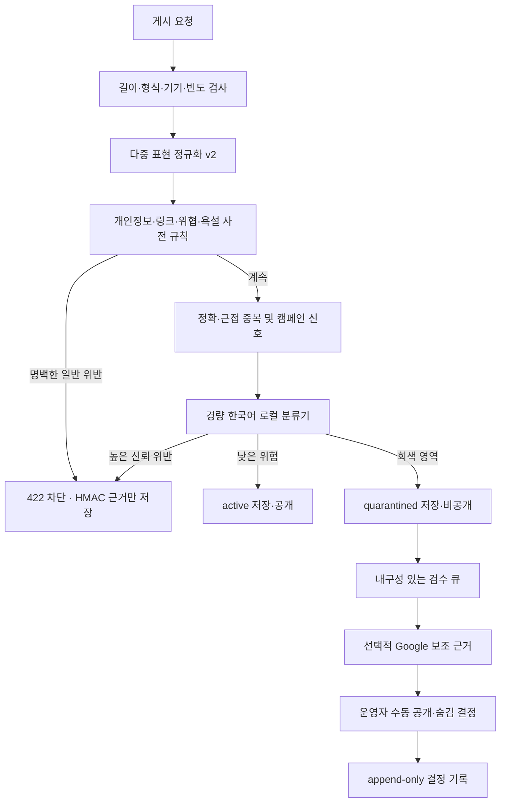
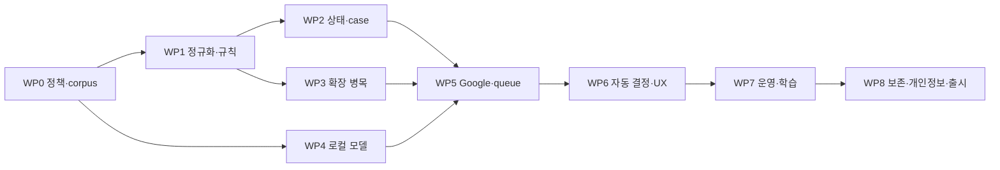

# 콘텐츠 안전·유해 표현 탐지 구현 설계 및 실행 계획

문서 상태: **정책 확정 / 구현 계획**

기준일: **2026-08-09**

정책 책임자·단독 운영자: **이건하**

적용 범위: 시민 포스트, 후보자 첫 메시지, 신고, 운영 검수

관련 문서:

- [어뷰징 방어 시스템 설계 및 구현 계획](./abuse-prevention-design-and-implementation-plan.md)
- [콘텐츠 moderation 외부 서비스 준비 체크리스트](./content-moderation-external-preparation-checklist.md)

## 1. 결론

이 서비스의 콘텐츠 안전 체계는 다음 원칙으로 구현한다.

1. 모든 글을 외부 AI에 보내지 않는다.
2. 모든 게시 요청에 저비용 정규화·명백 규칙·빈도·중복 검사를 먼저 적용한다.
3. 경량 한국어 분류 모델을 주 판별기로 사용하고, Google Cloud Text Moderation은 애매한
   일부 요청의 보조 판정과 모델 품질 비교에만 사용한다.
4. 명백한 위반은 저장 전에 차단하고, 문맥이 필요한 고위험 글은 `quarantined`로 저장해
   공개하지 않은 뒤 비동기 검수한다.
5. 신고 수나 모델 점수 하나만으로 게시물을 영구 삭제하지 않는다.
6. 정책·정규화·사전·모델 버전을 모두 기록해 같은 입력의 판정 근거를 재현할 수 있게 한다.
7. 트래픽이 커져도 게시 공통 경로에 외부 API, 무제한 유사도 검색, 동기 로그 적재가
   병목이 되지 않게 한다.
8. 운영 검수는 웹 운영 도구를 source of truth로 삼고 Telegram 전용 모니터 채널은 알림과
   MFA 검수 화면 진입을 빠르게 하는 보조 수단으로 사용한다.

권장 최종 흐름은 다음과 같다.



## 2. 현재 구현 기준선과 공백

### 2-1. 이미 구현된 보호

- 서버 발급 익명 기기 토큰과 BotID 검증
- 기기당 게시 15초 1회, 1시간 10회, 24시간 20회 제한
- 네트워크 단위 shadow budget
- 게시 요청 idempotency
- NFKC, zero-width 제거, 공백·문장부호 제거를 이용한 strict/loose 표현
- 같은 기기의 정확 중복 및 높은 유사도 중복 차단
- 여러 기기의 유사 문구 군집 shadow 로그
- 전화번호·이메일·일반 URL·일부 직접 위협 규칙
- `active`, `quarantined`, `hidden`, `deleted` 게시 상태
- 90일 만료 어뷰징 로그와 공개 Supabase 권한 회수

### 2-2. 현재 차단되지 않는 주요 예시

현재 `evaluateContentSafety()`는 일반 욕설, 성적 표현, 혐오 표현, 자모·숫자·공백을
이용한 우회, 광고 문구 대부분을 허용한다. 예를 들어 `시1발`, 초성 욕설, 자모 분해,
기호 삽입, 문맥형 괴롭힘은 별도 탐지 대상이 아니다.

### 2-3. 확장 전에 보완해야 하는 구조적 위험

| 위험 | 현재 원인 | 해결 방향 |
| --- | --- | --- |
| DB 왕복 증폭 | 게시 1건에 여러 rate window RPC를 순차 호출 | 여러 window를 한 번에 소비하는 단일 RPC로 통합 |
| rate row 경합 | 같은 network·window row에 쓰기 집중 | network는 shadow·challenge 중심, 필요 시 전용 분산 rate store로 분리 |
| 유사도 검색 비용 | 최근 전체 글에 `pg_trgm` 유사도 검색 | 동일 기기는 기존 인덱스 유지, 교차 기기는 시간·지역·서명 버킷으로 제한 |
| 동기 로그 지연 | 차단·shadow 결정마다 DB insert를 `await` | 필수 감사 사건만 동기, 일반 telemetry는 큐·배치·표본 저장 |
| 외부 API 비용 공격 | 애매한 문장을 대량 생성해 모델 호출 유도 | 기기·network budget 이후 호출, fingerprint cache, 전역 provider budget |
| idempotency 상태 오류 | replay 응답이 상태와 무관하게 `published`로 반환될 수 있음 | 조회 시 실제 moderation/publication 상태를 함께 반환 |
| 공급망 위험 | 외부 욕설 사전·모델이 예고 없이 바뀔 수 있음 | digest 고정, 내부 vendoring, 라이선스·출처·SBOM 기록 |

## 3. 목표와 비목표

### 3-1. 목표

- `시1발`처럼 단순한 우회부터 자모 분해·zero-width·유사문자까지 탐지한다.
- 욕설, 혐오, 표적 괴롭힘, 선정성, 직접 위협, 개인정보, 사기·광고를 구분한다.
- 정치적 비판·풍자·뉴스 설명은 허용하되 명확한 욕설 표기가 있으면 공격 대상·인용 여부와
  무관하게 수정 요청으로 차단한다.
- 외부 moderation이 느리거나 중단되어도 명백한 위반 방어와 정상 게시를 유지한다.
- 정상 게시 공통 경로의 외부 moderation 호출 비율을 안정화 후 10% 이하로 유지한다.
- 차단·격리·운영 복구를 request ID, 정책 버전, 모델 버전으로 감사할 수 있게 한다.
- 트래픽 증가에 따라 규칙, 추론, 큐, 운영 도구를 독립적으로 확장한다.

### 3-2. 비목표

- 모든 정치적 주장의 참·거짓을 범용 모델로 판정하지 않는다.
- 사용자의 거주지, 실명, 선거권을 콘텐츠 모델로 추론하지 않는다.
- 원본 IP나 브라우저 fingerprint를 추가 수집하지 않는다.
- 정상 합성어까지 부분 문자열 일치만으로 욕설로 차단하지 않는다.
- 후보자 답변에는 시민용 콘텐츠 moderation을 적용하지 않는다.
- 신고 개수만으로 자동 삭제하지 않는다.
- 5B~8B 범용 가드 모델을 초기 주 판별기로 운영하지 않는다.

## 4. 정책 분류와 기본 조치

정책은 모델 카테고리가 아니라 서비스가 취할 행동을 기준으로 정의한다. 모델 출력은
근거 중 하나일 뿐 최종 정책이 아니다.

| 코드 | 범주 | 예시 성격 | 높은 신뢰 | 애매한 경우 |
| --- | --- | --- | --- | --- |
| `personal_information` | 타인 개인정보·연락 유도 | 전화, 이메일, 상세 주소, 계좌, 메신저 ID | 차단 | 격리 |
| `direct_threat` | 구체적 위해·협박 | 살해·폭파·방화·추적 위협 | 차단 | 긴급 우선 격리 |
| `hate_or_dehumanization` | 보호 특성 대상 혐오 | 집단 비하·배제·비인간화 | 차단 | 격리 |
| `targeted_harassment` | 개인 대상 반복 공격 | 모욕, 괴롭힘, 성희롱 | 차단 | 격리 |
| `sexual_explicit` | 노골적 성적 표현 | 성행위 묘사·성적 요구 | 차단 | 격리 |
| `sexual_minor_risk` | 미성년자 성적 위험 | 성착취 유도·묘사 | 차단 및 긴급 검수 | 긴급 격리 |
| `self_harm_encouragement` | 자해·자살 조장 | 타인에게 자해 강요·방법 권유 | 차단 | 긴급 격리 |
| `profanity` | 욕설·비속어 | 일반 욕설, 우회 욕설 | 수정 요청 | 보수적 격리 또는 수정 요청 |
| `scam_or_malicious_link` | 사기·악성 유도 | 피싱, 금전 요구, 단축·난독화 URL | 차단 | 격리 |
| `spam_or_ad` | 상업·정치성 반복 도배 | 광고, 모집, 같은 구호 대량 게시 | 행동 신호 결합 차단 | shadow·격리 |
| `impersonation` | 후보·기관 사칭 | 공식 답변처럼 위장 | 격리 | 검수 |
| `election_logistics_risk` | 투표 절차 방해 가능 정보 | 투표일·장소·자격 허위 의심 | 자동 삭제 금지 | 높은 우선순위 검수 |
| `misinformation_claim` | 검증이 필요한 주장 | 특정인 범죄 단정 등 | 자동 삭제 금지 | 신고·검수 |

욕설은 다음처럼 처리한다.

- 명확한 욕설 표기가 있으면 공격 대상의 존재, 인용, 신고·설명 문맥과 무관하게 수정 요청으로
  차단한다.
- `시1발`, 자모 분해, 초성, 공백·기호·zero-width 삽입처럼 같은 욕설을 의도적으로 우회한
  표현도 동일하게 차단한다.
- `시발점`, `개발`처럼 정상 단어 안에 우연히 문자열이 포함된 경우는 토큰·예외 사전으로
  허용한다.
- 사전과 모델이 충돌하거나 정상 합성어인지 불확실하면 즉시 공개하지 않고 보수적으로
  격리한다.
- 사용자에게는 탐지 단어를 그대로 되돌려 보여주지 않는다. 구체적 매칭 결과는 우회 공격의
  oracle이 될 수 있으므로 내부 reason code로만 남긴다.

권장 사용자 문구:

```text
게시할 수 없는 표현이 포함되어 있어요. 표현을 바꿔주세요.
개인정보나 연락처는 글에 포함할 수 없어요.
위협하거나 위해를 암시하는 표현은 게시할 수 없어요.
내용을 안전하게 확인하고 있어요. 확인이 끝나면 게시 여부가 반영됩니다.
```

## 5. 정규화 v2 설계

### 5-1. 한 개의 정규화 문자열로 모든 판단을 하지 않는다

원문 외에 목적별 표현을 만든다.

```ts
type ModerationTextViews = {
  original: string;
  strict: string;
  loose: string;
  hangulSkeleton: string;
  confusableSkeleton: string;
  tokenView: string[];
  normalizationVersion: 2;
};
```

- `original`: 사용자가 입력한 원문. 공개 또는 격리된 게시물에만 저장한다.
- `strict`: NFKC, default-ignorable 제거, 소문자화, 공백 축약. 정확 중복에 사용한다.
- `loose`: strict에서 문장부호·기호·공백을 제거. 근접 중복·사전 매칭에 사용한다.
- `hangulSkeleton`: 완성형과 분해 자모를 같은 방식으로 비교할 수 있는 표현.
- `confusableSkeleton`: 제한된 숫자·라틴·키릴·전각 유사문자를 정책 사전과 비교하기 위한 표현.
- `tokenView`: 모델과 문맥 규칙에 사용할 토큰·형태 특징. 원문 표시에는 사용하지 않는다.

### 5-2. 처리 순서

1. 원문 길이와 byte 상한을 먼저 검증한다. 시민 글·후보 첫 메시지는 100자, 후보 답변은
   현재 정책인 200자를 각각 적용한다.
2. UTF-16의 잘못된 surrogate 입력을 거부한다.
3. NFKC를 적용한다.
4. zero-width와 Unicode `Default_Ignorable_Code_Point` 중 허용하지 않는 문자를 제거한다.
5. 한글 완성형·호환 자모·현대 자모를 비교용 skeleton으로 통일한다.
6. 비교용 표현에서만 공백·기호를 제거한다.
7. 세 번 이상 반복되는 글자·음절은 원문을 보존한 채 별도 축약 view를 만든다.
8. `1→ㅣ/일`, `l→ㅣ`, `@→아` 같은 변환은 전체 문자열에 무조건 적용하지 않고
   사전 후보 주변에서만 제한적으로 적용한다.
9. skeleton과 fingerprint에는 반드시 버전을 함께 저장한다.

Unicode skeleton 데이터는 버전 사이에 바뀔 수 있으므로 버전을 올릴 때 저장된 비교용 값을
재생성해야 한다. Unicode UTS #39도 confusable skeleton을 표시용 문자열이 아니라 버전 종속
중간 표현으로 취급한다.

### 5-3. 안전성 제약

- 모든 정규식은 해당 콘텐츠 profile의 최대 길이(현재 100자 또는 200자) 검증 후 실행한다.
- 중첩 수량자·가변 lookbehind처럼 ReDoS 위험이 큰 패턴을 금지한다.
- 치환 조합을 전부 생성하지 않고 최대 후보 수를 제한한다.
- 정규화 결과가 비어 있거나 기호만 남으면 별도 `empty_after_normalization`으로 거부한다.
- 원문과 정규화 표현을 사용자에게 나란히 노출하지 않는다.

## 6. 규칙·사전 계층

### 6-1. 구성

```text
src/lib/moderation/
  normalize.ts
  types.ts
  policy.ts
  rule-engine.ts
  decision-engine.ts
  providers/
    local-classifier.ts
    google-moderate-text.ts
  dictionaries/
    manifest.json
    profanity.ko.json
    hate.ko.json
    sexual.ko.json
    scam.ko.json
```

`korcen.ts`는 Apache-2.0 사전 기반 초기 후보로 검토하되 런타임에서 최신 버전을 자동으로
받지 않는다. 검수한 단어와 예외 규칙만 내부 데이터 파일로 고정하고 다음 정보를
`manifest.json`에 남긴다.

- 원 출처와 commit SHA
- 라이선스와 attribution
- 검수일
- 추가·제외한 항목
- dictionary version
- 테스트 corpus version

### 6-2. 사전 항목 형식

```ts
type LexiconEntry = {
  canonical: string;
  category: ModerationCategory;
  severity: 1 | 2 | 3 | 4;
  matchViews: Array<"strict" | "loose" | "hangul" | "confusable">;
  targetRequired: boolean;
  allowContexts?: string[];
  denyContexts?: string[];
};
```

단어가 포함됐다는 사실과 정책 위반은 분리한다. `targetRequired`인 욕설은 인칭·고유명·집단명
근처에 있을 때 위험도를 높이고, `allowContexts`는 `시발점` 같은 명백한 정상 용례의 오탐을
줄인다.

## 7. 경량 로컬 분류기

### 7-1. 후보 선정

초기 benchmark 후보는 다음 두 가지다.

- `Now100/kmhas_electra_binary`
- `jinkyeongk/kcELECTRA-toxic-detector`

모델 카드 수치는 후보 선정 자료일 뿐 운영 승인 기준이 아니다. 두 모델을 같은 고정
evaluation corpus로 비교하고, 더 나은 모델을 서비스 데이터로 재학습·보정한 뒤 ONNX로
내보낸다. K-MHaS 연구는 분해 문자를 인식하는 sub-character tokenizer가 강점을 보였으므로
자모 분해 성능을 별도 평가한다.

### 7-2. 추론 서비스 경계

- 모델은 Next.js/Vercel 함수 번들에 넣지 않는다.
- 별도 CPU/ONNX 추론 서비스로 배포하고 private endpoint 또는 서명된 service-to-service
  요청만 허용한다.
- 요청은 `requestId`, profile 상한을 통과한 최대 200자 텍스트, policy version만 포함한다.
- 서비스는 원문 request body를 로그에 남기지 않는다.
- 응답 timeout은 초기에 150~300ms 범위에서 부하 테스트 후 확정한다.
- circuit breaker와 동시 요청 상한을 둔다.
- 배치 추론은 비동기 검수 worker에서 사용하고, 동기 게시 경로에서는 단건 저지연을 우선한다.

권장 응답 계약:

```ts
type ClassifierAssessment = {
  categories: Partial<Record<ModerationCategory, number>>;
  engine: "local-electra";
  engineVersion: string;
  latencyMs: number;
  requestId: string;
};
```

### 7-3. 임계값

전체 카테고리에 하나의 0.5 임계값을 쓰지 않는다. category별로 다음 두 값을 운영 설정으로
관리한다.

```text
allowThreshold < quarantineThreshold < blockThreshold
```

- `direct_threat`, `sexual_minor_risk`: 낮은 확신부터 quarantine하고 매우 높은 확신만 자동 차단
- `profanity`: 높은 precision이 검증된 구간만 수정 요청으로 차단
- `hate_or_dehumanization`: target·문맥 신호와 함께 판정
- `spam_or_ad`: 모델 점수 단독이 아니라 빈도·중복·기기 군집과 결합
- `misinformation_claim`: 모델 점수로 자동 차단하지 않음

임계값은 코드 상수가 아니라 버전된 policy config로 관리하며 변경 시 audit event를 남긴다.

## 8. Google Cloud 보조 판정

Google Cloud Natural Language `moderateText`는 한국어 입력에 대해 Toxic, Insult,
Profanity, Derogatory, Sexual, Violent 등의 신뢰도 점수를 반환한다. 점수는 심각도가 아니라
해당 범주일 가능성이며 Google도 정확성 보증값으로 사용하지 말고 서비스별 기준을 시험하도록
명시한다.

### 8-1. 호출 조건

다음 조건을 모두 만족할 때만 호출한다.

- 기기·network·global moderation budget을 통과함
- 규칙 계층에서 명백 차단되지 않음
- 로컬 분류기가 회색 구간을 반환했거나 shadow 품질 표본에 선정됨
- 동일 `contentDecisionKey`의 유효 cache가 없음
- provider circuit breaker가 닫혀 있음

```text
contentDecisionKey = HMAC(
  normalized-content + policy-version + local-model-version + provider-version
)
```

짧은 게시글 hash는 사전 대입이 가능하므로 일반 SHA-256 값을 운영 로그의 장기 식별자로
사용하지 않고 secret HMAC을 사용한다.

### 8-2. 비용과 quota 경계

시민 게시글이 최대 100자이므로 게시물 1개는 Text Moderation 과금 단위 1개다. 최대 200자인
후보 답변은 길이에 따라 최대 2개 단위가 될 수 있으므로 별도 action으로 비용을 집계한다.

| 월 Google 판정 건수 | 공식 계층 가격 기준 예상 비용 |
| ---: | ---: |
| 5만 | $0 |
| 10만 | $25 |
| 100만 | $475 |
| 1,000만 | $4,975 |

기본 quota는 분당 600요청, 일일 80만 요청이므로 전체 글의 주 판별기로 사용할 수 없다.
초기 목표는 전체 게시의 1%, 품질 확인 후 5%까지 확대하고 절대 비율 상한은 10%로 둔다.
다만 월 $100 예산 상한이 비율 상한보다 우선한다. 현재 가격에서 $50은 월 누적 약 15만 unit,
$100은 약 25만 unit에 해당한다.

```text
MODERATION_GOOGLE_MODE=off|shadow|uncertain
MODERATION_GOOGLE_SAMPLE_RATE
MODERATION_GOOGLE_DAILY_BUDGET
MODERATION_GOOGLE_MONTHLY_BUDGET_USD=100
MODERATION_GOOGLE_WARNING_USD=50
MODERATION_GOOGLE_TIMEOUT_MS
```

월 누적 추정 비용이 $50에 처음 도달하면 Telegram 모니터 채널에 billing-period별 1회
warning을 전송한다. $100에 도달하면 Google 호출을 중단하고 critical 알림을 전송한다.
이후 로컬 결과가 명확하면 allow 또는 block하고 애매하면 처리될 때까지 quarantine한다.
명백한 위협·개인정보 차단은 외부 provider 상태와 무관하게 유지한다. 다음 달 자동 재개는
가능하지만 billing period와 계량값을 검증한 뒤에만 budget counter를 초기화한다.

### 8-3. Google과 managed local CPU 비용 비교

Google을 모든 시민 게시에 직접 호출하는 경우와 경량 모델을 상시 운영하는 경우를 분리해
비교한다. Hugging Face Inference Endpoints의 현재 AWS CPU 시간당 가격은 x1 2GB $0.033,
x2 4GB $0.067, x4 8GB $0.134다. 730시간 상시 1 replica 기준으로 약 $24.09, $48.91,
$97.82이며 네트워크·중복 replica·추가 운영비는 제외한 값이다.

| 월 시민 게시 | Google이 100% 판정 | hybrid 목표 Google 호출 | $100 상한 적용 후 실제 최대 비율 |
| ---: | ---: | ---: | ---: |
| 10만 | $25 | 1천~5천, 무료 구간 | 10% 이하 |
| 100만 | $475 | 1만~5만, 무료 구간 | 10% 이하 |
| 1,000만 | $4,975 | 10만~50만, $25~$225 | 2.5% |
| 1억 | $21,225 | 100만~500만, 예산 초과 | 0.25% |

따라서 초기 저사용량에는 Google 무료 구간을 shadow 비교에 활용하는 편이 저렴하다. 반면
게시량이 커지면 $100 상한 때문에 Google 표본 비율이 자동으로 낮아지므로 로컬 모델이 주
판별기를 맡아야 한다. Google은 local model의 대체재가 아니라 품질 비교·회색 영역 판정을
위한 추가 비용이다.

managed CPU는 x2부터 benchmark하고 메모리나 p95가 부족하면 x4로 올린다. x2와 x4의
Google 100% 호출 대비 단순 비용 교차점은 각각 월 약 14.8만, 24.6만 판정이지만 실제 선택은
고정 endpoint 비용이 아니라 다음 부하 시험으로 결정한다.

- 모델 로드 후 실제 메모리
- replica당 지속·burst RPS
- p95/p99 latency
- scale-to-zero cold start
- 한 replica 장애 시 처리량
- 월 평균 replica 수와 egress

모델이 품질 gate를 통과하지 못하면 저렴하더라도 채택하지 않는다. 초기 운영안은 managed
CPU 1 replica + Google 1% shadow이며, 트래픽과 품질 지표를 본 뒤 local replica와 Google
비율을 독립 조정한다.

## 9. 결정 엔진

### 9-1. 입력

- 규칙 hit와 severity
- 로컬 모델 category score
- 선택적 Google category score
- 같은 기기의 게시 빈도·최근 정책 위반
- strict/loose/cluster 중복 신호
- 여러 기기·network의 동일 문구 확산 신호
- 신고 정보는 이미 공개된 게시물의 재검토 우선순위에만 사용

### 9-2. 출력

```ts
type ModerationDecision = {
  action: "allow" | "block" | "quarantine";
  publicReason: "unsafe_expression" | "personal_information" | "threat" | null;
  reasonCodes: string[];
  policyVersion: number;
  riskBand: "low" | "medium" | "high" | "critical";
  score: number;
  providerTrace: Array<{ engine: string; version: string }>;
};
```

### 9-3. 결합 규칙

- 점수 평균만으로 결정을 내리지 않는다. critical category는 다른 낮은 점수로 상쇄하지 않는다.
- deterministic critical rule은 모델의 allow 결과로 해제하지 않는다.
- 욕설 사전 단일 hit는 target·문맥 또는 높은 모델 점수가 없으면 처음에는 shadow 처리한다.
- spam은 콘텐츠 점수보다 행동 신호를 우선한다.
- 수동 지역 선택 자체는 위험 신호로 사용하지 않는다.
- BotID `unknown` 단독으로 콘텐츠를 차단하지 않는다.
- 동일 입력·동일 policy/model version은 항상 같은 결정을 반환해야 한다.
- Google 결과는 회색 영역의 보조 근거와 검수 우선순위에만 사용한다. 격리 글을 Google 점수만으로
  자동 공개하거나 영구 삭제하지 않는다.

### 9-4. 장애 시 결정

| 장애 | 처리 |
| --- | --- |
| 로컬 모델 timeout | 명백 규칙은 유지, 보통 글은 allow+표본 로그, 고위험 규칙 hit는 quarantine |
| Google timeout·429 | 재시도 폭주 금지, 회색 글은 quarantine, provider circuit open |
| 큐 지연 | 신규 high-risk 격리 유지, low-risk Google shadow 작업은 버림 |
| moderation DB 로그 실패 | 게시 판단은 유지하되 필수 quarantine case 생성 실패 시 503 |
| 정책 설정 오류 | 마지막 검증된 config 사용, 없으면 규칙 최소 안전 모드 |
| block 비율 급증 | 모델 auto-block 즉시 shadow 전환, 명백 규칙만 차단 |

## 10. 게시 요청 처리 변경

`POST /api/posts`의 순서를 다음으로 고정한다.

1. body 크기·좌표·기기 토큰·BotID 검증
2. idempotency replay 조회
3. 게시 rate budget을 **단일 DB RPC**로 소비
4. 위치 토큰 확인 또는 역지오코딩
5. 콘텐츠 정규화 v2와 deterministic rule
6. 정확·근접 중복 및 campaign 신호
7. 로컬 분류기와 결정 엔진
8. `allow`는 `active`, `quarantine`은 `quarantined`로 저장
9. 격리는 case와 queue message를 같은 원자적 DB 경계에서 생성
10. allow 게시에만 일반 공개 응답과 후속 알림 동작 수행

응답 계약:

| 결과 | HTTP | body |
| --- | --- | --- |
| 공개 | 200 | `publicationStatus: "published"` |
| 검토 중 | 200 | `publicationStatus: "under_review"` |
| 정책 위반 | 422 | `code: "UNSAFE_CONTENT"`와 일반화된 문구 |
| 정확·근접 중복 | 409 | 기존 중복 문구 |
| 빈도 제한 | 429 | `Retry-After` |
| 보호 계층 전체 불가 | 503 | 재시도 안내 |

격리는 게시 요청 자체가 성공했으므로 클라이언트 자동 재시도를 유발하는 202보다 현재 응답
계약과 호환되는 200을 우선한다. `clientRequestId` replay 시 DB의 실제 `moderation_state`를 읽어
`published` 또는 `under_review`를 동일하게 반환한다.

후보자 첫 메시지는 같은 rule/normalization/decision 모듈을 사용한다. 후보자 답변은 시민용
콘텐츠 moderation 대상에서 제외하며 전화번호·이메일·외부 링크를 허용한다. 답변 경로의
후보자 인증, active 상태, 길이 200자, rate limit, HTML escape 같은 구조적 보안 검사는 그대로
유지한다. 현재 후보자 답변에서 `evaluateContentSafety()`가 차단하는 동작은 이 정책에 맞게
분리해야 한다.

### 10-1. rate budget 단일 RPC

현재 여러 window를 순차 호출하는 방식을 다음 계약으로 합친다.

```ts
type BudgetWindow = { limit: number; windowSeconds: number };

consumeAbuseBudgetSet({
  action: "post.create",
  subjectKind: "device",
  subjectHash,
  windows: ABUSE_POLICY.postCreate.deviceBudgets,
});
```

- 클라이언트가 limit을 전달하는 API로 공개하지 않고 서버의 versioned policy만 입력한다.
- DB 함수는 모든 window row를 하나의 statement/transaction에서 원자 upsert한다.
- 하나라도 초과하면 `allowed=false`와 가장 긴 `retryAfterSeconds`를 반환한다.
- 초과 요청도 모든 window에 집계해 짧은 제한만 반복해서 두드리는 공격이 장기 window에서
  사라지지 않게 한다.
- RPC execute는 service role에만 부여한다.
- network budget은 같은 이동통신 NAT 사용자를 보호하기 위해 단독 영구 차단 근거로 쓰지 않는다.
- DB lock wait가 SLO를 넘으면 동일 인터페이스를 유지한 채 전용 분산 rate store로 교체한다.

## 11. 데이터 모델

### 11-1. `posts` 최신 상태 projection

피드 조회가 moderation event 테이블과 join하지 않도록 최신 공개 상태를 `posts`에 둔다.

```text
moderation_state text not null default 'allowed'
  -- allowed/pending/review/rejected
moderation_policy_version integer not null default 1
moderation_risk_band text not null default 'low'
moderation_reason_codes text[] not null default '{}'
moderation_decided_at timestamptz null
normalization_version smallint not null default 1
```

상태 불변식:

```text
posts.status = active       => moderation_state = allowed
posts.status = quarantined  => moderation_state in (pending, review)
posts.status = hidden       => moderation_state in (rejected, review)
```

기존 게시물은 `allowed`, policy version `1`로 backfill하되 당시 모델이 판정한 것처럼 기록하지
않는다. `moderation_reason_codes`는 공개 API projection에 포함하지 않는다.

### 11-2. `moderation_cases`

정상 allow 전체에 case를 만들지 않는다. 격리·신고·사후 탐지된 게시물에만 한 건의 open case를
유지한다.

```sql
-- 최종 migration이 아닌 설계 스케치
create table public.moderation_cases (
  id bigint generated always as identity primary key,
  public_id uuid not null unique default gen_random_uuid(),
  post_id uuid not null references public.posts(id),
  state text not null check (state in ('queued', 'reviewing', 'resolved')),
  source text not null check (source in ('submission', 'report', 'retroactive')),
  priority smallint not null check (priority between 0 and 100),
  risk_score smallint not null check (risk_score between 0 and 1000),
  rule_codes text[] not null default '{}',
  policy_version integer not null,
  model_version text,
  available_at timestamptz not null default now(),
  claimed_at timestamptz,
  resolved_at timestamptz,
  created_at timestamptz not null default now(),
  updated_at timestamptz not null default now()
);

create unique index uq_moderation_cases_open_post
  on public.moderation_cases (post_id)
  where state in ('queued', 'reviewing');

create index idx_moderation_cases_post_created
  on public.moderation_cases (post_id, created_at desc);

create index idx_moderation_cases_queue
  on public.moderation_cases (priority desc, available_at, id)
  where state = 'queued';
```

### 11-3. `moderation_decisions`

결정은 append-only다. 기존 row를 UPDATE해 이력을 지우지 않는다.

```sql
create table public.moderation_decisions (
  id bigint generated always as identity primary key,
  case_id bigint not null references public.moderation_cases(id),
  actor_type text not null check (actor_type in ('system', 'moderator')),
  moderator_auth_user_id uuid,
  decision text not null check (decision in ('publish', 'keep_hidden', 'hide', 'delete')),
  reason_code text not null,
  policy_version integer not null,
  engine_versions jsonb not null default '{}',
  note text,
  created_at timestamptz not null default now(),
  constraint moderation_decisions_actor_check check (
    (actor_type = 'system' and moderator_auth_user_id is null)
    or (actor_type = 'moderator' and moderator_auth_user_id is not null)
  ),
  constraint moderation_decisions_note_length_check check (
    note is null or char_length(note) <= 1000
  )
);

create index idx_moderation_decisions_case_created
  on public.moderation_decisions (case_id, created_at desc);
```

`note`는 길이를 제한하고 연락처·token 등 민감정보를 저장하지 않는다. 운영자 결정 함수는
결정 insert, post 상태 전환, case resolve를 하나의 짧은 transaction으로 처리한다.

### 11-4. `moderation_decision_cache`

Google 호출 전용 server-side cache다. allow·block 여부만으로 영구 정책을 만들지 않고 provider
호출 중복을 줄이는 데만 사용한다.

```sql
create table public.moderation_decision_cache (
  decision_key text primary key,
  provider text not null,
  provider_version text not null,
  policy_version integer not null,
  scores jsonb not null,
  expires_at timestamptz not null,
  created_at timestamptz not null default now()
);

create index idx_moderation_decision_cache_expires
  on public.moderation_decision_cache (expires_at);
```

- `decision_key`는 원문이 아니라 secret HMAC이다.
- score key allowlist, 0~1 숫자 범위, JSON byte 상한을 검증한다.
- 정책 또는 provider version이 바뀌면 key가 달라져 이전 판정을 재사용하지 않는다.
- TTL cleanup이 DB에 부담을 주기 시작하면 같은 repository interface를 managed cache로 교체한다.
- RLS와 권한은 case 테이블과 동일하게 service role 전용이다.

### 11-5. 원문 증거와 보존

일반 욕설 자동 차단은 원문을 저장하지 않고 secret HMAC, reason code, 정책·사전 버전만 남긴다.
구체적 위해, 미성년 성적 위험 등 critical case와 격리 case는 운영 검수와 사고 대응에 필요한
최소 원문을 application-level envelope encryption으로 별도 보관하고 90일 후 삭제한다.

```text
moderation_evidence
  case_id bigint unique
  ciphertext bytea
  nonce bytea
  key_version text
  content_type text
  created_at timestamptz
  expires_at timestamptz  # created_at + 90 days
```

- 암호화 키는 DB나 repository에 두지 않고 KMS 또는 배포 환경의 별도 secret으로 관리한다.
- 격리 제출은 평문을 일반 `posts`, abuse log, queue, Telegram에 복제하지 않는다. 검수 화면은
  AAL2 운영자 확인 뒤 서버에서만 복호화한다. 공개 결정 시에만 공개용 post 본문을 materialize한다.
- 이미 공개된 글의 신고 case는 기존 공개 본문과 별도로 당시 원문 snapshot을 암호화해 보존한다.
- 복호화 열람, 공개, 숨김, 삭제, 복구와 key version 변경을 모두 append-only 감사 기록에 남긴다.
- 삭제는 사용자 노출 상태를 `hidden/rejected`로 바꾸는 의미이며, 보존 기간 동안 암호화 증거와
  결정 이력은 유지한다. 90일 cleanup은 evidence와 관련 운영 알림을 삭제하고 비식별 집계만 남긴다.
- 긴급 사고의 법적 보존이 필요해지면 일반 retention job과 분리된 명시적 legal-hold 절차를
  별도로 승인·구현하기 전에는 자동 연장하지 않는다.

### 11-6. allow 판정과 block 판정 telemetry

- 공개된 모든 게시물: `posts`에 policy/model 최신 버전과 risk band만 저장
- 일반 자동 차단: 원문을 저장하지 않고 HMAC content key, reason code, 버전만 `abuse_logs`에 저장
- 일반 자동 차단 HMAC log도 90일 후 삭제하고 category·일자 aggregate만 장기 유지
- allow 상세 score: 초기 shadow 기간에는 표본 저장, 안정화 후 집계 지표만 장기 보존
- critical·격리: 암호화 원문 evidence와 case·append-only decision을 90일 유지
- provider 원응답 전체를 그대로 저장하지 않고 허용한 category score만 숫자 범위 검증 후 저장

### 11-7. RLS와 권한

- 새 테이블은 RLS를 즉시 활성화한다.
- `anon`, `authenticated`, `public`에 table privilege나 공개 policy를 부여하지 않는다.
- 현재 서버 REST 구조와 호환하기 위해 초기에는 `public`에 두되 service role 전용으로 사용한다.
- 운영자 권한은 `user_metadata`가 아니라 서버 DB의 활성 moderator 매핑 또는 안전한
  `app_metadata`로 검증한다.
- 검수 view가 필요하면 `security_invoker = true`를 사용하고 불필요한 execute/select 권한을
  회수한다.
- `SECURITY DEFINER` 함수는 노출된 public schema에 만들지 않는다.

### 11-8. 대용량 전환 기준

- `moderation_cases`는 위반·신고 건만 저장하므로 초기에는 일반 테이블로 시작한다.
- time-series 성격의 event/log가 1억 row에 접근하거나 retention delete가 vacuum을 방해하면
  `created_at` 월 단위 partition으로 전환한다.
- 만료 데이터는 대량 `DELETE`보다 오래된 partition drop을 사용한다.
- queue claim은 `FOR UPDATE SKIP LOCKED` 또는 Supabase Queues의 visibility window를 사용한다.

## 12. 큐와 worker

Supabase Queues는 Postgres `pgmq` 기반의 내구성 있는 message queue로 guaranteed delivery와
visibility window를 제공하므로 초기 격리 검수 작업에 사용할 수 있다. 다만 애플리케이션
worker는 end-to-end exactly-once를 가정하지 않고 항상 idempotent하게 작성한다.

message에는 원문을 복제하지 않고 다음 ID만 넣는다.

```json
{
  "caseId": "case-public-uuid",
  "postId": "post-uuid",
  "policyVersion": 2,
  "attempt": 1
}
```

worker 규칙:

- `caseId + policyVersion`으로 중복 실행을 무해하게 한다.
- 처리 전 case가 이미 resolved인지 확인한다.
- 외부 HTTP 호출 중 DB transaction이나 row lock을 유지하지 않는다.
- 429와 5xx만 지수 backoff하고 정책상 block 응답은 재시도하지 않는다.
- 최대 시도 후 dead-letter 상태와 운영 알림을 만든다.
- 긴급 위험 case, 신고 급증 case, 일반 회색 case 순으로 priority를 둔다.
- queue 원문 archive는 끄고 audit에는 case ID와 결과만 남긴다.

초기 queue SLO 후보:

- critical case oldest age: 1분 미만
- 자동 보조 판정 queue oldest age: 5분 미만
- 수동 검수 최대 목표 시간: 12시간
- 일반 격리 case는 6시간 warning, 10시간 critical 예고, 12시간 overdue 알림
- 12시간을 넘겨도 자동 공개하거나 삭제하지 않고 운영자가 처리할 때까지 계속 격리
- Google shadow 작업은 backlog 시 폐기 가능, 사용자 격리 case는 폐기 금지

## 13. 근접 중복·조직적 캠페인 탐지 확장

전역 `pg_trgm` 검색은 게시물이 매우 많아지면 주 게시 경로에 유지하지 않는다.

### 13-1. 단계별 전환

1. 같은 기기·24시간은 현재 trigram 검색과 exact fingerprint를 유지한다.
2. 교차 기기 검색은 같은 시간 bucket과 행정구역 범위로 후보를 먼저 제한한다.
3. loose text의 character n-gram으로 고정 길이 SimHash 또는 MinHash bucket을 만든다.
4. `(time_bucket, area_code, signature_bucket)` 집계 row를 원자 upsert한다.
5. bucket count가 임계값을 넘을 때만 상세 후보 비교와 shadow event를 실행한다.
6. 여러 지역에 같은 문구가 동시에 퍼지면 별도 campaign risk를 올린다.

### 13-2. 정상 캠페인 보호

정치 서비스에는 같은 구호를 자발적으로 쓰는 정상 집단 행동이 존재한다. 따라서 교차 기기
유사 문구만으로 차단하지 않고 다음 신호를 함께 요구한다.

- 매우 짧은 시간의 비정상 증가
- 새 기기 비율
- network 집중도
- 여러 행정구역 도약
- 동일한 URL·연락처·금전 유도
- 신고 및 다른 정책 위반 동반

초기에는 shadow, 검수 화면이 준비된 뒤 quarantine까지만 허용하며 영구 삭제는 운영 결정으로
제한한다.

## 14. 추가 탐지 위험과 솔루션

| 추가 위험 | 탐지 신호 | 솔루션 |
| --- | --- | --- |
| 자모·숫자·공백 우회 | skeleton 사전 hit, 이상한 script 혼합 | 다중 view, KOTOX 변환 회귀 테스트, versioned confusable mapping |
| 영어·일본어·혼용 욕설 | script 비율, 다국어 사전, 모델 score | 한국어 전용 모델 miss를 Google shadow와 신고 데이터로 보완 |
| 문맥 오탐 | 인용 부호, `신고합니다`, 정상 합성어 | 명시적 욕설은 문맥과 무관하게 차단하되 정상 합성어 예외 corpus와 비욕설 category의 문맥 규칙을 분리 |
| 은어·dog whistle 변화 | 신고 후 미탐 비율, unknown n-gram 급증 | 주간 drift 검토, 사전 PR review, shadow rollout |
| 타인 주소·계좌·메신저 ID | 숫자·주소·계좌·ID 패턴 | 연락처 외 PII detector 확대, cloud 전송 전 로컬 차단 |
| 성적 미성년 위험 | 나이 표현+성적 category 결합 | critical quarantine, 최소 접근 검수, 별도 긴급 runbook |
| 자해 조장 | 자해 동사+명령·권유 표현 | 조장만 차단, 도움 요청은 차단하지 않고 지원 문구 검토 |
| 후보·기관 사칭 | 후보 이름+1인칭 공식 표현, 계정 불일치 | 후보 session과 author type을 서버에서 결합, 격리 |
| 투표 방해 정보 | 투표일·시간·장소·자격 패턴 | 자동 사실 단정 금지, 공식 데이터 대조 queue와 긴급 검수 |
| 반복 괴롭힘 | 동일 target에 여러 변형 글, 장기 빈도 | 단일 글 점수와 actor history를 분리, 단계적 쓰기 제한 |
| report bombing | 같은 network·신규 기기 신고 집중 | reporter 다양성 가중, 신고 수 단독 자동 숨김 금지 |
| moderation oracle | 단어별 상세 오류를 반복 조회 | 일반화된 사용자 문구, reason code 비공개, 시도 budget |
| provider 비용 공격 | 회색 문장 반복, cache miss 유도 | provider 전용 budget, fingerprint cache, sample ceiling |
| 모델 endpoint 직접 공격 | 공개 URL 호출, 큰 body, replay | private/signature auth, profile별 100·200자 상한, timestamp·nonce, rate limit |
| 모델·사전 공급망 변조 | upstream 최신판 자동 반영 | commit/digest pin, SBOM, 라이선스 검토, 재현 가능한 artifact |
| 모델 feedback 오염 | 악의적 신고를 정답 label로 사용 | 신고는 약한 신호, 운영 확정·복구 label만 gold 편입 |
| 정책 drift | 모델·사전 교체 후 차단률 급변 | version별 shadow A/B, score distribution·오탐 모니터링 |
| 위치 기반 표적화 | 특정 좁은 지역·개인 언급 반복 | 기존 100m 좌표 양자화 유지, 상세 주소 PII 탐지, actor-area 다양성 감시 |
| 격리 backlog | 공격으로 검수 큐 고갈 | priority·global admission budget, shadow 작업 폐기, critical worker 예비 용량 |
| 외부 전송 개인정보 | PII 미탐 원문이 provider로 전송 | 로컬 PII 선검사, 최소 provider 호출, DPA·retention 설정 확인 |
| 짧은 hash 역추론 | 100자 이하 문구 hash 사전 대입 | 로그·cache key는 secret HMAC, secret rotation version 기록 |

이미지·동영상 업로드가 생기면 텍스트 moderation의 범위 밖이므로 출시 전에 별도 이미지
안전성, EXIF 제거, 악성 파일, OCR, CSAM 대응 절차를 독립 설계해야 한다.

## 15. 테스트 전략

### 15-1. 고정 evaluation corpus

다음 데이터 묶음을 versioned fixture로 만든다.

- 정상 동네 정책 비판·칭찬·질문
- 정상 합성어와 욕설 없는 인용·설명: `시발점`, 신고 절차 설명, 작품명
- 명시적 욕설을 포함한 인용·신고·설명 문장은 정책상 차단 fixture로 별도 고정
- 직접 욕설, 표적 욕설, 집단 혐오, 성적 표현, 협박, 자해 조장
- 전화·이메일·주소·계좌·메신저 ID·난독화 URL
- 광고·사기·후보 사칭·투표 절차 정보
- KOTOX의 언어학적 우회 변환과 서비스 자체 변형
- K-MHaS 계열 분해 문자와 교차 category 문장
- 한국어·영어·숫자·이모지·키릴문자 혼합

실제 사용자 문장을 학습·fixture로 편입할 때 개인정보 제거와 접근·보존 승인을 먼저 한다.

### 15-2. 자동 테스트

Unit:

- 모든 normalization view와 version fixture
- 한글 완성형·자모 분해 동치
- zero-width, bidi control, full-width, confusable, 반복 문자
- allow context와 deny context
- 정규식 실행 시간과 조합 후보 상한
- 동일 정책의 결정 결정성

Property/fuzz:

- 금칙 seed에 공백·문장부호·숫자·자모·zero-width를 무작위 삽입해 탐지 유지 확인
- 정상 seed에 같은 변환을 적용해 오탐 증가 확인
- 임의 Unicode 입력을 profile별 최대 100·200자로 생성해 예외·무한 루프·과도한 메모리 없음 확인

API:

- allow/block/quarantine 응답과 idempotency replay 상태 일치
- 격리 글이 feed, detail, card, candidate 조회에서 노출되지 않음
- provider timeout·429·잘못된 JSON·고지연 fallback
- 일반 욕설 차단 원문이 DB·application log에 남지 않고 HMAC 근거만 저장됨
- critical·격리 원문은 제한 테이블에 암호화되어 90일 만료되고 AAL2 열람이 감사됨
- 후보 메시지와 시민 게시의 profile별 정책 차이

DB:

- case 생성과 post quarantine의 원자성
- 한 post에 open case 하나만 존재
- 여러 worker의 중복 claim과 idempotent resolve
- decision append-only와 복구 이력
- RLS·grant·function execute 검증
- 만료 cleanup과 부분 인덱스 query plan

Load/chaos:

- 게시 peak RPS의 2배에서 p95/p99와 DB RPC latency
- 같은 network·signature bucket hot key 경합
- local classifier replica 장애·cold start·circuit breaker
- Google quota 소진과 queue backlog
- log queue 중단 시 게시 경로 영향

### 15-3. 차단 활성화 gate

다음은 초기 후보값이며 실제 corpus 크기와 정책 승인 후 고정한다.

- 명백 deterministic rule: gold 정상 corpus 오탐 0건
- 모델 auto-block 구간 precision 99.5% 이상
- 전체 정상 글의 자동 차단률 0.1% 미만
- critical category recall 95% 이상 또는 미탐 전량 원인 분석
- KOTOX 기반 우회 suite 탐지율 95% 이상
- 모델 timeout·오류가 정상 게시 성공률을 0.1%p 이상 떨어뜨리지 않음
- 격리 복구율이 기준을 넘으면 해당 규칙 auto-block 금지 및 shadow 회귀

전체 accuracy 하나로 승인하지 않고 category·문맥·우회 난이도별 precision/recall과 confusion
matrix를 함께 본다.

## 16. 모니터링과 알림

### 16-1. 용량 산정

peak 게시 요청을 초당 `P`, Google 전송 비율을 `g`라고 두면 다음 용량을 준비한다.

```text
정규화·규칙 처리량   >= 2P
로컬 모델 처리량     >= 2P (한 replica 장애를 포함한 목표)
Google 평균 요청률   = gP
case queue 유입률     = quarantineRate × P
```

Google 기본 quota 600 RPM은 평균 10 RPS다. 다른 Natural Language 호출이 없다고 가정해도
`g=0.05`이면 평균 게시 200 RPS, `g=0.10`이면 100 RPS에서 기본 quota에 도달한다. 실제 트래픽은
burst가 있으므로 이 수치는 최대 처리량이 아니라 quota 증설·sample 축소를 시작할 경고선으로만
사용한다.

- local inference는 CPU 60~70% 또는 p95 목표를 기준으로 autoscale한다.
- scale-to-zero는 첫 게시 지연을 만들 수 있으므로 최소 replica 수를 부하 시험으로 정한다.
- 한 replica와 한 availability zone 장애를 견디는 목표는 실제 사용량 증가 단계에서 활성화한다.
- database는 `consume_abuse_budget_set`, post insert, case transaction 각각의 p95와 lock wait를
  따로 측정한다.
- 월 비용 예측은 `게시 수 × Google 비율 × 100자 unit`과 local replica 시간으로 매일 갱신한다.

### 16-2. 필수 지표와 알림

필수 지표:

- action·policy version별 allow/block/quarantine 비율
- reason code별 발생률과 일·주간 변화
- normalization view별 dictionary hit
- local·Google category score 분포
- 모델 p50/p95/p99, timeout, circuit open 횟수
- Google 호출 비율·cache hit·일일 과금 unit·quota 잔량
- queue depth, oldest age, retry, dead-letter
- 운영 publish/hide/delete와 운영자 복구율
- 같은 content signature의 기기·network·지역 다양성
- rate RPC round-trip과 row lock wait
- trigram·cluster query 실행 시간과 examined row
- moderation log 적재 실패·sampling 비율

초기 알림:

- 5분 block 또는 quarantine 비율이 같은 시간대 7일 기준선의 3배
- 정상 allow corpus synthetic probe가 block
- Google 월 추정 비용 $50 도달, $100 도달 또는 호출 비율 10% 초과
- local classifier p95 300ms 초과 또는 오류율 1% 초과
- critical 자동 판정 queue oldest age 1분, 일반 자동 판정 queue 5분 초과
- 수동 검수 case가 6시간·10시간·12시간에 도달
- auto-block 후 운영 복구율이 category별 허용 상한 초과
- rate budget RPC 또는 moderation 상태 transaction 오류 발생

### 16-3. Telegram 모니터 채널 연동

참조 구현은 `C:\Users\ghlee\OneDrive\문서\protest\loudnclear-v2`의 다음 패턴을 따른다.

- 전용 `TELEGRAM_MONITOR_CHANNEL_ID`를 사용하고 공개 채널로 fallback하지 않음
- `event_key + event_hash` unique key로 같은 상태의 반복 알림 억제
- 발송 row를 먼저 `pending`으로 만들고 `sent/failed` 및 `telegram_message_id` 기록
- Telegram `retry_after`가 있으면 상한을 검증한 뒤 한 번만 재시도
- noisy event를 category·severity별 summary로 묶음
- inline keyboard의 URL 버튼으로 웹 검토 화면 연결
- cron GET과 수동 dry-run POST를 분리하고 production 오류 상세를 숨김

#### 보안 경계

- Telegram은 알림 채널이지 moderation DB나 승인 권한의 source of truth가 아니다.
- 차단·격리 원문, 전화번호, 이메일, 상세 주소, 좌표, 기기·network hash, provider 원응답을
  Telegram 메시지에 포함하지 않는다.
- 메시지는 case public ID 일부, category, risk band, 생성 시각, 경과 시간, 넓은 지역 단위,
  신고·유사 문구의 범위형 집계만 포함한다.
- bot token과 chat ID는 server-only 환경변수이며 `NEXT_PUBLIC_` 접두사를 금지한다.
- bot token, Telegram API URL 전체, authorization header를 application log에 남기지 않는다.
- 모니터 채널이 없거나 발송에 실패해도 공개 채널로 보내지 않고 DB의 `failed` 상태와 별도
  dashboard에 남긴다.
- Telegram 링크 자체는 권한을 부여하지 않는다. 링크를 전달받아도 Supabase Auth 운영자 계정,
  활성 `moderator_memberships`, AAL2 MFA를 모두 통과해야 원문을 열람할 수 있다.
- GET 링크는 절대 상태를 변경하지 않는다. 공개·숨김·삭제는 웹 확인 화면에서 CSRF·Origin
  검증을 통과한 POST로만 처리한다.

#### 메시지와 버튼

```text
[moderation:critical] 검토가 필요한 글
case: 7cb2…91df
category: direct_threat
risk: critical
area: 서울 종로구
age: 3m
signals: rule+local_model

[검토 열기] [공개 검토] [숨김 검토]
[대기열 보기] [운영 현황] [비용 보기]
```

- `검토 열기`: `/ops/moderation/cases/{publicId}`
- `공개 검토`: 같은 화면을 `intent=publish`로 열지만 최종 확인 전에는 변경하지 않음
- `숨김 검토`: 같은 화면을 `intent=hide`로 열지만 최종 확인 전에는 변경하지 않음
- `대기열 보기`: `/ops/moderation?sort=oldest&state=open`
- `운영 현황`: `/ops/moderation/status`
- `비용 보기`: `/ops/moderation/costs`
- `삭제`와 critical evidence 열람은 일반 버튼에 두지 않고 상세 화면의 추가 확인 뒤 수행
- direct Telegram `callback_data`로 공개·숨김을 즉시 실행하는 기능은 초기 범위에서 제외

알림 경로가 안정화된 뒤에는 전용 monitor channel과 운영자 Telegram user ID allowlist에서만
`/mod_status`, `/mod_queue`, `/mod_cost` 읽기 전용 명령을 허용한다. 응답은 건수·oldest age·비용
진행률 같은 비식별 집계와 웹 링크만 포함한다. webhook의 `secret_token`, chat ID, user ID를 모두
검증하고 명령으로 공개·숨김·삭제는 수행하지 않는다. 명령 남용 방지를 위해 사용자별 rate
limit과 동일 결과 dedupe를 적용한다.

#### 알림 정책

| 이벤트 | severity | 발송 방식 |
| --- | --- | --- |
| 구체적 위해·미성년 성적 위험 | critical | 즉시 개별 발송, 시간대 억제 없음 |
| 수동 검수 6시간 | warning | case별 1회 또는 요약 |
| 수동 검수 10시간 | critical | case별 1회 |
| 수동 검수 12시간 초과 | critical | 상태가 바뀔 때까지 주기적 요약, 반복 간격 제한 |
| Google 누적 $50 | warning | billing period별 1회 |
| Google 누적 $100·호출 중단 | critical | billing period별 1회 |
| local model circuit open | critical | 상태 전환 시 1회, 복구 시 info |
| block·quarantine 비율 급증 | warning/critical | 5분 window 요약 |
| queue dead-letter·DB 상태 실패 | critical | 즉시 요약 |

#### 저장 모델

`ops_monitor_notifications`를 별도 테이블로 만들고 case 원문과 분리한다.

```text
id uuid
event_type text
event_key text
event_hash text
severity info|warning|critical
case_public_id uuid null
subject text
body_redacted text
status pending|sent|failed
telegram_message_id bigint null
error_code text null
first_seen_at timestamptz
sent_at timestamptz null
expires_at timestamptz
unique(event_key, event_hash)
```

- RLS 활성화·강제, 공개 policy 없음, public/anon/authenticated 권한 회수
- Telegram 오류 전문은 token·URL을 제거하고 길이를 제한한 error code로 저장
- 90일 보존 후 삭제하고 aggregate만 장기 유지
- queue/case transaction과 Telegram HTTP 호출을 묶지 않는다. 상태를 commit한 뒤 worker 또는
  cron이 알림을 발송한다.

#### 운영 route와 환경변수

```text
GET  /api/ops/moderation/monitor   # CRON_SECRET 전용
POST /api/ops/moderation/monitor   # 운영자 AAL2, 기본 dryRun=true

TELEGRAM_BOT_TOKEN
TELEGRAM_MONITOR_CHANNEL_ID
TELEGRAM_MODERATION_ALERTS_ENABLED
TELEGRAM_WEBHOOK_SECRET
TELEGRAM_OPERATOR_USER_IDS
MODERATION_OPS_BASE_URL
MODERATION_REVIEW_LINK_SECRET
```

`MODERATION_REVIEW_LINK_SECRET`는 링크 만료·변조 방지용일 뿐 인증을 대체하지 않는다. route는
Node.js runtime을 사용하고 한 run의 최대 발송 수, 메시지 간격, timeout을 제한한다.

## 17. 단계별 구현 계획

### WP0. 정책·corpus·측정 기준 고정

작업:

1. 이 문서의 확정 정책을 versioned policy manifest로 변환
2. 정상·위반·문맥·우회 gold corpus 작성
3. Hugging Face 후보, KOTOX, K-MHaS, korcen.ts의 라이선스·출처·재배포 조건 기록
4. 모델·provider 비용 dashboard 기준선 정의
5. 서비스 고유 우회·정상 합성어 corpus를 외부 데이터와 분리해 구축

완료 조건:

- 모든 fixture에 기대 category와 action이 있음
- 개인정보가 제거된 corpus만 저장소 또는 제한된 데이터 저장소에 존재
- 차단 활성화 gate를 자동 계산할 수 있음
- 상업 이용·파생 artifact 배포가 불명확한 데이터는 학습에서 제외됨

### WP1. 정규화 v2와 구조화된 rule engine

예상 변경:

- `src/lib/abuse/content-normalization.ts`를 moderation normalize 모듈로 확장
- `src/lib/abuse/content-safety.ts`를 category·severity를 반환하는 rule engine으로 교체
- 사전 manifest와 version 추가
- KOTOX 스타일 변환·Unicode fuzz 테스트 추가

rollout:

- 기존 PII·URL·직접 위협 차단 유지
- 새 욕설·혐오·성적 규칙은 1주 또는 충분한 표본까지 shadow
- 오탐 검토 후 높은 precision 규칙만 enforce

### WP2. 단일 판정 계약과 DB 상태

작업:

1. `ModerationAssessment`, `ModerationDecision` 타입
2. `posts` moderation projection migration과 backfill
3. `moderation_cases`, `moderation_decisions` migration
4. allow/block/quarantine 저장 transaction/RPC
5. idempotency replay publication 상태 수정
6. 모든 공개 조회에서 `active` 불변식 재검증

완료 조건:

- quarantine 생성과 case 생성 사이 부분 실패가 없음
- 격리 글은 어떤 공개 경로에서도 노출되지 않음
- 운영 publish/hide/복구가 append-only로 감사됨

### WP3. 확장 병목 제거

작업:

1. 여러 rate window를 한 번에 소비하는 RPC
2. 교차 기기 `pg_trgm`을 지역·시간 후보로 제한
3. signature bucket shadow 집계
4. 일반 abuse telemetry 큐·배치·sampling
5. provider 전용 device/network/global budget

완료 조건:

- 게시 1건의 rate budget DB 왕복이 1회
- peak load에서 hot row lock과 similarity query가 SLO 이내
- telemetry 장애가 정상 게시를 막지 않음

### WP4. 로컬 모델 benchmark와 shadow 배포

작업:

1. 두 KcELECTRA 후보의 동일 corpus benchmark
2. category·우회·문맥별 confusion matrix
3. 서비스 데이터 재학습·calibration 여부 결정
4. ONNX artifact, digest, model card, SBOM 생성
5. private inference service와 signed client
6. 100% shadow scoring

완료 조건:

- 부하·품질 gate 통과
- artifact가 재현 가능하고 rollback 가능
- 원문이 inference application log에 남지 않음

### WP5. Google 보조 provider와 격리 queue

작업:

1. Google provider adapter, timeout, circuit breaker
2. HMAC decision cache와 일일 budget
3. Supabase Queue와 idempotent worker
4. shadow 1%로 local/Google/운영 판단 비교
5. 회색 영역에만 5%까지 확대

완료 조건:

- 기본 quota와 일일 budget을 넘지 않음
- provider 장애가 명백 규칙과 정상 저위험 게시를 중단시키지 않음
- queue retry와 dead-letter runbook 검증

### WP6. 자동 결정 활성화와 사용자 경험

작업:

1. category별 threshold config와 versioning
2. high-precision 욕설·혐오·선정성 auto-block
3. 회색 영역 `under_review` UI
4. 일반 차단에는 구체적 매칭어를 숨긴 수정 안내, 격리에는 처리 중 안내 제공
5. 사용자 재검토 요청 없이 운영자 복구만 가능한 상태·문구 구현
6. 후보자 첫 메시지는 동일 profile에 통합
7. 후보자 답변은 시민용 moderation에서 명시적으로 제외하고 전화·이메일·외부 링크를 허용하되,
   인증·active 상태·200자·rate limit·HTML escape는 유지

완료 조건:

- auto-block precision gate 유지
- 사용자가 격리 성공을 실패로 오해해 중복 제출하지 않음
- broad error 문구가 매칭 단어를 노출하지 않음
- 후보자 답변 경로에서 시민용 `evaluateContentSafety()` 호출이 제거되고 구조적 보안 테스트가 통과

### WP7. 단독 운영 검수·Telegram·지속 학습

작업:

1. 이건하 단독 `moderator_memberships`와 별도 Supabase Auth 운영자 계정 구성
2. TOTP 등록·복구 코드 보관·AAL2 강제와 세션 만료 처리
3. priority queue, category·age·risk filter, case 상세, 원문 최소 노출
4. publish/hide/delete/restore 확인 화면과 append-only 결정·열람 감사
5. 신고 다양성·집중도와 model/rule 근거를 범위·요약으로 표시
6. `ops_monitor_notifications` outbox, Telegram 발송 worker, 중복 억제·재시도·90일 cleanup
7. 텔레그램의 검토·공개 검토·숨김 검토·대기열·현황·비용 URL 버튼과 MFA deep-link 복귀
8. allowlist 기반 `/mod_status`, `/mod_queue`, `/mod_cost` 읽기 전용 명령
9. 6·10·12시간 검수 경고, critical 사건, $50·$100 Google 비용, 장애·급증 알림
10. 주간 drift·사전 갱신·월간 threshold 검토와 운영 복구 label의 gold 편입

완료 조건:

- 비운영자는 case·원문·결정 API에 접근할 수 없음
- 운영자는 AAL2가 아니면 원문·결정 화면에 접근할 수 없고 열람 자체가 감사됨
- 신고 raw count가 최종 결정을 대신하지 않음
- Telegram 메시지에 원문·연락처·좌표·hash가 없고 발송 실패 시 공개 채널 fallback이 없음
- Telegram URL을 열기만 해서는 상태가 바뀌지 않으며 최종 POST에 재인증·CSRF 방어가 적용됨

### WP8. 증거 보존·개인정보 문서·비용 검증·출시 준비

작업:

1. normal profanity HMAC-only 기록과 critical/quarantine 암호화 evidence 저장소 구현
2. key versioning, 복호화 감사, 90일 만료 job, 복구·legal-hold runbook 작성
3. `docs/privacy-policy-draft.md` 초안 작성
4. 운영자명 이건하를 반영하고 사업자 정보·연락처·시행일·Google 프로젝트 리전 등은
   명시적 placeholder로 표시
5. Supabase, Vercel, Google Cloud Natural Language, Hugging Face endpoint, Resend, Telegram의
   처리 목적·전송 데이터·보존·국외 이전 후보를 provider inventory로 정리
6. 월 10만·100만·1,000만·1억 건 부하에서 managed CPU x2/x4의 처리량·지연·비용 benchmark
7. Google 1%→5% 표본, 10% 비율 상한, $50 경고, $100 hard stop의 통합 테스트
8. 운영 runbook, 비상 kill switch, secret rotation, 단독 운영자 부재 시 안전한 격리 유지 검증

완료 조건:

- 평문 critical evidence와 secret이 DB log·queue·Telegram·analytics에 나타나지 않음
- 90일 만료와 암호화 키 rotation·폐기 테스트가 통과
- 개인정보 처리방침 초안의 placeholder가 CI에서 목록화되어 출판 전에 누락을 막음
- 비용 비교 보고서가 실제 benchmark 수치와 공식 provider 가격 기준일을 함께 기록
- 외부 provider 계약·retention·리전과 corpus 라이선스 검토가 체크리스트로 승인되기 전에는
  production 전송·학습 feature flag를 켤 수 없음

### 의존성



권장 PR 단위:

1. normalization v2 + adversarial tests
2. structured rules + dictionary provenance + shadow logs
3. moderation schema + RLS + state invariants + idempotency fix
4. consolidated rate RPC + bounded similarity search
5. model benchmark tooling + inference client
6. Google provider + cache + quota budget
7. quarantine queue/worker + fallback tests
8. decision engine enforcement + compose UX
9. moderator Auth/AAL2 + API/UI + audit
10. Telegram outbox/alerts + secure review deep links
11. encrypted evidence + retention cleanup
12. privacy draft + provider inventory + cost benchmark

## 18. 배포와 롤백

모든 신규 탐지는 다음 순서를 따른다.

```text
off → shadow → quarantine → enforce
```

- `shadow`: 사용자 결과를 바꾸지 않고 score·가상 결정을 표본 저장
- `quarantine`: 높은 위험을 비공개 저장하되 영구 삭제하지 않음
- `enforce`: 품질 gate를 통과한 category·threshold만 즉시 차단

필수 feature flag:

```text
MODERATION_RULES_VERSION
MODERATION_NEW_RULES_MODE
MODERATION_LOCAL_MODEL_MODE
MODERATION_LOCAL_MODEL_VERSION
MODERATION_GOOGLE_MODE
MODERATION_QUARANTINE_ENABLED
MODERATION_AUTO_BLOCK_CATEGORIES
MODERATION_GLOBAL_KILL_SWITCH
```

롤백은 schema를 되돌리지 않고 판정 mode를 shadow/off로 전환한다. 이미 격리된 글은 일괄
공개하지 않고 운영 검수 또는 이전의 마지막 검증 정책으로 재판정한다.

## 19. 확정 정책과 구현 전 준비물

### 19-1. 확정 정책

| 항목 | 확정 내용 |
| --- | --- |
| 명시적 욕설 | 공격 대상·인용·신고·설명 여부와 무관하게 전부 차단하고 수정 요청 |
| 정상 합성어 | 토큰·예외 사전으로 허용. 확신할 수 없으면 보수적으로 격리 |
| 혐오·선정성 | 최대한 보수적으로 판정하고 애매하면 즉시 공개하지 않고 수동 검수 |
| 차단 응답 | 성공처럼 보이는 shadow-ban이 아니라 일반화된 거절 문구 반환 |
| 격리 | 최대 검토 목표 12시간. 처리 전까지 계속 비공개이며 자동 공개·삭제 없음 |
| 정치 주장 | 욕설 없는 비판·풍자·설명은 허용하고 범용 모델로 참·거짓을 자동 단정하지 않음 |
| 사용자 재검토 | 별도 요청 경로 없음. 운영자가 오탐을 발견하면 조용히 복구 |
| 후보자 범위 | 첫 메시지는 시민 정책 적용. 후보자 답변은 제외하고 연락처·링크 허용 |
| 정책 책임자·운영자 | 이건하 단독 운영 |
| 운영 인증 | 별도 Supabase Auth 운영자 계정과 TOTP AAL2 필수 |
| 운영 알림 | Telegram 전용 모니터 채널. 웹 운영 도구가 source of truth |
| Telegram 조작 | 초기에는 URL deep link만 사용. Telegram 안에서 즉시 승인·삭제하지 않음 |
| 증거 | 일반 욕설은 HMAC만, critical·격리는 암호화 원문과 결정 이력을 90일 보존 |
| 삭제 의미 | 공개 상태를 숨기되 보존 기간의 암호화 증거·감사 기록은 유지 |
| Google 표본 | 1% 시작, 품질 확인 뒤 5%, 절대 비율 상한 10% |
| Google 예산 | 월 $50에서 Telegram 경고, $100에서 호출 중단·critical 알림 |
| 로컬 모델 | managed CPU부터 benchmark하고 로컬 분류기를 주 판별기로 사용 |
| 개인정보 문서 | 구현 범위에 초안을 포함하고 미확정 사업·연락·리전 정보는 placeholder 처리 |
| 자해 문맥 | 도움 요청은 허용하고 조장·명령·방법 권유를 차단·격리 |

### 19-2. 구현 전에 준비하거나 구현 과정에서 생성할 것

- Telegram bot과 공개 채널과 분리된 monitor channel, bot의 발송 권한, channel ID
- 이건하 운영자 전용 Supabase Auth 계정, TOTP 기기, 오프라인 복구 코드 보관 위치
- Google Cloud 서비스 계정·quota·billing budget alert와 월별 비용 counter 기준시각
- Hugging Face managed endpoint 조직·결제 설정과 x2/x4 benchmark 환경
- corpus·사전·모델별 원문 출처, license, commit/digest, 상업 이용·파생물 조건 manifest
- evidence envelope encryption용 KMS/secret, key version·rotation·폐기 절차
- 개인정보 처리방침 placeholder를 채울 사업자 정보, 개인정보 문의 연락처, 시행일,
  provider 리전·retention·국외 이전 정보
- 단독 운영자가 12시간 안에 처리하지 못할 때도 자동 공개하지 않는 격리 지속 runbook

위 항목은 구현 계획에 포함된 산출물이다. 단, 결제 계정 생성, 실제 bot/channel 생성, 법률 검토와
같이 운영자 본인 권한이 필요한 외부 준비는 코드로 대신할 수 없으므로 출시 체크리스트에서
완료 여부를 확인한다.

## 20. 최종 완료 기준

- 일반 욕설, 혐오, 선정적 표현, 직접 위협, PII, 사기·광고가 category별 정책으로 동작한다.
- `시1발`, 자모 분해, 공백·기호·zero-width·유사문자 우회 suite가 CI에서 통과한다.
- 욕설 없는 정상 정치 비판·풍자·인용 corpus가 정해진 오탐 gate를 통과하고, 명시적 욕설을
  포함한 인용은 정책상 차단된다.
- 게시 공통 경로는 Google에 의존하지 않고, 외부 호출률과 비용 상한이 강제된다.
- local model·Google·queue 장애 시 fallback이 통합 테스트로 증명된다.
- 격리 시민 글과 후보자 첫 메시지는 feed, detail, card, candidate 공개 경로에 노출되지 않는다.
- 일반 차단 원문·IP·token·좌표·이메일은 moderation 로그에 저장되지 않으며, critical·격리 원문은
  별도 암호화 evidence에만 90일 저장된다.
- RLS·grant·moderator 권한·append-only decision이 DB 테스트로 검증된다.
- 이건하 운영자 계정도 AAL2가 아니면 case 원문과 결정 API에 접근할 수 없다.
- rate budget은 게시 요청당 한 번의 DB 왕복으로 소비된다.
- 전역 trigram 검색 없이도 조직적 문구 확산을 bounded cost로 shadow 탐지한다.
- `npm run verify`에 moderation unit, adversarial, API, architecture 검사가 포함된다.
- 운영 dashboard, alert, kill switch, 오탐 급증·provider 장애 runbook이 준비된다.
- Telegram 알림에는 원문·PII가 없고 공개 채널 fallback이 없으며 URL 버튼은 상태를 직접
  변경하지 않는다.
- Google 비용 $50 경고와 $100 hard stop이 Telegram 및 provider circuit 통합 테스트로 검증된다.
- 개인정보 처리방침 초안, provider inventory, 90일 retention 및 비용 benchmark 보고서가 준비된다.

## 21. 참고 자료

- [Google Cloud Natural Language 텍스트 검토](https://docs.cloud.google.com/natural-language/docs/moderating-text?hl=ko)
- [Google Cloud Natural Language 가격](https://cloud.google.com/products/natural-language/pricing)
- [Google Cloud Natural Language quota](https://docs.cloud.google.com/natural-language/quotas)
- [Hugging Face Inference Endpoints 가격](https://huggingface.co/docs/inference-endpoints/pricing)
- [Telegram Bot API](https://core.telegram.org/bots/api)
- [Supabase Queues](https://supabase.com/docs/guides/queues)
- [Supabase Row Level Security](https://supabase.com/docs/guides/database/postgres/row-level-security)
- [Supabase Auth MFA](https://supabase.com/docs/guides/auth/auth-mfa)
- [Unicode UTS #39: Unicode Security Mechanisms](https://www.unicode.org/reports/tr39/)
- [KOTOX: Obfuscation Rules for Detecting and Detoxifying Korean Toxicity](https://arxiv.org/abs/2510.10961)
- [K-MHaS: Korean Multi-label Hate Speech Dataset](https://aclanthology.org/2022.coling-1.311/)
- [korcen.ts](https://github.com/Tanat05/korcen.ts)
- [Now100/kmhas_electra_binary](https://huggingface.co/Now100/kmhas_electra_binary)
- [jinkyeongk/kcELECTRA-toxic-detector](https://huggingface.co/jinkyeongk/kcELECTRA-toxic-detector)
