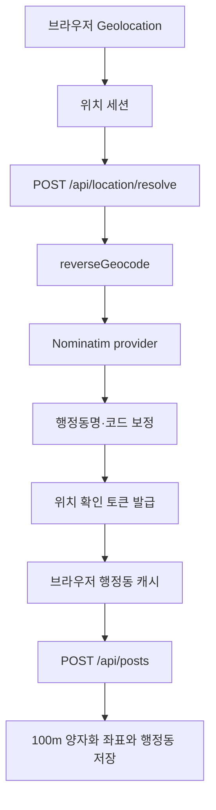
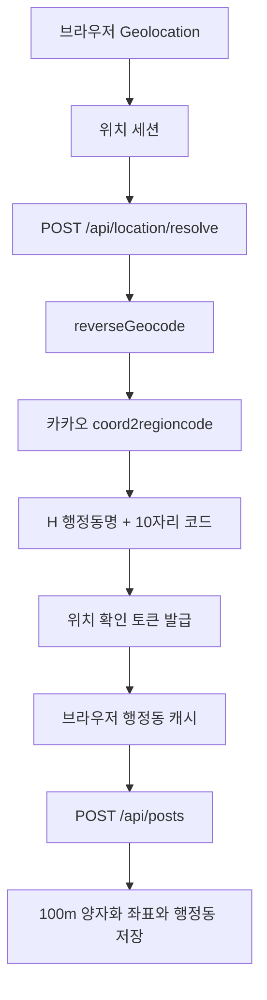
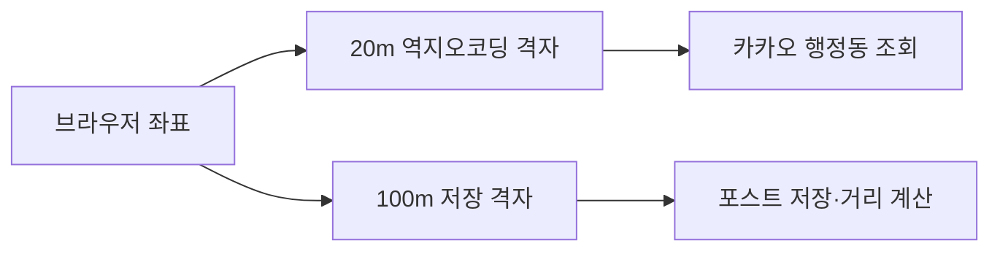

# 카카오 행정동 역지오코딩 전환 설계 및 구현 계획

> 이 문서는 최초 전환 설계를 기록한다. 실제 구현 이후 확인된 캐시,
> 토큰, 동시성, 운영 및 테스트 보완 사항은
> [`location-system-hardening-plan.md`](location-system-hardening-plan.md)를
> 기준으로 한다.

## 1. 목적

현재 Nominatim 기반 좌표 역지오코딩을 카카오 Local REST API의
`coord2regioncode`로 교체한다.

이번 전환의 핵심 목표는 다음과 같다.

- 한국 행정동과 법정동을 명시적으로 구분한다.
- 카카오가 반환하는 10자리 행정동 코드를 직접 사용한다.
- API 키를 브라우저에 노출하지 않는다.
- 기존 위치 세션, 행정동 캐시, 위치 토큰, 포스트 저장 흐름을 유지한다.
- 제공자 전환과 모바일 위치 정확도 개선을 분리해 회귀 위험을 줄인다.

## 2. 범위

### 포함

- Nominatim을 카카오 `coord2regioncode` API로 교체
- `region_type === "H"`인 행정동 결과 선택
- 카카오의 행정동명과 10자리 행정동 코드 사용
- 카카오 API 오류와 설정 오류 처리
- 기존 역지오코딩 서버 캐시 버전 갱신
- 로컬 및 Vercel 환경변수 설정
- 유효 좌표 역지오코딩 검증 절차 추가
- 후속 단계로 모바일 위치 정확도 개선 설계

### 제외

- 지도 UI 추가
- 주소 또는 도로명 주소 표시
- 사용자의 이동 경로 저장
- DB에 원본 고정밀 좌표 저장
- 행정동 직접 선택 UI
- PostGIS 행정구역 경계 데이터 운영

## 3. 현재 구조

현재 위치 흐름은 다음과 같다.



관련 파일:

- `src/lib/geo/browser-location.ts`
- `src/lib/geo/browser-location-session.ts`
- `src/lib/geo/browser-administrative-location-resolver.ts`
- `src/app/api/location/resolve/route.ts`
- `src/lib/geo/resolve-location.ts`
- `src/lib/geo/reverse-geocode.ts`
- `src/lib/geo/reverse-geocode-provider.ts`
- `src/lib/geo/reverse-geocode-result.ts`
- `src/lib/geo/location-resolution-token.ts`
- `src/app/api/posts/route.ts`

현재 캐시 정책:

- 브라우저 좌표 세션: 3분
- 브라우저 행정동 캐시: 30분
- 위치 확인 토큰: 10분
- 서버 역지오코딩 캐시: 7일
- 역지오코딩 좌표: 100m 격자 중심점
- DB 저장 좌표: 100m 격자

## 4. 목표 구조



카카오 호출은 서버에서만 수행한다.

```http
GET https://dapi.kakao.com/v2/local/geo/coord2regioncode.json
    ?x={longitude}
    &y={latitude}
    &input_coord=WGS84

Authorization: KakaoAK {KAKAO_REST_API_KEY}
```

응답의 `documents`에서 `region_type === "H"`인 항목을 사용한다.

사용할 필드:

- `region_1depth_name`: 시·도
- `region_2depth_name`: 시·군·구
- `region_3depth_name`: 행정동
- `address_name`: 전체 행정구역명
- `code`: 10자리 행정동 코드

`region_type === "B"`는 법정동이므로 행정동 결과로 직접 사용하지 않는다.

## 5. 설계 원칙

### 5-1. API 키는 서버 전용으로 유지

환경변수 이름은 `KAKAO_REST_API_KEY`를 사용한다.

- `NEXT_PUBLIC_` 접두사를 붙이지 않는다.
- Client Component에서 참조하지 않는다.
- API 응답이나 오류 로그에 키를 포함하지 않는다.
- `.env.local`과 Vercel 환경변수에 각각 설정한다.

### 5-2. 카카오 행정동 코드를 최우선 사용

카카오는 행정동 이름과 10자리 코드를 함께 반환한다. 따라서 기존처럼
동 이름으로 코드를 다시 추론할 필요가 없다.

행정동 코드 결정 순서:

1. 카카오 `H` 결과의 유효한 10자리 `code`
2. 기존 `administrative-dong-map.json` 매핑 결과
3. 기존 known dong code
4. 기존 synthetic code

카카오 코드 유효성은 `/^\d{10}$/`로 확인한다.

### 5-3. 기존 fallback은 결과 보정용으로 유지

카카오가 정상적인 `H` 결과를 반환하면 기존 법정동→행정동 매핑은
사용하지 않는다.

다음 비정상 응답에 대비해 기존 결과 빌더 fallback은 유지한다.

- `H` 결과의 동 이름이 비어 있음
- 코드 형식이 올바르지 않음
- 테스트 또는 mock provider가 직접 코드를 제공하지 않음

카카오 요청 자체가 실패한 경우 Nominatim으로 자동 전환하지 않는다.
자동 fallback은 동일 요청이 공급자마다 다른 행정동으로 판정될 수 있고,
설정 오류나 쿼터 초과를 숨길 수 있기 때문이다.

서비스가 해외 좌표도 지원해야 한다면 별도의 명시적 provider 분기를
추가한다. 현재 계획은 한국 내 서비스만을 대상으로 한다.

### 5-4. 위치 획득과 역지오코딩 전환을 분리

첫 번째 구현에서는 기존 `getCurrentPosition`과 100m 양자화 정책을
유지하고 역지오코딩 제공자만 교체한다.

`watchPosition`, 정확도 등급, 행정동 확인 UI는 후속 단계에서 적용한다.
이렇게 해야 행정동 결과 변화가 카카오 전환 때문인지 GPS 정확도 변화
때문인지 구분할 수 있다.

## 6. 타입 설계

`ReverseGeocodeProviderPayload`에 직접 행정동 결과를 추가한다.

```ts
export type ReverseGeocodeProviderPayload = {
  administrativeDongCandidateNames: Array<string | null | undefined>;
  directAdministrativeDongName: string | null;
  directAdministrativeDongCode: string | null;
  countryCode: string | null;
  overseasAdministrativeDongFallbackNames: Array<
    string | null | undefined
  >;
  sidoName: string | null;
  sigunguName: string | null;
};
```

카카오 응답 타입은 외부 API가 반환할 수 있는 최소 필드만 선언한다.

```ts
type KakaoRegionDocument = {
  region_type?: "H" | "B" | string;
  address_name?: string;
  region_1depth_name?: string;
  region_2depth_name?: string;
  region_3depth_name?: string;
  region_4depth_name?: string;
  code?: string;
  x?: number;
  y?: number;
};

type KakaoRegionResponse = {
  meta?: {
    total_count?: number;
  };
  documents?: KakaoRegionDocument[];
};
```

외부 응답은 신뢰하지 않고 런타임에서 다음을 검증한다.

- `documents`가 배열인지
- `H` 결과가 존재하는지
- `region_3depth_name`이 비어 있지 않은지
- `code`가 10자리 숫자인지

## 7. 파일별 구현 계획

### 7-1. `src/lib/geo/reverse-geocode-provider.ts`

Nominatim 타입과 요청 코드를 카카오 구현으로 교체한다.

구현 내용:

1. `KAKAO_REVERSE_GEOCODE_ENDPOINT` 상수 정의
2. `KAKAO_REST_API_KEY` 로딩 및 누락 검증
3. 100m 버킷을 기존 방식대로 좌표로 복원
4. `x=longitude`, `y=latitude`, `input_coord=WGS84` 설정
5. `Authorization: KakaoAK ...` 헤더 추가
6. 5초 timeout과 `cache: "no-store"` 유지
7. 응답에서 `region_type === "H"` 선택
8. 행정동명, 행정동 코드, 시·도, 시·군·구를 provider payload로 변환

오류 메시지는 다음 범주로 구분한다.

- 키 누락: 서버 설정 오류
- 401/403: 인증 또는 앱 설정 오류
- 429: 쿼터 또는 호출 제한
- 5xx: 카카오 서비스 오류
- timeout: 외부 API 지연
- `H` 결과 없음: 지원하지 않는 좌표 또는 응답 데이터 오류

로그와 사용자 응답에 REST API 키를 포함하지 않는다.

### 7-2. `src/lib/geo/reverse-geocode-result.ts`

카카오 direct result를 우선 사용한다.

행정동명 결정 순서:

1. `directAdministrativeDongName`
2. 기존 행정동 매핑 결과
3. 기존 행정동 후보명 heuristic
4. 해외 fallback 이름

행정동 코드 결정 순서:

1. 유효한 `directAdministrativeDongCode`
2. 기존 행정동 매핑 결과
3. known dong code
4. synthetic code

동 이름은 기존 `normalizeAdministrativeDongName`을 통과시켜 UI와 DB의
표기 형식을 유지한다.

### 7-3. `src/lib/geo/reverse-geocode.ts`

provider 전환 전에 캐시 namespace를 변경한다.

```ts
["reverse-geocode-100m-v2"]
```

기존 `v1` 캐시에는 Nominatim 결과가 최대 7일간 남기 때문에 동일 키를
재사용하면 배포 직후에도 카카오 결과가 적용되지 않을 수 있다.

캐시 TTL 7일은 1차 전환에서 유지한다.

### 7-4. `.env.example`

다음 서버 전용 환경변수를 추가한다.

```dotenv
# Kakao Local REST API key. Use only on the server.
KAKAO_REST_API_KEY=
```

실제 키는 문서나 Git에 기록하지 않는다.

### 7-5. `docs/llm-maintenance-guide.md`

위치 유틸 목록과 위치 데이터 흐름에 다음 내용을 추가한다.

- 카카오 provider 파일 위치
- `H` 행정동 결과를 사용한다는 규칙
- 카카오 direct code가 기존 매핑보다 우선한다는 규칙
- provider 변경 시 역지오코딩 캐시 버전을 올려야 한다는 규칙

### 7-6. `scripts/run-api-smoke-tests.mjs`

외부 API에 의존하는 성공 테스트는 CI에서 불안정할 수 있으므로 기본
스모크 테스트에서 카카오를 직접 호출하지 않는다.

추가할 검증:

- `POST /api/location/resolve`의 잘못된 좌표가 계속 400을 반환
- 키가 없는 테스트 환경에서 provider 오류가 민감한 값을 노출하지 않음

유효 좌표 성공 테스트는 로컬 또는 배포 전 운영 점검 명령으로 분리한다.

## 8. 좌표 정밀도와 개인정보 정책

현재 시스템은 역지오코딩 전에 좌표를 100m 격자 중심점으로 변환한다.
따라서 실제 좌표가 행정동 경계에 가까우면 격자 중심점이 옆 행정동에
속할 수 있다.

1차 전환에서는 이 동작을 유지한다. provider와 좌표 정책을 동시에
변경하지 않기 위해서다.

2차 개선에서는 다음 대안을 비교한다.

### 대안 A: 원본 좌표로 역지오코딩

- 장점: 가장 정확한 행정동 판정
- 단점: 카카오에 고정밀 좌표 전달, 서버 캐시 cardinality 증가
- DB에는 계속 100m 양자화 좌표만 저장

### 대안 B: 역지오코딩 전용 20m 격자 사용

- 장점: 100m보다 경계 오분류 감소, 원본 좌표 노출 최소화
- 단점: 별도 격자 유틸과 캐시 namespace 필요
- DB 저장과 피드 계산은 기존 100m 격자 유지

### 권장안

역지오코딩에는 20m 격자를 사용하고 DB 저장에는 기존 100m 격자를
유지한다.

변경 후 구조:



이 변경은 카카오 provider 전환이 안정화된 뒤 별도 작업으로 수행한다.

## 9. 모바일 위치 정확도 후속 개선

현재 브라우저 위치 타입에는 `accuracy`와 브라우저의 `position.timestamp`
가 포함되지 않는다. 글 작성 시에는 `maximumAge: 0`으로 새 위치를
요청하지만 `enableHighAccuracy`는 `false`이고 단일 결과만 사용한다.

후속 단계에서는 홈과 글 작성 정책을 분리한다.

### 홈 피드

- 빠른 초기 표시 우선
- `getCurrentPosition` 유지
- 기존 캐시와 세션 재사용 유지
- 위치 권한 요청과 피드 로딩을 차단하지 않음

### 글 작성

- `watchPosition`을 최대 8초 사용
- `enableHighAccuracy: true`
- `maximumAge: 0`
- 가장 작은 `accuracy`의 좌표 선택
- `accuracy <= 100m`이면 조기 종료
- timeout 시 확보한 결과 중 가장 정확한 좌표 사용
- 확보한 결과가 없으면 실패

권장 정확도 처리:

- 100m 이하: 제출 허용
- 100m 초과 500m 이하: 행정동 표시 후 경고와 재시도 제공
- 500m 초과: 자동 제출 차단
- 2km 초과: 위치 서비스 또는 정확한 위치 권한 안내

첫 구현에서는 숫자 임계값을 코드에 분산하지 않고 위치 모듈 상수로
관리한다.

브라우저 위치 결과 타입:

```ts
type BrowserLocationMeasurement = {
  latitude: number;
  longitude: number;
  accuracy: number;
  measuredAt: number;
};
```

`measuredAt`은 `Date.now()`가 아니라 `GeolocationPosition.timestamp`를
사용한다.

## 10. 오류 및 사용자 경험

### 카카오 API 실패

- 홈 피드: 기존 global feed fallback 유지
- 글 작성: 행정동 확인 실패 메시지 표시, 포스트 저장 차단
- 기존에 유효한 위치 토큰이 있으면 만료 전까지 재사용 가능
- 서버 로그에 status, duration, 오류 범주만 기록

### 위치 권한 거부

- 기존 위치 권한 안내 다이얼로그 유지
- 카카오 API를 호출하지 않음

### 부정확한 위치

2차 위치 정확도 개선 이후 다음 안내를 제공한다.

```text
정확한 위치를 확인할 수 없습니다.

휴대전화의 위치 서비스와 브라우저의 정확한 위치 권한을 켠 뒤
다시 시도해 주세요.
```

행정동 직접 선택 기능이 없기 때문에 초기 구현에서는 잘못된 지역을
사용해 제출하는 것보다 재시도를 요구하는 정책을 우선한다.

## 11. 보안

- `KAKAO_REST_API_KEY`는 서버 코드에서만 읽는다.
- 키를 URL query parameter에 넣지 않는다.
- 외부 API 응답 전체를 로그에 남기지 않는다.
- 카카오 오류 응답을 그대로 사용자에게 전달하지 않는다.
- API route는 외부 provider 구현을 직접 알지 않도록 유지한다.
- 위치 확인 토큰의 HMAC 검증과 100m 버킷 일치 검증을 유지한다.
- DB에는 원본 고정밀 좌표를 저장하지 않는다.

## 12. 운영 준비

배포 전에 카카오 개발자 콘솔에서 다음을 확인한다.

1. 서비스 앱과 REST API 키가 활성 상태인지 확인
2. 좌표→행정구역 API 사용 설정 확인
3. 허용 IP를 사용한다면 Vercel outbound IP 정책과 호환되는지 확인
4. 현재 무료 쿼터와 과금 정책 확인
5. 로컬 `.env.local`에 키 설정
6. Vercel Production, Preview, Development 환경에 키 설정
7. 환경변수 변경 후 재배포

카카오 지도 API의 사용 방식과 무료 쿼터 정책은 2026년 7월 21일
변경되었으므로 배포 시점의 공식 정책을 다시 확인한다.

## 13. 구현 순서

### 1차: provider 전환

1. `.env.example`에 `KAKAO_REST_API_KEY` 추가
2. 카카오 응답 타입과 provider payload direct 필드 추가
3. Nominatim 호출을 카카오 호출로 교체
4. `H` 행정동 선택과 10자리 코드 검증 구현
5. 결과 빌더에서 direct 이름·코드 우선 처리
6. 서버 역지오코딩 캐시 키를 `v2`로 변경
7. 유지보수 문서 갱신
8. 타입 검사, 빌드, API 스모크 실행
9. 서울·경기·광역시·도농복합시 좌표로 수동 검증
10. Preview 배포 후 로그와 오류율 확인

### 2차: 역지오코딩 정밀도 개선

1. 역지오코딩 전용 20m 격자 유틸 추가
2. 위치 토큰은 기존 100m 저장 버킷 검증 유지
3. 역지오코딩 캐시 namespace 재변경
4. 경계 좌표 회귀 케이스 검증

### 3차: 모바일 측위 개선

1. `accuracy`와 `position.timestamp` 타입 추가
2. 글 작성 전용 단기 `watchPosition` 구현
3. 조기 종료, timeout, cleanup 처리
4. 정확도 임계값과 재시도 UX 구현
5. Geolocation mock 기반 회귀 테스트 추가

## 14. 검증 계획

### 정적 검증

```bash
npm run typecheck
npm run build
npm run guard:architecture
```

빌드 완료 후:

```bash
npm run smoke:api
```

### provider 검증 좌표

최소 다음 유형을 확인한다.

- 서울특별시 일반 행정동
- 세종특별자치시
- 광역시의 구·동
- 경기도 시·구·동
- 도농복합시의 읍·면
- 행정동 경계에 가까운 좌표
- 바다 또는 한국 밖 좌표

각 결과에서 확인할 값:

- `administrativeDongName`
- `administrativeDongCode`가 10자리인지
- `sidoName`
- `sigunguName`
- `formattedAdministrativeAreaName`
- location resolution token 발급 여부
- 포스트 저장 행정동명과 코드

### 오류 검증

- 키 누락
- 잘못된 키
- 카카오 429
- 카카오 5xx
- request timeout
- 빈 `documents`
- `B`만 있고 `H`가 없는 응답
- malformed JSON

### 회귀 검증

- 홈 위치 권한 요청
- nearby/global feed fallback
- 글쓰기 진입 시 최신 좌표 갱신
- 위치 토큰을 포함한 포스트 작성
- 토큰 없이 포스트 작성할 때 서버 재해석
- 후보자 선거구 매칭에 10자리 행정동 코드 사용

## 15. 배포 전략

1. Preview 환경에 카카오 키 설정
2. provider 변경 배포
3. 주요 국내 좌표 수동 검증
4. Preview의 `/api/location/resolve` latency와 오류 로그 확인
5. Production에 키 설정
6. Production 배포
7. 초기 24시간 동안 다음 항목 관찰
   - 카카오 401/403/429 응답
   - `LOCATION_RESOLUTION_FAILED` 빈도
   - 역지오코딩 응답 시간
   - synthetic 행정동 코드 생성 여부
   - 위치 실패로 인한 포스트 등록 실패율

롤백은 provider 구현을 Nominatim 버전으로 되돌리고 캐시 namespace를
별도 버전으로 올리는 방식으로 수행한다. 서로 다른 provider가 같은
캐시 namespace를 공유하지 않도록 한다.

## 16. 완료 조건

다음 조건을 모두 만족하면 1차 전환을 완료한 것으로 본다.

- 카카오 REST API 키가 브라우저 번들에 포함되지 않음
- 카카오 `H` 결과가 행정동으로 사용됨
- 10자리 행정동 코드가 DB와 위치 토큰에 반영됨
- 기존 Nominatim 캐시가 재사용되지 않음
- 키 누락과 외부 API 실패가 안전하게 처리됨
- 한국 내 주요 좌표 검증 통과
- 타입 검사와 프로덕션 빌드 통과
- API 스모크 테스트 통과
- Vercel 환경변수와 카카오 쿼터 점검 완료

## 17. 구현 전 확정 사항

구현 시작 전에 다음 정책을 확정한다.

1. 서비스 범위를 한국 내 좌표로 제한할지
2. 카카오 장애 시 포스트 작성을 차단할지, Nominatim fallback을 둘지
3. 2차 단계에서 원본 좌표와 20m 격자 중 어느 것을 사용할지
4. 위치 정확도가 100~500m일 때 경고만 할지 제출을 차단할지
5. 행정동 확인 및 직접 선택 UI를 추가할지

이 문서의 기본 권장값은 다음과 같다.

- 한국 내 서비스로 제한
- 카카오 장애 시 자동 Nominatim fallback 없이 명시적 실패
- 역지오코딩 전용 20m 격자 사용
- 500m 초과 시 제출 차단
- 직접 선택 UI는 별도 기능으로 연기

## 18. 참고 문서

- [카카오 Local REST API 개발 가이드](https://developers.kakao.com/docs/en/local/dev-guide)
- [카카오 REST API 레퍼런스](https://developers.kakao.com/docs/en/rest-api/reference)
- [카카오 지도 API 개념 및 운영 정책 안내](https://developers.kakao.com/docs/en/local/common)
