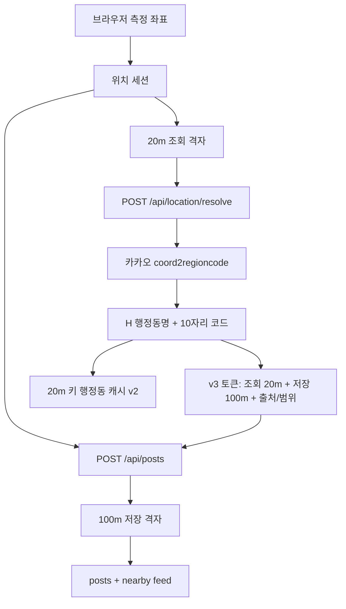
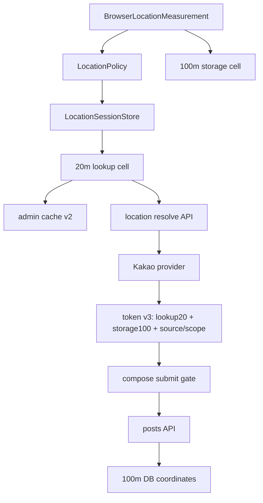
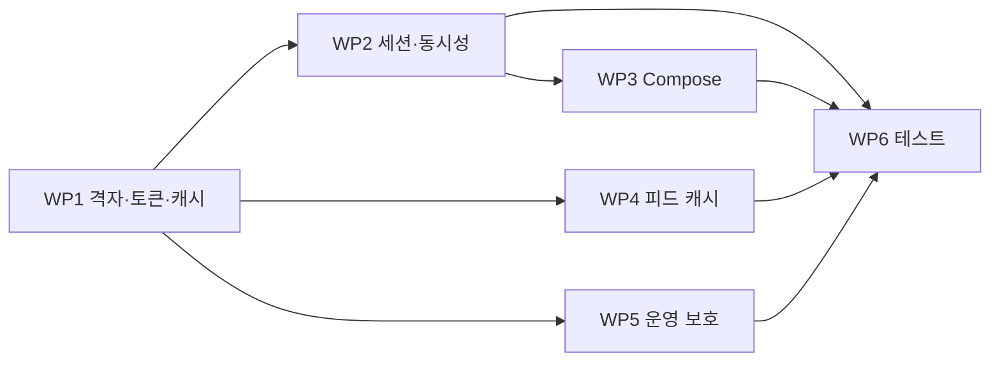

# 위치 시스템 종합 보완 설계 및 구현 계획

## 1. 문서 목적

이 문서는 카카오 행정동 역지오코딩, 20m 조회 격자, 100m 저장 격자,
브라우저 위치 측정, 위치 세션, 캐시, 위치 확인 토큰, 포스트 제출,
운영과 테스트를 하나의 일관된 시스템으로 정리한다.

기존 `docs/kakao-reverse-geocoding-plan.md`는 제공자 전환의 최초 설계를
기록한 문서다. 실제 구현 이후 확인된 계층 간 불일치와 운영 공백은
이 문서의 보완 계획을 기준으로 처리한다.

### 구현 상태 (2026-08-06)

> 2026-08-08 모바일 브라우저 권한·WebView·정확도 보완 이후의 위치 획득
> 정책과 QA 기준은 `docs/mobile-geolocation-compatibility-audit.md`를
> 우선한다. 특히 정밀 측위는 전체 8초 제한이 아니라 첫 fix 최대 30초와
> 첫 결과 이후 8초 개선 구간으로 분리됐다.
> 권한 거부는 현재 문서에서 즉시 재요청하고, 계속 거부되면 한 번
> 새로고침한 직후 권한 요청을 자동으로 다시 실행한다.
> 센서 오류는 1회 재측정하며, 좌표 확보 후
> 역지오코딩 오류는 기존 좌표만 재사용한다. 같은 오류가 반복되면 전국
> 지역 직접 선택으로 전환한다.
> 작성 화면은 GPS 위치일 때 `{행정동}에 남기기`만 표시하며 지역 변경을
> 숨긴다. 직접 선택 위치일 때만 제목 옆에 `지역 변경`을 제공한다.

WP1~WP6의 애플리케이션 코드 구현을 완료했다. 이 문서의 "현재 구현"과
"확인된 문제" 절은 보완 전 기준의 조사 기록이며, 현재 동작은 아래와 같다.

- 위치 토큰 v3는 카카오 행정 지역 10자리 코드, 20m 조회 셀, 100m 저장 셀,
  위치 출처와 선택 범위를 모두 서명하며 이전 토큰을 거부한다.
- 행정동 표시 캐시는 `v2` 키와 20m 셀을 사용하고 provider와 schema
  version을 검증한다.
- 홈 측위를 글쓰기 측위가 취소·대체하며 동일한 글쓰기 요청은 하나로
  병합된다. `watchPosition`은 `AbortSignal`로 정리된다.
- 글쓰기 패널은 fresh 좌표, 카카오 행정 지역, 유효한 위치 토큰이 모두
  준비된 뒤 열린다. 500m 초과는 한 번 재시도하고, 재시도 후 2km 이내는
  경고 후 허용하며 2km 초과는 지역 직접 선택으로 전환한다.
- nearby 피드 캐시는 현재 GPS의 100m 셀이 일치할 때만 읽으며 위치
  세션을 prime하지 않는다.
- Nominatim fallback은 없고 카카오 실패 유형을 분류해 좌표와 키 없이
  구조화 로그로 남긴다.
- 위치 정책은 `src/lib/geo/location-policy.ts`에 모았고 Vitest와
  architecture guard로 핵심 불변식을 검증한다.

배포 전 필수 작업:

1. 로컬·Preview·Production에 32자 이상의
   `LOCATION_RESOLUTION_TOKEN_SECRET`을 각각 설정한다. Supabase secret
   fallback은 지원하지 않으며 누락 시 서버 시작을 중단한다.
2. `KAKAO_REST_API_KEY`를 같은 환경에 설정한다.
3. Vercel Firewall에서 `/api/location/resolve`에 IP 기반 rate limit을
   설정하고, 카카오 개발자 콘솔에서 401·403·429와 일일 쿼터 알림을 켠다.
   서버리스 인스턴스별 메모리 rate limit은 사용하지 않는다.

## 2. 조사 범위

다음 경로를 현재 미커밋 변경까지 포함해 조사했다.

- 브라우저 Geolocation과 `watchPosition`
- 홈 진입 시 위치 요청
- 글쓰기 진입·재시도·제출
- 위치 세션 singleton과 비동기 요청 병합
- 행정동 localStorage 캐시
- nearby 피드 localStorage 캐시
- `/api/location/resolve`
- 카카오 `coord2regioncode`
- 서버 `unstable_cache`
- 위치 확인 토큰 생성·검증
- `/api/posts` fallback 역지오코딩
- DB 100m 좌표 저장과 피드 조회
- 환경변수·로그·쿼터·배포
- 자동 테스트와 아키텍처 guard

## 3. 현재 구현 상태

### 3-1. 좌표 표현

현재 시스템에는 목적이 다른 세 종류의 좌표가 있다.

1. **측정 좌표**
   - 브라우저가 반환한 원본 위도·경도
   - `accuracy`, `position.timestamp` 포함
   - 메모리에서만 사용

2. **행정동 조회 좌표**
   - 측정 좌표를 20m 격자로 양자화
   - 카카오 역지오코딩과 서버 캐시 키에 사용

3. **저장·피드 좌표**
   - 측정 좌표를 100m 격자로 양자화
   - DB 저장, 거리 계산, nearby 피드 키에 사용

20m와 100m 분리는 의도적이다. 행정동 경계 판정은 더 정확하게 하고,
공개 데이터와 DB에는 고정밀 좌표를 남기지 않기 위함이다.

### 3-2. 현재 데이터 흐름



위 흐름은 보완 구현 후 기준이다. 아래 문제 분석은 구현 전 상태에서
발견된 원인과 변경 근거를 보존한다.

## 4. 확인된 핵심 문제

## 4-1. 20m 행정동 결과가 100m 범위에서 재사용됨

관련 파일:

- `src/lib/geo/reverse-geocode.ts`
- `src/lib/geo/location-resolution-token.ts`
- `src/lib/geo/browser-administrative-location.ts`

같은 100m 셀 안에 여러 20m 셀이 있고 행정동 경계가 셀을 가로지르면,
한 20m 셀에서 발급된 행정동 토큰이 다른 20m 셀에서도 유효하다.

결과:

- 카카오를 20m로 조회해도 이전 행정동이 저장될 수 있음
- 배포 전 Nominatim 기반 localStorage 캐시가 남을 수 있음
- 오래된 v1 토큰이 카카오 전환 후에도 만료 전까지 통과할 수 있음

### 보완 원칙

- 행정동 판정 결과의 재사용 범위는 반드시 **20m 조회 셀**과 일치
- DB와 피드의 위치 익명화 범위는 계속 **100m 저장 셀** 유지
- 토큰 payload에 조회 셀과 저장 셀을 둘 다 기록

## 4-2. 글쓰기 재측위가 진행 중인 요청과 충돌함

관련 파일:

- `src/lib/geo/browser-location-session.ts`
- `src/components/home/use-home-compose-flow.ts`
- `src/components/post/use-compose-location.ts`

현재 `refreshFreshBrowserLocationCoordinates()`는 진행 중인 refresh가 있으면
그 요청을 기다린 뒤 새 `watchPosition`을 시작한다.

영향:

- 홈 진입 위치 요청 중 글쓰기를 누르면 일반 측위와 카카오 조회가 끝난
  뒤 최대 8초 측위를 다시 수행
- 글쓰기 버튼 연타 시 정확도 측위가 연속 실행될 수 있음
- 작성 패널이 열린 뒤 두 번째 측위가 세션 좌표를 바꿀 수 있음
- 사용자에게 측위 진행 상태가 표시되지 않아 연타 가능성이 커짐

## 4-3. 정확도 측위 취소와 수명 관리가 없음

`watchPosition`은 성공·오류·8초 timeout 시 정리되지만 호출자가 취소할
수 없다.

영향:

- 홈 unmount 또는 새 요청으로 대체돼도 기존 watch가 최대 8초 유지
- 배터리와 센서를 불필요하게 사용
- 늦게 완료된 요청은 sequence로 결과가 버려져도 측위 자체는 계속됨

## 4-4. 행정동 확인 완료와 제출 준비 상태가 분리돼 있음

정확한 좌표 수집 함수는 좌표 Promise를 반환하지만 같은 refresh에서
시작한 행정동 확인 Promise는 기다리지 않는다.

현재 서버는 토큰이 없으면 제출 좌표를 다시 카카오로 해석하므로 저장
정확성은 유지된다. 그러나 다음 문제가 남는다.

- 패널에서 토큰이 준비되기 전에 제출 가능
- 클라이언트 캐시 행정동과 서버 저장 행정동의 시점이 다를 수 있음
- 카카오 호출이 중복될 수 있음
- 재확인 버튼이 끝난 것처럼 보여도 행정동 확인은 진행 중일 수 있음

## 4-5. nearby 피드 캐시가 위치 세션을 오염시킬 수 있음

`readLatestCachedNearbyPostList()`는 저장된 `cacheKey`와 새 GPS 위치를
비교할 수 없는 시점에 가장 최근 캐시를 반환한다.

현재 bootstrap은 이 캐시의 위치로 세션을 prime할 수 있다.

영향:

- 이동 직후 이전 지역 피드가 잠깐 표시될 수 있음
- 피드 캐시 좌표가 실제 측정 좌표처럼 위치 세션에 들어갈 수 있음

피드 캐시는 빠른 렌더링을 위한 데이터일 뿐, 위치 측정의 근거로 사용하면
안 된다.

## 4-6. 위치 정책 상수가 여러 파일에 분산됨

현재 값:

- 정확도 목표: 100m
- 제출 경고: 100m 초과
- 500m 초과: 한 번 재시도
- 재시도 후 제출 상한: 2km
- 재시도 후 2km 초과: 지역 직접 선택
- accurate watch: 최대 8초
- 측정 결과 허용 나이: 30초
- 일반 geolocation 캐시: 60초
- 세션 freshness: 3분
- 행정동 localStorage: 30분
- 위치 토큰: 10분
- nearby 피드 캐시: 3분
- 서버 역지오코딩 캐시: 7일

정책이 여러 모듈에 흩어져 있어 일부 값만 변경되기 쉽다.

## 4-7. 운영 관측과 쿼터 보호가 부족함

현재 카카오 실패는 사용자에게 안전한 일반 메시지로 변환되지만, 서버
로그에는 실패 원인과 지연 시간이 구조적으로 남지 않는다.

또한 `/api/location/resolve`는 공개 endpoint이고 20m 셀은 기존 100m보다
고유 캐시 키 수가 최대 약 25배 많다.

필요한 보완:

- 설정 누락, 인증, 쿼터, upstream 5xx, timeout, 응답 형식 오류 구분
- 좌표·API 키를 남기지 않는 구조화 로그
- 한국 서비스 범위 사전 검증
- Vercel/Kakao 레벨 호출 제한과 알림

프로세스 메모리 기반 rate limit은 서버리스 인스턴스 간 공유되지 않으므로
사용하지 않는다.

## 4-8. 자동 테스트 공백

현재 위치 흐름에는 단위 테스트가 없다.

누락된 핵심 테스트:

- 20m·100m 격자 경계
- 토큰 v1/v2 호환·무효화
- localStorage cache version
- `watchPosition` best measurement 선택과 cleanup
- 요청 취소
- concurrent compose 요청 병합
- 카카오 `H`/`B` 응답 파싱
- 키 누락·401·429·timeout
- 토큰 유무에 따른 `/api/posts` 경로

## 5. 목표 아키텍처



### 핵심 불변식

1. 행정동 결과는 결과를 만든 20m 조회 셀에서만 재사용한다.
2. DB와 공개 피드는 100m 저장 셀만 사용한다.
3. 피드 캐시는 위치 측정 세션을 prime하지 않는다.
4. 글쓰기 측위는 동시에 하나만 존재한다.
5. 정확한 위치 요청은 같은 intent끼리 Promise를 공유한다.
6. 새 intent는 이전 측위를 취소하거나 명시적으로 승격한다.
7. 작성 패널은 좌표와 행정동 확인이 모두 완료된 뒤 연다.
8. 서버는 이전 클라이언트를 위해 토큰 없는 제출 fallback을 유지한다.
9. 브라우저의 신규 클라이언트는 유효한 v3 토큰이 준비돼야 제출한다.
10. 외부 provider 오류는 사용자에게 노출하지 않고 운영 로그에는 분류한다.

## 6. 좌표·캐시·토큰 설계

## 6-1. 공통 위치 셀 타입

`src/lib/geo/location-buckets.ts`에 목적이 드러나는 타입을 둔다.

```ts
type ReverseGeocodeCell = {
  latitudeBucket20m: number;
  longitudeBucket20m: number;
};

type StorageLocationCell = {
  latitudeBucket100m: number;
  longitudeBucket100m: number;
};
```

UI·세션은 측정 좌표를 사용하고, provider와 캐시 경계에서만 셀 타입으로
변환한다.

## 6-2. 위치 확인 토큰 v3

관련 파일:

- `src/lib/geo/location-resolution-token.ts`
- `src/app/api/location/resolve/route.ts`
- `src/app/api/posts/route.ts`

권장 payload:

```ts
type LocationResolutionTokenPayloadV2 = {
  version: 2;
  administrativeDongCode: string;
  formattedAdministrativeAreaName: string;
  expiresAt: number;
  latitudeBucket20m: number;
  longitudeBucket20m: number;
  latitudeBucket100m: number;
  longitudeBucket100m: number;
};
```

검증 규칙:

- HMAC 서명 일치
- `version === 2`
- 만료 전
- 제출 좌표의 20m 조회 셀 일치
- 제출 좌표의 100m 저장 셀 일치
- 행정동 코드는 10자리 숫자

기존 version 없는 토큰은 무효로 처리하고 서버가 제출 좌표를 다시
역지오코딩한다. 즉시 배포 호환성은 유지하되 이전 행정동 결과를 신뢰하지
않는다.

`LOCATION_RESOLUTION_TOKEN_SECRET`을 필수 서버 환경변수로 전환한다.
`SUPABASE_SECRET_KEY` fallback은 마이그레이션 기간 후 제거한다.

## 6-3. 브라우저 행정동 캐시 v2

관련 파일:

- `src/lib/geo/browser-administrative-location.ts`

변경:

- storage key:
  `herebtw.cachedAdministrativeLocation.v2`
- cache key:
  `latitudeBucket20m:longitudeBucket20m`
- payload에 `provider: "kakao"`와 `schemaVersion: 2` 저장
- `formattedAdministrativeAreaName` 저장
- token version과 expiry 검증

정책:

- 행정동명은 30분 동안 표시용으로 사용할 수 있음
- 토큰이 없거나 만료되면 상태는 `cached`, 제출 준비 상태는 아님
- `verified` 상태는 유효한 v3 토큰이 있을 때만 사용

## 6-4. nearby 피드 캐시

관련 파일:

- `src/lib/posts/browser-nearby-post-cache.ts`
- `src/components/home/home-feed-bootstrap.ts`

변경:

- `readCachedNearbyPostList(location)`처럼 현재 측정 좌표를 받는 API 추가
- 100m cache key가 일치할 때만 피드 적용
- `readLatestCachedNearbyPostList()` 결과로 위치 세션을 prime하지 않음
- GPS 확인 전에는 SSR global feed 또는 명시적 로딩 상태 유지

nearby 캐시는 100m 단위가 맞다. 행정동 캐시와 달리 20m로 바꾸지 않는다.

## 7. 위치 정책 단일화

새 파일:

- `src/lib/geo/location-policy.ts`

```ts
export const LOCATION_POLICY = {
  accurateWatchTargetMeters: 100,
  accurateWatchMaxWaitMs: 8000,
  submitWarningAboveMeters: 100,
  submitBlockAboveMeters: 500,
  maximumMeasurementAgeMs: 30000,
  browserMaximumAgeMs: 60000,
  sessionFreshnessMs: 180000,
  administrativeDisplayCacheMs: 1800000,
  resolutionTokenTtlMs: 600000,
  nearbyFeedCacheMs: 180000,
  reverseGeocodeCacheSeconds: 604800,
} as const;
```

정확도 정책:

- 100m 이하: 경고 없이 제출
- 100m 초과 500m 이하: 경고와 재확인 제공, 제출 허용
- 500m 초과: 한 번 재시도
- 재시도 후 500m 초과 2km 이하: 넓은 범위 경고 후 제출 허용
- 재시도 후 2km 초과: 위치 제출 차단 후 지역 직접 선택
- accuracy 없음: 제출 차단

이 정책은 제품 결정이므로 UI와 세션에서 각각 숫자를 재선언하지 않는다.

## 8. 위치 측정 Port와 취소

관련 파일:

- `src/lib/geo/browser-location.ts`

목표 API:

```ts
type GeolocationFailureCode =
  | "GEOLOCATION_UNAVAILABLE"
  | "GEOLOCATION_PERMISSION_DENIED"
  | "GEOLOCATION_POSITION_UNAVAILABLE"
  | "GEOLOCATION_TIMEOUT"
  | "GEOLOCATION_ABORTED"
  | "GEOLOCATION_FAILED";

type AccurateLocationRequest = {
  signal?: AbortSignal;
  onProgress?: (measurement: BrowserLocationMeasurement) => void;
};

interface GeolocationPort {
  getCurrent(
    options?: BrowserLocationRequestOptions,
    signal?: AbortSignal,
  ): Promise<BrowserLocationMeasurement>;

  getAccurate(
    options?: AccurateBrowserLocationRequestOptions & AccurateLocationRequest,
  ): Promise<BrowserLocationMeasurement>;
}
```

`AbortSignal` 수신 시:

- `clearWatch(watchId)`
- timeout 해제
- `GEOLOCATION_ABORTED`로 reject
- listener 제거

`onProgress`는 정확도 표시가 필요한 경우에만 UI로 전달한다.

## 9. 위치 세션 재설계

현재 `browser-location-session.ts`는 500줄을 넘고 위치 측정, 캐시,
행정동 API, Promise 병합, React store 역할을 모두 담당한다.

다음과 같이 분리한다.

- `browser-location.ts`: 브라우저 API adapter
- `location-policy.ts`: 상수와 selector 정책
- `location-session-store.ts`: 순수 상태와 명령
- `browser-location-session.ts`: 브라우저 의존성 조립과 React binding
- `browser-administrative-location.ts`: localStorage adapter

### 9-1. 직교 상태

```ts
type CoordinatesState =
  | { kind: "absent" }
  | {
      kind: "measuring";
      mode: "home" | "compose";
      requestId: number;
      startedAt: number;
    }
  | {
      kind: "ready";
      measurement: BrowserLocationMeasurement;
    }
  | {
      kind: "failed";
      reason: GeolocationFailureCode;
    };

type AdministrativeState =
  | { kind: "unknown" }
  | { kind: "cached"; snapshot: ResolvedAdministrativeLocation }
  | { kind: "resolving"; requestId: number }
  | { kind: "verified"; snapshot: ResolvedAdministrativeLocation }
  | { kind: "failed"; reason: string };
```

permission은 별도 축으로 유지한다.

### 9-2. 명령

```ts
ensureForHome(): Promise<LocationSessionSnapshot>
refreshForCompose(): Promise<LocationSessionSnapshot>
retryForCompose(): Promise<LocationSessionSnapshot>
ensureResolutionToken(): Promise<LocationSessionSnapshot>
abortActiveRequest(reason: "unmount" | "superseded" | "user"): void
```

### 9-3. 동시성 정책

- 같은 `home` 요청끼리 병합
- 같은 `compose` 요청끼리 병합
- `compose` 요청이 `home` 요청보다 우선
- `home` 측위 중 compose가 시작되면 home 요청을 중단하고 compose 요청 시작
- 새 compose 요청은 이미 진행 중인 compose Promise를 재사용
- requestId가 다른 늦은 결과는 상태에 반영하지 않음
- 패널 닫기나 화면 unmount 시 compose 요청 abort

`refreshForCompose()`는 다음 전체 과정을 하나의 Promise로 반환한다.

```text
정확한 좌표 수집
→ 20m 행정동 캐시 확인
→ 유효한 v3 토큰이 없으면 /api/location/resolve
→ verified snapshot 반환
```

## 10. Compose UX와 제출 설계

관련 파일:

- `src/components/home/use-home-compose-flow.ts`
- `src/components/home/compose-permission-dialog.tsx`
- `src/components/post/use-compose-location.ts`
- `src/components/post/post-compose-form.tsx`
- `src/components/post/use-compose-submit.ts`

### 10-1. 글쓰기 진입 상태

```ts
type ComposeGateState =
  | { kind: "idle" }
  | { kind: "locating"; bestAccuracyMeters: number | null }
  | { kind: "blocked"; reason: "permission" | "accuracy" | "timeout" | "resolve" }
  | { kind: "open" };
```

`locating` 동안:

- CTA 중복 클릭 차단
- “현재 위치 확인 중…” 표시
- 홈 목록 interaction lock
- 같은 요청 재사용

### 10-2. 작성 패널

- verified 행정동명 표시
- 100~500m이면 정확도 경고와 “위치 재확인” 제공
- 500m 초과는 한 번 재시도하고 2km까지 경고 후 허용
- 2km 초과 또는 위치 접근 차단은 전국 지역 직접 선택 제공
- 재확인 중 제출 버튼 비활성화
- 재확인은 좌표와 행정동 토큰까지 모두 갱신
- 패널 닫기 시 active compose request 취소

### 10-3. 제출

신규 클라이언트 조건:

- 좌표 fresh
- 첫 측정 accuracy 500m 이하 또는 재시도 후 2km 이하
- administrative state가 `verified`
- 유효한 v2 token 존재
- 제출 중이 아님

서버 정책:

- v2 token 유효: 토큰 결과 사용
- token 없음·v1·불일치: 제출 좌표를 카카오로 다시 해석
- provider 실패: 502, 포스트 저장 안 함

서버 fallback을 유지하는 이유는 배포 중 이전 클라이언트와의 호환성이다.

중복 submit 방어를 위해 React state 외에 `submitPromiseRef` 또는
`submittingRef`를 사용한다.

## 11. API와 provider 운영 보완

## 11-1. 한국 서비스 범위 검증

카카오 호출 전에 좌표가 한국 서비스 범위에 있는지 대략적인 bbox로
검증한다.

범위 검증은 provider 비용과 명백한 해외 요청을 줄이기 위한 1차 필터다.
정확한 국경 판정은 카카오 `H` 결과가 담당한다.

범위 밖 응답:

- code: `OUT_OF_SERVICE_AREA`
- HTTP 400
- 사용자 메시지: `현재는 한국 내 위치만 지원해요.`

bbox 값은 별도 상수로 관리하고 제주·도서 지역이 빠지지 않도록 fixture로
검증한다.

## 11-2. 구조화 오류

```ts
type ReverseGeocodeErrorCategory =
  | "CONFIG_MISSING"
  | "AUTH"
  | "QUOTA"
  | "UPSTREAM"
  | "TIMEOUT"
  | "NO_ADMINISTRATIVE_REGION"
  | "INVALID_PAYLOAD"
  | "NETWORK";
```

provider는 category와 안전한 status만 포함한 전용 Error를 던진다.

로그:

```text
[reverse-geocode] provider_error
category=QUOTA
status=429
durationMs=...
```

로그하지 않는 값:

- API key
- Authorization header
- Kakao 응답 body
- 원본 좌표
- 20m bucket identifier

## 11-3. 호출 제한

권장 우선순위:

1. Kakao 콘솔 quota와 알림
2. Vercel Firewall/WAF rate limiting
3. 필요 시 durable store 기반 application rate limit

서버리스 process memory의 `Map` 기반 rate limit은 금지한다.

홈 최초 요청은 아직 device registration 이전일 수 있으므로
`anonymousDeviceId`만으로 `/api/location/resolve`를 제한하면 안 된다.

## 11-4. 환경변수

필수 runtime 변수:

```dotenv
KAKAO_REST_API_KEY=
LOCATION_RESOLUTION_TOKEN_SECRET=
```

운영 배포 검사 스크립트를 분리한다.

```text
npm run verify
npm run verify:runtime-env
```

일반 PR 빌드는 실제 비밀 값 없이도 가능하게 하고, Preview/Production
배포 단계에서 runtime env를 검사한다.

## 11-5. 서버 캐시

서버 역지오코딩 캐시는 20m 셀, 7일 TTL을 유지한다.

필수 운영 규칙:

- provider 또는 parser 변경 시 namespace bump
- 잘못된 결과 긴급 수정 시 namespace bump 후 재배포
- cache miss latency와 provider 오류율 관측
- 20m 전환 후 쿼터 사용량을 확인해 필요하면 TTL 조정

`revalidateTag`용 공개 API route는 만들지 않는다. 필요하다면 후보자
인증과 분리된 운영자 인증 체계가 먼저 필요하다.

## 12. 테스트 아키텍처

현재 테스트 프레임워크가 없으므로 Vitest를 도입한다.

### 12-1. pure unit test

- 20m·100m 양자화와 역변환
- 한국 bbox
- token v3 생성·검증
- v1 토큰 거부
- 카카오 H 선택
- B만 있는 응답 거부
- direct 10자리 코드 우선
- cache v2 schema 검증
- 정확도 selector

### 12-2. GeolocationPort test

fake geolocation과 fake timer로 검증한다.

- 100m 이내 측정 시 조기 종료
- timeout 시 best measurement 반환
- measurement 없음 timeout
- stale measurement 무시
- permission denied
- abort 시 `clearWatch`
- 같은 compose 요청 병합
- home 요청을 compose가 supersede

### 12-3. API test

실제 카카오를 CI에서 호출하지 않는다.

provider dependency를 주입하거나 mock transport를 사용한다.

- valid resolve → 10자리 code + v2 token
- invalid coordinate → 400
- 해외 coordinate → 400
- missing key → 502, 비밀 노출 없음
- Kakao 401/429/5xx → sanitized 502
- `/api/posts` v2 token 경로
- `/api/posts` token fallback 경로

### 12-4. UI integration

- 글쓰기 연타 시 측위 한 번
- locating 동안 CTA 잠금
- 80m 정확도: 경고 없이 패널
- 200m 정확도: 경고와 제출 허용
- 600m 정확도: 차단
- 재확인 시 token까지 갱신
- 패널 닫기·unmount 시 abort
- 제출 연타 시 POST 한 번

### 12-5. 운영 수동 검증

실제 카카오 키를 사용하는 별도 스크립트를 둔다.

검증 좌표:

- 서울 일반 동
- 세종특별자치시
- 광역시
- 경기도 시·구
- 읍·면 지역
- 제주·도서 지역
- 행정동 경계 양쪽
- 한국 밖 좌표

## 13. 아키텍처 guard와 문서

`scripts/check-architecture-rules.mjs`에 다음 회귀 방지를 추가한다.

- `src/components`에서 `KAKAO_REST_API_KEY` 참조 금지
- Client Component에서 `reverse-geocode-provider` import 금지
- 위치 policy 숫자 리터럴의 무분별한 재선언 점검은 테스트로 고정

갱신할 문서:

- `docs/kakao-reverse-geocoding-plan.md`
  - 초기 계획과 실제 구현 범위 차이 표시
  - 이 문서를 후속 보완 기준으로 링크
- `docs/llm-maintenance-guide.md`
  - v3 토큰·20m 행정동 캐시·상태 store 설명
- `docs/verification-guardrails.md`
  - 위치 unit/API test와 runtime env 검사
- 필요 시 PRD의 클라이언트 역지오코딩 설명 수정

## 14. 구현 작업 패키지

## WP1. 격자·토큰·캐시 일관성

수정 파일:

- `src/lib/geo/location-resolution-token.ts`
- `src/lib/geo/browser-administrative-location.ts`
- `src/lib/geo/location-buckets.ts`
- 관련 API route

작업:

1. token payload v2와 20m+100m 셀 바인딩
2. 기존 token 무효화 후 서버 fallback
3. admin localStorage v2와 20m cache key
4. formatted name과 provider metadata 저장
5. dedicated token secret 문서화

완료 조건:

- 같은 100m 안의 다른 20m 좌표에서 토큰 검증 실패
- v1 token이 서버 fallback을 타고 카카오 결과로 교정
- 기존 Nominatim localStorage가 읽히지 않음

## WP2. 세션 store와 요청 동시성

수정·추가 파일:

- `src/lib/geo/location-policy.ts`
- `src/lib/geo/location-session-store.ts`
- `src/lib/geo/browser-location-session.ts`
- `src/lib/geo/browser-location.ts`

작업:

1. 위치 정책 중앙화
2. GeolocationPort에 AbortSignal 지원
3. session 상태 축 분리
4. home/compose 요청 intent별 dedupe
5. compose가 home 요청을 supersede
6. full verified refresh Promise 제공

완료 조건:

- compose 연타 시 watch 한 번
- home refresh 중 compose가 최대 한 번의 accurate watch로 전환
- unmount·취소 시 clearWatch
- 늦은 요청 결과가 세션을 덮어쓰지 않음

## WP3. Compose gate와 제출

수정 파일:

- `src/components/home/use-home-compose-flow.ts`
- `src/components/home/compose-permission-dialog.tsx`
- `src/components/home/home-screen.tsx`
- `src/components/post/use-compose-location.ts`
- `src/components/post/post-compose-form.tsx`
- `src/components/post/use-compose-submit.ts`

작업:

1. locating 상태와 중복 클릭 잠금
2. 진행·권한·정확도·timeout·resolve 메시지 분리
3. verified 행정동명 표시
4. 재확인에서 좌표+token 갱신
5. submit ref guard
6. 패널 닫기 시 active request abort

완료 조건:

- 위치 확인 중 사용자에게 즉시 피드백
- 신규 클라이언트는 valid v2 token 준비 후 제출
- 서버 fallback으로 이전 클라이언트 호환
- 중복 POST 없음

## WP4. nearby 피드 캐시 분리

수정 파일:

- `src/lib/posts/browser-nearby-post-cache.ts`
- `src/components/home/home-feed-bootstrap.ts`
- 관련 feed sync 파일

작업:

1. current location 기반 cache read API
2. 피드 cache로 위치 세션 prime 제거
3. 100m key 일치 후에만 nearby 캐시 적용
4. compose 성공 후 실제 submit 좌표로 피드 갱신

완료 조건:

- 이동 후 이전 지역 피드가 nearby로 표시되지 않음
- 피드 캐시 좌표가 측정 좌표로 승격되지 않음

## WP5. provider 운영 보호

수정·추가 파일:

- `src/lib/geo/reverse-geocode-provider.ts`
- `src/lib/geo/resolve-location.ts`
- API route
- runtime env 검사 script
- 운영 문서

작업:

1. 한국 bbox
2. category 기반 provider error
3. 안전한 구조화 로그
4. runtime env 검사
5. Kakao/Vercel quota·rate-limit runbook

완료 조건:

- 401/429/timeout을 로그에서 구분
- 사용자 응답에 내부 오류·키·좌표 없음
- 해외 요청은 Kakao 호출 전 거부
- 배포 전에 필수 env 누락 감지

## WP6. 자동 테스트와 guard

작업:

1. Vitest 설치·설정
2. pure 함수와 store 단위 테스트
3. provider mock 기반 API 테스트
4. 스모크 성공 경로 확장
5. architecture guard 보강
6. 문서 동기화

완료 조건:

- 위치 핵심 상태 전이가 CI에서 재현 가능
- 실제 Kakao 호출 없이 성공·실패 API 경로 검증
- `npm run verify`에 안정적인 위치 테스트 포함

## 15. 구현 순서와 의존성



권장 PR 분리:

1. token v3 + admin cache v2
2. location policy + cancellable session store
3. compose gate + submit readiness
4. nearby cache 분리
5. provider 운영 보호
6. tests + guard + docs

WP1은 데이터 정확성 문제를 막으므로 가장 먼저 수행한다.

## 16. 검증 매트릭스

### 기능

- 홈 첫 진입 위치 허용·거부
- 캐시가 있는 재방문
- 이동 후 재방문
- 글쓰기 즉시 클릭
- 글쓰기 연타
- 정확도 80m, 200m, 600m
- 위치 재확인
- 패널 닫기와 화면 전환
- token 만료
- 기존 v1 token과 localStorage

### 행정동

- 동일 100m 안의 서로 다른 20m 셀
- 행정동 경계 양쪽
- 시·구·동
- 시·읍·면
- 세종·제주·도서
- 한국 밖

### 장애

- 위치 권한 거부
- OS 위치 서비스 꺼짐
- approximate location
- GPS timeout
- Kakao timeout
- Kakao 401·403·429·5xx
- malformed Kakao payload
- token secret 누락

### 비기능

- API 키가 client bundle에 없음
- 원본 좌표가 로그에 없음
- watch cleanup
- concurrent request dedupe
- cold cache 호출량
- build와 smoke 안정성

## 17. 배포 및 관측

### 배포 전

1. Preview·Production에 Kakao key와 token secret 설정
2. Kakao API 활성화와 쿼터 확인
3. Vercel rate limiting 정책 확인
4. 자동 테스트와 수동 좌표 검증
5. localStorage/token v3 migration 확인

### 배포 후 24시간

관측 항목:

- location resolve 성공률
- Kakao 오류 category 분포
- 429 발생 수
- provider latency p50/p95
- `LOCATION_RESOLUTION_FAILED`
- 포스트 제출 실패율
- synthetic code 생성 수
- reverse-geocode cache miss 수

로그에 좌표나 bucket identifier를 남기지 않는다.

### 롤백

- provider code rollback
- cache namespace를 새 버전으로 변경해 혼합 결과 방지
- token version은 v3 유지
- localStorage v2 유지
- 필요 시 위치 작성 기능을 일시적으로 차단

## 18. 최종 완료 기준

- 20m 행정동 결과가 20m 캐시와 v3 토큰에만 재사용됨
- DB와 피드는 계속 100m 좌표만 사용함
- 기존 Nominatim cache와 v1 token이 신뢰되지 않음
- compose 측위가 중복 실행되지 않고 취소 가능함
- 작성 패널이 verified 행정동 확인 후 열림
- 위치 재확인이 token까지 갱신함
- nearby 피드 캐시가 위치 세션을 prime하지 않음
- Kakao 오류·쿼터·환경변수를 운영에서 식별 가능함
- 핵심 위치 흐름에 자동 테스트가 존재함
- Preview와 Production 배포 체크리스트가 완료됨
