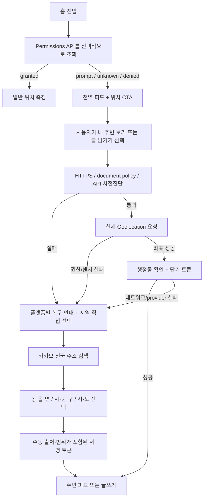

# 모바일 위치정보 호환성 진단 및 운영 기준

## 1. 목적

이 문서는 2026-08-08 기준으로 모바일 웹의 현재 위치 획득 실패를
브라우저 API, 운영체제 권한, 인앱 브라우저, 정확도, 네트워크, 역지오코딩
계층으로 나누어 진단하고, 현재 코드에 적용한 복구 전략과 실기기 QA 기준을
기록한다.

웹 서비스는 사용자가 거부한 권한이나 호스트 앱이 차단한 센서 접근을
우회할 수 없다. 따라서 여기서 말하는 호환성은 모든 환경에서 좌표를
강제로 얻는다는 뜻이 아니라 다음을 보장한다는 뜻이다.

1. 가능한 환경에서는 신뢰할 수 있는 좌표를 얻는다.
2. 불가능한 환경에서는 원인을 구분하고 사용자가 복구할 수 있는 경로를
   제공한다.
3. 위치가 없어도 전역 피드를 읽을 수 있다.
4. 부정확하거나 오래된 좌표로 글을 잘못된 동네에 저장하지 않는다.

## 2. 웹·플랫폼 조사 요약

- Geolocation API는 보안 컨텍스트(HTTPS)에서만 제공되며, 사용자 권한과
  `Permissions-Policy`의 영향을 함께 받는다. `maximumAge`, `timeout`,
  `enableHighAccuracy`는 정확도·속도·전력 소비의 트레이드오프를 만든다.
  [MDN getCurrentPosition](https://developer.mozilla.org/en-US/docs/Web/API/Geolocation/getCurrentPosition)
- Geolocation 표준은 권한 수명이 브라우저마다 다를 수 있고, 문서가 보이지
  않을 때 위치 요청 진행을 기다릴 수 있다고 명시한다. 권한을 영구 상태로
  가정하면 안 된다.
  [W3C Geolocation](https://www.w3.org/TR/geolocation/)
- `Permissions-Policy: geolocation=(self)`의 기본 의미는 최상위 문서와
  same-origin 컨텍스트만 허용하는 것이다. cross-origin iframe은 별도 위임이
  없으면 거부된다.
  [Chrome Permissions Policy](https://developer.chrome.com/docs/privacy-security/permissions-policy)
- iOS는 기기 위치 서비스, 브라우저/앱 권한, 정확한 위치 설정을 각각
  제어한다. 정확한 위치를 끄면 웹이 받는 오차 범위가 글쓰기 기준을 넘을 수
  있다.
  [Apple 위치 정보 제어](https://support.apple.com/guide/iphone/control-the-location-information-you-share-iph3dd5f9be/ios)
- iOS Safari의 `navigator.permissions.query({name: "geolocation"})`가
  사이트별 실제 권한과 일치하지 않았던 WebKit 이력이 있다. 따라서
  Permissions API는 자동 요청 여부를 정하는 힌트로만 사용하고, 최종 상태는
  실제 Geolocation 성공·오류 콜백으로 판단해야 한다.
  [WebKit bug 275950](https://bugs.webkit.org/show_bug.cgi?id=275950)
- Android에서는 기기 위치, 브라우저 앱 권한, 사이트 권한이 모두 허용돼야
  한다. Android 12 이상에서는 앱에 대략적 위치만 줄 수도 있다.
  [Google Android 위치 권한 안내](https://support.google.com/android/answer/179386)
- Android WebView는 호스트 앱이 OS 위치 권한을 가지고
  `WebChromeClient.onGeolocationPermissionsShowPrompt`를 처리해야 한다.
  웹 페이지 코드만으로 이 누락을 고칠 수 없다.
  [Android WebSettings](https://developer.android.com/reference/android/webkit/WebSettings.html)
- iOS의 임의 `WKWebView`도 호스트 앱이 origin별 Geolocation 요청을
  허용해야 할 수 있다. 서비스가 제어하지 않는 메신저 인앱 브라우저에서는
  외부 Safari/Chrome으로 여는 경로가 최종 폴백이다.
  [Apple WKWebView Geolocation delegate](https://developer.apple.com/documentation/webkit/wkuidelegate/webview%28_%3Arequestgeolocationpermissionfor%3Ainitiatedbyframe%3Adecisionhandler%3A%29)

## 3. 기존 코드에서 확인한 실패 지점

| 심각도 | 기존 동작 | 영향 | 적용한 변경 |
| --- | --- | --- | --- |
| 높음 | 홈 hydration 직후 두 경로에서 위치를 자동 요청 | 설명 없이 권한 팝업이 떠 모바일 거부율 증가, 중복 호출 가능 | 첫 방문은 권한 상태만 읽고 서비스 내 CTA 이후 실제 요청 |
| 높음 | `navigator.geolocation` 존재 여부만 확인 | HTTP, iframe policy, WebView host 차단을 모두 일반 실패로 표시 | insecure context, policy, API 부재, native 오류를 별도 코드로 분류 |
| 높음 | 정밀 `watchPosition` 전체 제한 8초 | 첫 권한 선택과 GPS 첫 fix가 같은 8초를 소비 | 첫 fix 최대 30초, 첫 결과 이후 개선 구간 8초로 분리 |
| 높음 | 홈에서 거부 후 복구 상태를 감시하지 않음 | 설정에서 허용해도 탭이 이전 `denied` 상태에 머무름 | Permissions API `change`와 foreground 복귀 시 granted를 감지해 재측위 |
| 중간 | `Permissions API` 미지원·오동작 전략 부재 | Safari/구형 브라우저에서 잘못된 선판단 가능 | API 미지원은 `unknown`, 실제 사용자 요청 결과를 최종 판정으로 사용 |
| 중간 | `watchPosition`이 없는 부분 구현 WebView | 객체는 있으나 정밀 측위 호출 실패 | `getCurrentPosition({enableHighAccuracy:true})`로 폴백 |
| 중간 | 오래되거나 범위를 벗어난 좌표 검증 부족 | stale/비정상 좌표가 세션으로 들어갈 수 있음 | timestamp, 위·경도 범위, accuracy 유효성 검증 |
| 중간 | `localStorage` 접근 예외가 캐시 함수 밖에서 발생 | 저장소 차단·용량 초과가 위치/피드 전체 실패로 전파 | read/write 모두 best-effort로 격리 |
| 중간 | 글쓰기에서 새 위치를 얻어도 홈 선택 위치가 갱신되지 않음 | 작성 후 전역 피드를 다시 읽을 수 있음 | verified 위치를 홈 선택·피드 기준에도 즉시 반영 |
| 낮음 | 하드코딩된 100m/500m UI 기준 | 정책 변경 시 세션과 UI 불일치 | `LOCATION_POLICY` 상수만 참조 |

## 4. 현재 위치 획득 흐름

글쓰기는 다음 추가 조건을 만족해야 한다.

- 좌표 timestamp가 요청 시점 기준 30초 이내
- 첫 측정에서 `accuracy <= 500m`
- 행정동 확인 성공
- 유효한 위치 확인 토큰 존재

`accuracy <= 100m`는 최적 상태, `100m < accuracy <= 500m`는 경고 후
제출 가능하다. 첫 측정이 500m를 넘으면 정확한 위치를 한 번 더 요청한다.
재시도 결과가 2km 이내이면 넓은 범위를 안내하고 제출을 허용하며, 2km를
넘으면 좌표 작성은 중단하고 지역 직접 선택으로 이동한다.

지역 직접 선택은 현재 카카오 Local REST 키로
`/v2/local/search/address.json`을 호출한다. 응답의 행정동명·행정동 코드와
지역 단위 코드를 이용해 전국의 동·읍·면, 시·군·구, 시·도를 선택할 수
있다. 선택 결과는 서버가 발급한 v3 HMAC 토큰으로 게시 요청에 결합되며,
클라이언트가 지역명·코드·대표 좌표를 바꿔 보낼 수 없다.
[Kakao 주소 검색](https://developers.kakao.com/docs/latest/ko/local/dev-guide#search-by-address)

시·군·구와 시·도 결과의 좌표는 피드 검색·정렬을 위한 대표점이다. 이를
작성자의 실제 거리처럼 오해하지 않도록 공개 카드에서는 정확한 거리 대신
`거리 미확인`을 표시하며, 수동 선택 여부 자체는 별도로 노출하지 않는다.

## 5. 오류별 사용자 복구 경로

| 오류 | 판정 근거 | 사용자 안내 |
| --- | --- | --- |
| insecure context | `window.isSecureContext === false` | HTTPS 주소로 다시 접속 |
| policy blocked | `document.permissionsPolicy/featurePolicy` | iframe을 벗어나 Safari/Chrome에서 직접 열기 |
| API unavailable | 메서드 없음 | 최신 외부 브라우저에서 열기 |
| permission denied | native `PERMISSION_DENIED`, `SecurityError` | iOS/Android별 사이트·앱·기기 설정 안내 |
| position unavailable | native `POSITION_UNAVAILABLE` | 위치 서비스·Wi-Fi 확인, 창가/실외에서 재시도 |
| timeout | native/자체 deadline | 화면을 켠 채 최대 30초 재시도 |
| invalid position | 좌표 범위·accuracy·timestamp 검증 실패 | 새 위치 재확인 |
| low accuracy | 첫 측정 `accuracy > 500m` | 한 번 재시도; 2km 이내 허용, 초과 시 지역 직접 선택 |
| resolve failure | 행정동 API 실패 | 인터넷 확인 후 재시도; 서버는 provider 분류 로그 기록 |
| blocked/manual fallback | 권한·API·iframe·반복 정확도 실패 | 전국 지역 검색에서 동·읍·면/시·군·구/시·도 선택 |

## 6. 실기기 QA 매트릭스

에뮬레이션은 권한 상태와 API 오류 검증에는 유용하지만 GPS 정확도와
인앱 브라우저 호스트 권한을 완전히 재현하지 못한다. 아래 핵심 조합은 실제
기기에서 확인한다.

### iOS

- Safari: Ask → Allow Once, Allow, Deny
- 사이트별 위치 Deny 후 설정에서 Allow로 변경하고 복귀
- 위치 서비스 전체 Off
- 정확한 위치 Off (1회 재시도, 2km 허용/초과 폴백 확인)
- Private Browsing
- 홈 화면에 추가한 PWA
- 카카오톡·네이버·인스타그램 인앱 브라우저에서 실패 시 외부 브라우저 안내

### Android

- Chrome: Allow this time, Allow while visiting, Never allow
- Android 앱 권한: 허용, 거부, 대략적 위치
- 기기 Location Off
- Google Location Accuracy Off
- Samsung Internet
- 카카오톡·네이버·LINE 등 WebView/Custom Tab
- Android 인앱 브라우저의 `Chrome에서 열기` intent와 미설치 fallback
- 배터리 절약 모드와 백그라운드 후 foreground 복귀

### 공통

- 느린 네트워크, offline, `/api/location/resolve` timeout/429/5xx
- 실내 첫 GPS fix, 도심 빌딩 사이, 지하, 이동 중
- same-origin top level, cross-origin iframe
- localStorage 차단과 quota exceeded
- 권한 요청 중 빠른 화면 전환/닫기와 글쓰기 연타

## 7. 운영 관측 기준

좌표·격자 키·행정동 토큰은 로그에 남기지 않는다. 다음 비식별 값만 집계한다.

- `permission_state`: prompt / granted / denied / unsupported
- `failure_code`: 이 문서의 오류 코드
- `browser_family`, `os_family`, `embedded_browser_hint`
- `intent`: home / compose
- `accuracy_band`: <=100 / 101-500 / 501-2000 / >2000 / unavailable
- `location_source`: browser / manual / system
- `location_scope`: dong / district / province
- `time_to_first_fix_band`: <=3s / 4-10s / 11-30s / timeout
- 행정동 resolve 결과와 upstream category, 좌표 없는 latency

배포 후에는 성공률 하나만 보지 말고 브라우저·OS·인앱 여부별로
`permission denied`, `position unavailable`, `timeout`, `low accuracy`,
`resolve failure` 비율을 분리한다. 그래야 브라우저 UX 문제와 카카오 API
장애를 혼동하지 않는다.

## 8. 남는 플랫폼 한계

- 사용자가 거부한 위치 권한을 JavaScript로 설정 화면까지 직접 열거나
  강제로 허용할 수 없다.
- Android 인앱 브라우저는 사용자 클릭으로 Chrome을 여는 `intent:` 경로를
  제공하지만, iOS와 일반 브라우저에는 권한 설정 화면을 여는 표준 딥링크가
  없다. 이 경우 지역 직접 선택이 확정 폴백이다.
- 제3자 인앱 브라우저의 WebView 설정과 네이티브 OS 권한은 이 저장소에서
  수정할 수 없다.
- iOS의 정확한 위치 Off와 Android의 대략적 위치 선택을 웹에서 다시
  켤 수 없다.
- GPS가 없는 Wi-Fi 전용 기기, 지하, 전파 음영에서는 정확도 기준을 만족하지
  못할 수 있다.
- 따라서 외부 브라우저 열기 안내와 위치 없는 전역 읽기 모드는 제거하면
  안 된다.
